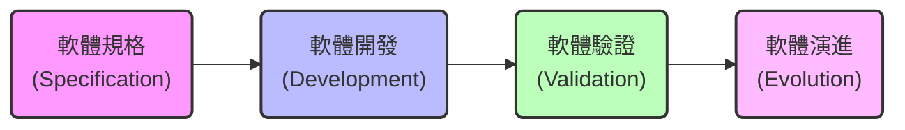
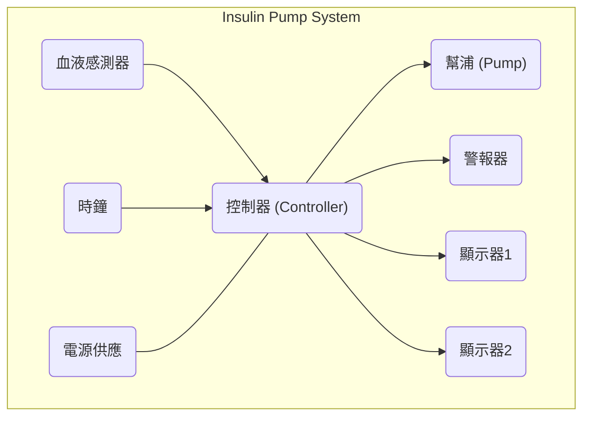
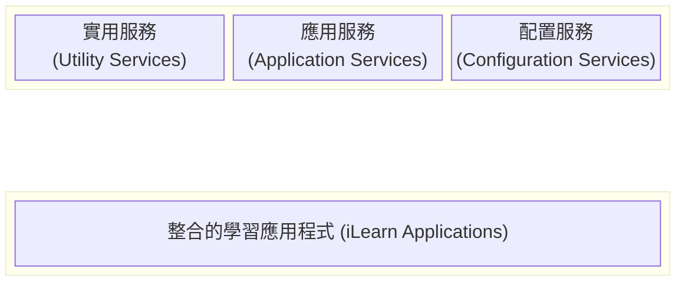

本章建立了軟體工程的基本框架，介紹了專業開發、倫理道德以及貫穿全書的四個案例研究。

### 1. 專業軟體開發 (Professional Software Development)

**1.1 什麼是軟體工程？**
*   **定義：** 軟體工程是一門關注軟體生產**所有方面**的工程學科，從早期的系統規格制定到系統投入使用後的維護。
*   **兩個關鍵點：**
    1.  **工程學科 (Engineering discipline)：** 工程師讓事物運作。他們應用理論、方法和工具，但也必須在組織和財務的限制下工作。
    2.  **所有方面 (All aspects)：** 不僅是技術過程（寫程式），還包括專案管理、工具開發、方法論等。
*   **軟體不僅是程式碼：** 在專業軟體工程中，「軟體」包括電腦程式以及所有相關的文檔（Documentation）、程式庫、支援網站和配置數據。

**1.2 軟體產品的類型**
區分軟體產品的類型對於理解規格由誰控制至關重要：

| 類型                                 | 描述                                         | 範例                               | 規格控制權           |
| :----------------------------------- | :------------------------------------------- | :--------------------------------- | :------------------- |
| **通用產品 (Generic products)**      | 由開發組織生產並在公開市場上銷售的獨立系統。 | 繪圖軟體、CAD 軟體、專案管理工具。 | **開發者**控制規格。 |
| **客製化產品 (Customized products)** | 為特定客戶受託開發的系統。                   | 嵌入式控制系統、特定業務流程軟體。 | **客戶**控制規格。   |

**1.3 良好軟體的基本屬性 (Essential attributes of good software)**
無論應用類型如何，專業軟體都應具備以下特質：

| 屬性                                              | 說明                                                                          |
| :------------------------------------------------ | :---------------------------------------------------------------------------- |
| **可維護性 (Maintainability)**                    | 軟體應能隨著客戶需求的變化而演進。這是關鍵屬性，因為商業環境不斷變化。        |
| **可信賴性與安全性 (Dependability and Security)** | 軟體應包含可靠性、安全性和保密性。不應造成身體/經濟損害，也不應允許惡意訪問。 |
| **效率 (Efficiency)**                             | 軟體不應浪費系統資源（如記憶體、處理器週期）。包括響應時間和處理時間。        |
| **可接受性 (Acceptability)**                      | 軟體必須被設計為用戶可以理解、可用，並能與其他系統相容。                      |

**1.4 軟體過程的基本活動**
所有軟體過程都包含四個基本活動：

1.  **規格 (Specification)：** 定義軟體應做什麼及操作限制。
2.  **開發 (Development)：** 生產軟體。
3.  **驗證 (Validation)：** 檢查軟體是否符合客戶需求。
4.  **演進 (Evolution)：** 修改軟體以反映變化的需求。

**1.5 當前面臨的一般性問題**
*   **異質性 (Heterogeneity)：** 系統需在網路分佈，並在不同類型的電腦和行動設備上運行，且需整合舊系統。
*   **商業與社會變革 (Business and social change)：** 商業環境變化極快，軟體必須能快速演進以提供價值。
*   **安全性與信任 (Security and trust)：** 確保軟體的安全性與可信度至關重要，尤其是面對網路攻擊時。

---

### 2. 軟體工程倫理 (Software Engineering Ethics)

軟體工程師不僅要有技術能力，還必須誠實並遵守道德規範。專業責任涵蓋以下領域：

*   **保密性 (Confidentiality)：** 即使沒有簽署正式保密協議，也應尊重雇主或客戶的機密。
*   **能力 (Competence)：** 不應誤導自己的能力水平，不應接受超出能力範圍的工作。
*   **智慧財產權 (Intellectual property rights)：** 應了解並保護專利和版權等法規。
*   **電腦濫用 (Computer misuse)：** 不應利用技術技能濫用他人的電腦（從玩遊戲到散播病毒）。

**ACM/IEEE 道德準則 (Code of Ethics)**
專業協會制定的八項原則：
1.  **公眾 (Public)**：以公眾利益為優先。
2.  **客戶與雇主 (Client and Employer)**：在符合公眾利益的前提下，為客戶和雇主的最佳利益行事。
3.  **產品 (Product)**：確保產品達到最高專業標準。
4.  **判斷 (Judgment)**：維護專業判斷的完整性和獨立性。
5.  **管理 (Management)**：推廣合乎道德的軟體管理與開發方法。
6.  **專業 (Profession)**：提升專業的誠信與聲譽。
7.  **同事 (Colleagues)**：公平對待並支持同事。
8.  **自我 (Self)**：終身學習並推動道德實踐。

---

### 3. 案例研究 (Case Studies)

本書使用四個不同類型的系統作為貫穿全書的範例，說明不同的軟體工程概念。

#### 3.1 胰島素幫浦控制系統 (Insulin Pump Control System)
*   **類型：** 嵌入式系統 (Embedded system)。
*   **描述：** 軟體控制硬體設備，收集感測器資訊並控制幫浦以注射胰島素。
*   **關鍵特性：** **安全關鍵 (Safety-critical)**。系統故障可能導致用戶受傷或死亡（低血糖導致昏迷）。
*   **硬體架構圖示：**

*(參考來源:)*

#### 3.2 心理健康護理患者資訊系統 (Mentcare system)
*   **類型：** 資訊系統 (Information system)。
*   **描述：** 用於診所管理患者記錄的醫療資訊系統。
*   **關鍵特性：**
    *   **隱私 (Privacy)：** 涉及敏感的心理健康數據。
    *   **安全性 (Safety)：** 需追蹤可能對自己或他人造成危險的患者。
    *   **可用性 (Availability)：** 即使在沒有網路連接的筆記型電腦上也需運行。
*   **系統目標：** 協助醫護人員管理護理過程，並為管理者提供報告。

#### 3.3 荒野氣象站 (Wilderness Weather Station)
*   **類型：** 感測器數據收集系統 (Sensor-based data collection system)。
*   **描述：** 部署在偏遠地區，收集氣象數據並傳輸到數據管理系統。
*   **關鍵特性：**
    *   **可靠性 (Reliability)：** 部署在偏遠地區，維修困難且昂貴。
    *   **電源管理：** 需要自我管理電力（如太陽能與電池）。
    *   **自主性：** 需能動態重新配置。

#### 3.4 數位學習環境 (iLearn)
*   **類型：** 系統之系統 (System of systems) / 支援環境。
*   **描述：** 一個基於網路的分佈式系統，整合了多種工具以支援學校學習。
*   **關鍵特性：**
    *   **服務整合：** 整合了外部服務（如影片、新聞檔案）和內部應用（如虛擬學習環境 VLE）。
    *   **通用框架：** 提供認證、存儲等通用服務，可根據需要配置不同的工具。
*   **架構概念：**

*(iLearn 是一個服務導向的系統，透過配置服務來整合各類應用與實用工具)*
