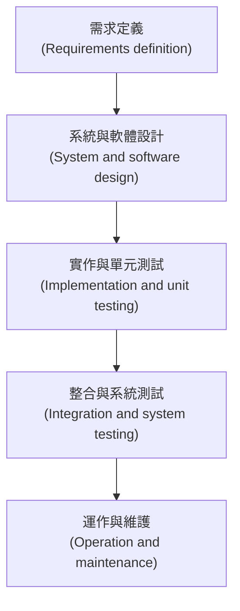
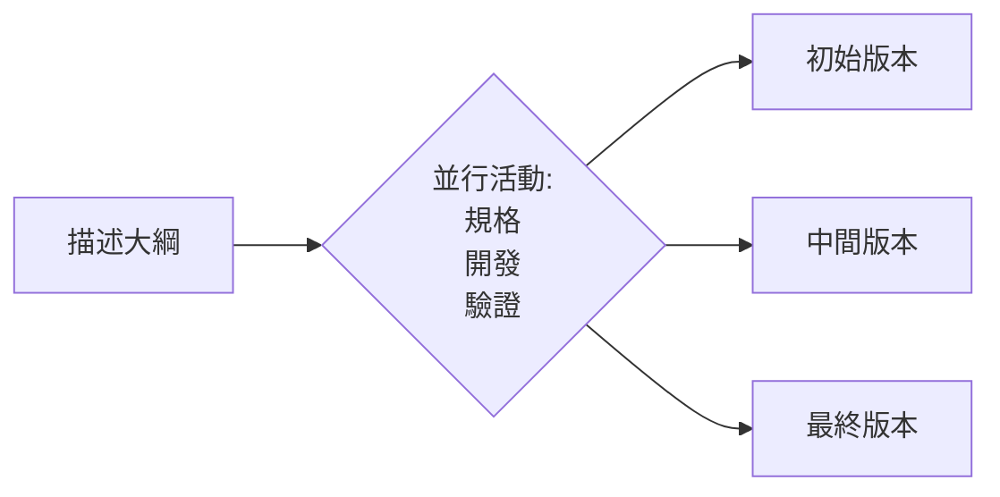
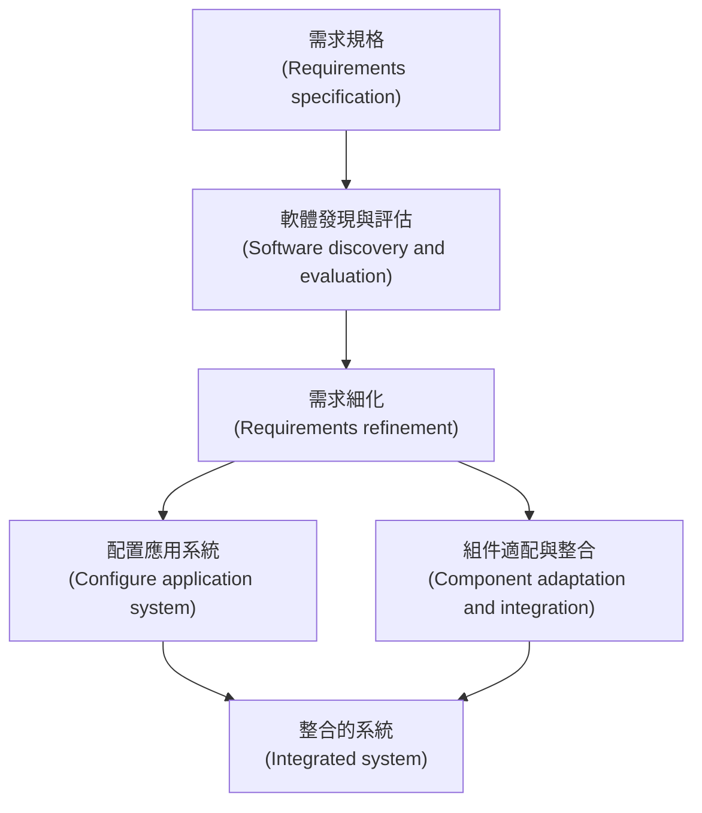
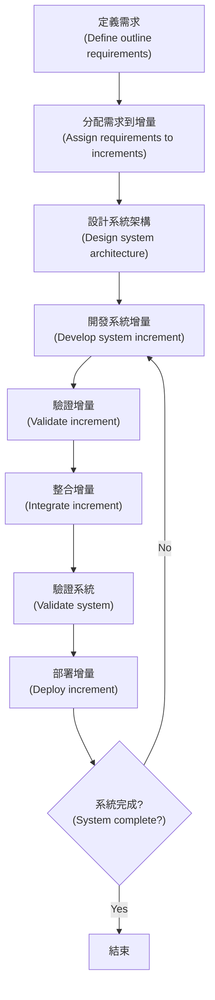
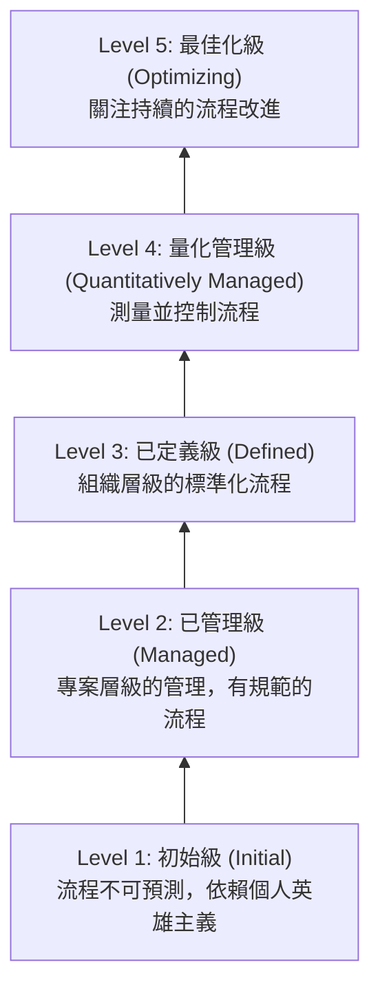

本章介紹了軟體開發的基礎框架、通用的流程模型、核心活動，以及如何應對變更和改進流程。

### 1. 軟體流程模型 (Software Process Models)

軟體流程是一組導致軟體產品生成的相關活動。雖然沒有通用的流程，但通常分為**計畫驅動 (Plan-driven)**（所有活動預先計畫）和**敏捷 (Agile)**（計畫是增量的）兩類。

書中介紹了三種通用的流程模型：

#### 1.1 瀑布模型 (The Waterfall Model)
這是第一個發表的軟體開發模型，將過程呈現為一系列獨立的階段。

*   **特點：** 階段間由文檔驅動，原則上一個階段簽核後才進入下一階段。
*   **適用場景：** 嵌入式系統、關鍵系統（需安全分析）、大型複雜系統。
*   **缺點：** 難以應對過程中的需求變更。

#### 1.2 增量開發 (Incremental Development)
此方法將規格、開發和驗證活動交織在一起。系統作為一系列的版本（增量）進行開發。

*   **特點：** 快速開發初始實現，根據用戶反饋演進。
*   **優點：** 降低適應變更的成本、更容易得到客戶反饋、可更早交付軟體。
*   **缺點：** 過程不可見（難以測量進度）、系統結構隨時間退化。

#### 1.3 整合與配置 (Integration and Configuration)
基於軟體重用 (Reuse)。通過配置和整合現有的軟體組件或現成系統 (COTS) 來構建系統。

*   **流程步驟：**
    1.  **需求規格：** 初步需求。
    2.  **軟體發現與評估：** 尋找可用的組件。
    3.  **需求細化：** 根據可用組件調整需求。
    4.  **配置與整合：** 修改組件並整合到新系統中。
*   **優點：** 降低成本和風險，加快交付。
*   **缺點：** 需求必須妥協，失去對系統演進的控制權。

---

### 2. 流程活動 (Process Activities)

所有軟體流程都包含四個基本活動，但在不同模型中組織方式不同。

#### 2.1 軟體規格 (Software Specification)
亦稱為需求工程，旨在理解並定義系統服務及限制。
*   **主要活動：**
    *   **需求獲取與分析 (Elicitation and analysis)**
    *   **需求規格 (Specification)：** 定義用戶和系統需求。
    *   **需求驗證 (Validation)：** 檢查需求是否現實、一致且完整。

#### 2.2 軟體設計與實作 (Software Design and Implementation)
將規格轉換為可執行的軟體系統。
*   **設計活動：** 架構設計、資料庫設計、介面設計、組件選擇與設計。
*   **實作：** 將設計轉換為程式碼。
*   **除錯 (Debugging)：** 定位並修復缺陷（不同於測試，測試是發現缺陷）。

#### 2.3 軟體驗證 (Software Validation)
旨在證明系統符合規格並滿足客戶期望（V&V）。
*   **測試階段：**
    1.  **組件測試 (Component testing)：** 測試獨立的組件。
    2.  **系統測試 (System testing)：** 測試整合後的系統，關注組件間的交互和系統整體功能。
    3.  **客戶測試 (Customer testing)：** 使用客戶的真實數據進行測試（如 Alpha/Beta 測試）。

#### 2.4 軟體演進 (Software Evolution)
軟體本質上是靈活的，開發與維護的界線逐漸模糊。軟體必須隨著商業需求的變化而演進。

---

### 3. 應對變更 (Coping with Change)

變更是不可避免的，會導致重做 (rework) 並增加成本。書中提出了兩種應對策略：

| 策略                               | 描述                                 | 方法                                                                                                       |
| :--------------------------------- | :----------------------------------- | :--------------------------------------------------------------------------------------------------------- |
| **變更預期 (Change anticipation)** | 在進行大量重做之前預測可能的變更。   | **原型製作 (Prototyping)：** 快速開發一個版本來驗證需求，幫助發現問題。                                    |
| **變更容忍 (Change tolerance)**    | 設計流程使得變更可以較低成本地容納。 | **增量交付 (Incremental Delivery)：** 分階段交付系統，優先交付高價值的服務，讓客戶及早獲得價值並提供反饋。 |

**增量交付 (Incremental Delivery) 流程：**

---

### 4. 流程改進 (Process Improvement)

透過理解和改變流程來提高產品質量、降低成本或縮短開發時間。

**4.1 改進循環**
*   **測量 (Measure)：** 收集流程或產品的屬性數據。
*   **分析 (Analyze)：** 評估當前流程的弱點。
*   **變更 (Change)：** 實施改進並重新測量。

**4.2 CMMI 能力成熟度模型 (Capability Maturity Model)**
這是一個分層模型，用於評估組織的軟體流程能力：

