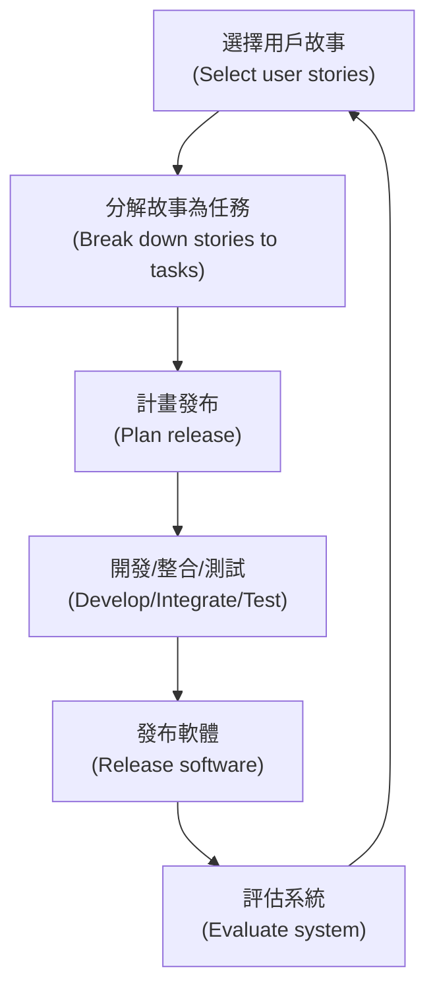
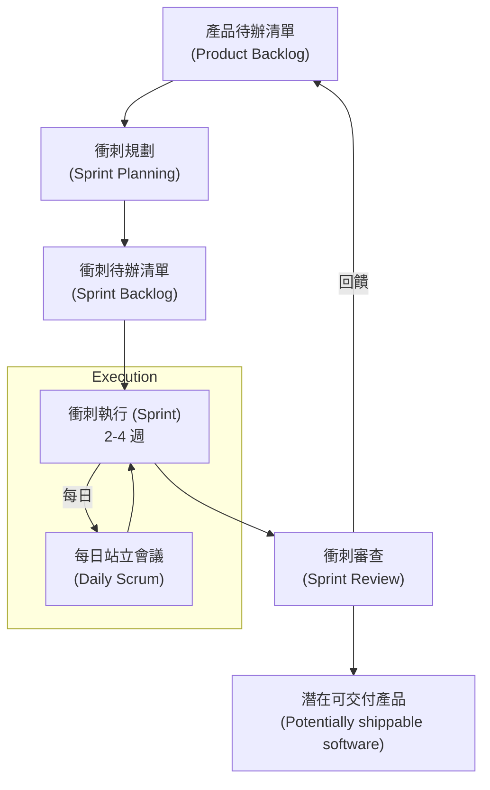
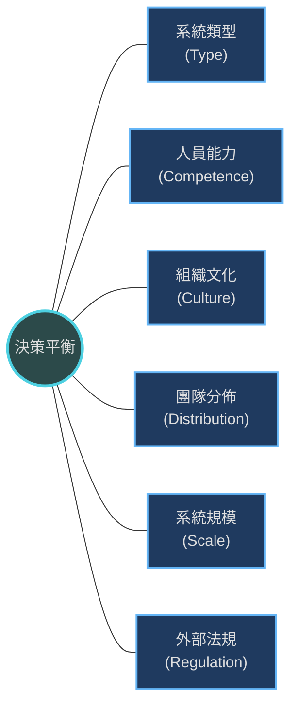

本章介紹了敏捷方法的基本原理、具體技術（以 XP 為例）、專案管理框架（Scrum）以及如何擴展敏捷方法以適用於大型系統。

### 1. 敏捷方法 (Agile Methods)

**1.1 背景與動機**
*   **起源：** 1980 和 90 年代，為了應對「計畫驅動」方法（如瀑布模型）的繁重開銷（overhead）而產生。計畫驅動方法過於依賴文檔，導致軟體交付緩慢。
*   **目標：** 敏捷方法旨在快速交付軟體，減少過程中的浪費，並能快速回應變更。

**1.2 敏捷宣言 (Agile Manifesto)**
敏捷開發的核心價值觀：
1.  **個人與互動** 重於 流程與工具。
2.  **可用的軟體** 重於 詳盡的文件。
3.  **與客戶合作** 重於 合約協商。
4.  **回應變更** 重於 遵循計畫。

**1.3 敏捷開發的五大原則**
所有敏捷方法都共享的一組原則：

| 原則                                | 描述                                                     |
| :---------------------------------- | :------------------------------------------------------- |
| **客戶參與 (Customer involvement)** | 客戶應全程緊密參與開發過程，提供需求並對其進行優先排序。 |
| **增量交付 (Incremental delivery)** | 軟體以頻繁的增量版本交付，讓客戶儘早獲得價值。           |
| **人盡其才 (People not process)**   | 承認開發團隊的技能，讓他們自行組織，不被規定的流程束縛。 |
| **擁抱變更 (Embrace change)**       | 預期系統需求會改變，並設計機制來適應這些變更。           |
| **保持簡單 (Maintain simplicity)**  | 盡可能簡化開發過程和軟體本身，剔除不必要的工作。         |

**1.4 適用場景**
敏捷方法特別適用於以下兩類系統開發：
1.  中小型軟體產品開發（產品經理與團隊溝通）。
2.  組織內部的客製化系統開發（客戶與開發者在同一組織）。

---

### 2. 敏捷開發技術 (Agile Development Techniques)

本章重點介紹了**極限編程 (Extreme Programming, XP)** 引入的關鍵技術實踐。雖然 XP 作為一個獨立的方法論可能不再主流，但其技術實踐被廣泛採用。

**2.1 XP 的發布週期**

*(參考圖 3.3 XP 發布週期)*

**2.2 關鍵實踐 (Key Practices)**

*   **用戶故事 (User Stories):**
    *   需求不寫成詳細規格，而是寫成描述場景的「故事」卡片。
    *   **流程：** 客戶與團隊討論 -> 寫成故事卡 -> 團隊估算 -> 客戶排序 -> 分解為開發任務 (Tasks)。
    *   **優點：** 易於理解，利於與非技術人員溝通。
    *   **缺點：** 難以判斷完整性（Completeness）。

*   **重構 (Refactoring):**
    *   **定義：** 在不改變軟體行為的前提下，改進其內部結構和可讀性。
    *   **目的：** 防止軟體隨著變更而退化（software degradation）。XP 主張不應為了「未來可能的變更」而過度設計，而是在需要時透過重構來改進。

*   **測試優先開發 (Test-First Development / TDD):**
    *   **核心：** 在編寫功能代碼**之前**先編寫測試代碼。
    *   **自動化：** 依賴自動化測試框架（如 JUnit），每次變更後都執行所有測試。
    *   **優點：** 建立測試覆蓋率、測試即文檔、快速發現回歸錯誤（Regression）。

*   **結對編程 (Pair Programming):**
    *   **方式：** 兩名程式設計師在同一台電腦前共同工作。
    *   **效益：**
        *   **集體所有權 (Collective ownership)：** 團隊共同對代碼負責。
        *   **非正式審查：** 每一行代碼都經過兩人檢查，能更早發現錯誤。
    *   **效率：** 雖然投入兩倍人力，但因減少錯誤和重做，整體效率未必降低。

---

### 3. 敏捷專案管理：Scrum

Scrum 是一種敏捷專案管理方法，專注於管理迭代開發，而不是規定具體的編程技術。

**3.1 Scrum 核心術語**

| 術語                               | 定義                                                          |
| :--------------------------------- | :------------------------------------------------------------ |
| **開發團隊 (Development Team)**    | 自行組織的小型團隊（通常不超過 7 人），負責開發軟體。         |
| **產品待辦清單 (Product Backlog)** | 所有待完成工作的清單，包含功能需求等。                        |
| **產品負責人 (Product Owner)**     | 負責產品清單，排列需求優先級，確保業務價值。                  |
| **Scrum Master**                   | 確保團隊遵循 Scrum 流程，排除外部干擾，不充當傳統的專案經理。 |
| **衝刺 (Sprint)**                  | 一個固定的開發迭代週期，通常為 2-4 週。                       |
| **速度 (Velocity)**                | 團隊在一個衝刺中能完成多少工作的估算值。                      |

**3.2 Scrum 衝刺週期 (Sprint Cycle)**

*(參考圖 3.9 Scrum 衝刺週期)*

**3.3 Scrum 的優點**
*   產品被分解為可管理的小塊。
*   需求不穩定不會阻礙整個進度。
*   整個團隊對專案有高可見度（Visibility），透過每日會議和看板。
*   客戶能及時看到增量交付並提供反饋。

---

### 4. 擴展敏捷方法 (Scaling Agile Methods)

敏捷方法最初是為小型團隊設計的，擴展到大型系統（Scaling up）或大型組織（Scaling out）面臨挑戰。

**4.1 實務挑戰**
*   **合約問題：** 傳統合約基於固定需求，而敏捷基於時間和投入。
*   **維護問題：** 由於缺乏詳細的技術文檔，加上開發團隊的連續性問題，敏捷軟體的長期維護可能較困難。
*   **大型系統特性：** 大型系統通常是「系統之系統」（Brownfield development），涉及多個團隊、不同地點，且需要與舊系統整合。

**4.2 敏捷與計畫驅動的平衡**
大多數大型專案需要在敏捷與計畫驅動之間取得平衡。決策因素包括：

**4.3 大型系統的敏捷擴展策略**
為了適應大型系統，敏捷方法需要進行調整：
1.  **前期設計：** 需要更多的事前規劃和架構設計，不能完全依賴增量設計。
2.  **多個產品負責人：** 無法由單一人員代表所有利益相關者，需要多個產品負責人協作。
3.  **文檔重視：** 需要產生更多的設計文檔以促進跨團隊溝通。
4.  **Scrum of Scrums：** 透過各團隊代表的會議來協調多個 Scrum 團隊。
5.  **發布對齊 (Release alignment)：** 不同團隊的產品發布日期必須對齊，以便整合成完整的系統。
