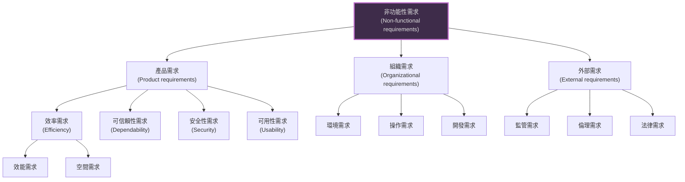
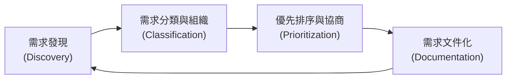
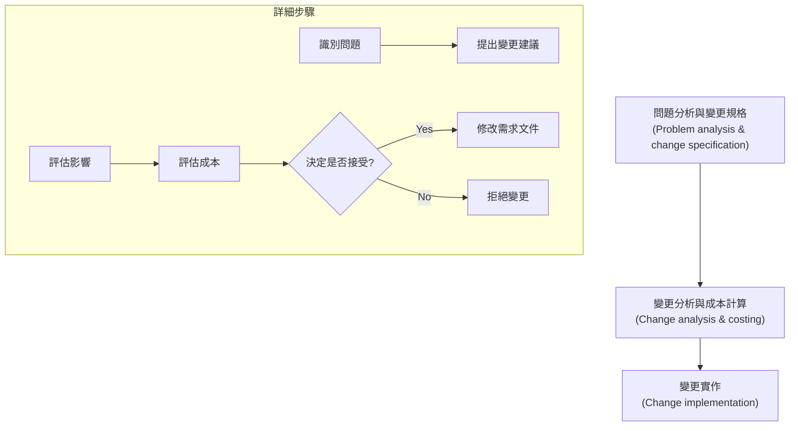

本章深入探討了發現、分析、記錄和檢查系統服務及其限制的過程。

### 1. 需求工程基礎 (Requirements Engineering Basics)

*   **定義：** 需求工程是產生軟體需求規格說明書的過程。需求是系統應提供的服務及其操作限制的描述。
*   **需求的層次 (Levels of Requirements)：** 為了滿足不同讀者的需求，需求通常分為兩個層次：

| 類型                               | 定義                                                                           | 讀者對象                                                   |
| :--------------------------------- | :----------------------------------------------------------------------------- | :--------------------------------------------------------- |
| **使用者需求 (User Requirements)** | 使用自然語言和圖表，說明系統應提供的服務及其操作限制。                         | 客戶經理、系統終端用戶、客戶工程師、承包商經理、系統架構師 |
| **系統需求 (System Requirements)** | 詳細描述系統的功能、服務和操作限制。它是系統買方和軟體開發商之間合約的一部分。 | 系統終端用戶、客戶工程師、系統架構師、軟體開發者           |

### 2. 功能性與非功能性需求 (Functional and Non-functional Requirements)

軟體系統需求通常分為功能性與非功能性兩類。

#### 2.1 功能性需求 (Functional Requirements)
*   描述系統**應該做什麼**（提供什麼服務、對特定輸入如何反應、在特定情況下的行為）。
*   有時也會明確指出系統**不應該做什麼**。
*   **精確度：** 使用者需求通常較抽象；系統需求則需詳細描述功能、輸入、輸出和異常。

#### 2.2 非功能性需求 (Non-functional Requirements)
*   **定義：** 對系統提供的服務或功能的**限制**，包括時間限制、開發過程的限制、標準等。
*   **重要性：** 它們通常適用於**整個系統**，而非個別功能。如果這些需求未被滿足（例如可靠性或安全性），整個系統可能無法使用。
*   **分類：** 非功能性需求可分為三大類（如下圖所示）。

*   **度量指標：** 非功能性需求應盡可能量化，以便進行測試和驗證。

| 屬性 (Property)            | 度量指標 (Measure)                               |
| :------------------------- | :----------------------------------------------- |
| **速度 (Speed)**           | 處理的事務/秒、使用者/事件回應時間、螢幕刷新時間 |
| **大小 (Size)**            | MBytes、ROM 晶片數量                             |
| **易用性 (Ease of use)**   | 訓練時間、幫助框架的數量                         |
| **可靠性 (Reliability)**   | 平均故障時間 (MTTF)、可用性機率、故障發生率      |
| **強健性 (Robustness)**    | 故障後重啟時間、導致故障的事件百分比             |
| **可移植性 (Portability)** | 目標依賴語句的百分比、目標系統的數量             |

---

### 3. 需求工程流程 (Requirements Engineering Processes)

需求工程不是一次性的線性過程，而是一個迭代的螺旋過程 (Spiral Process)。

*   **螺旋模型：** 流程在螺旋中反覆進行，隨著每一輪迭代，對需求的理解逐漸加深。
*   **主要活動：**
    1.  **需求獲取與分析 (Elicitation and analysis)**
    2.  **需求規格 (Specification)**
    3.  **需求驗證 (Validation)**

### 4. 需求獲取 (Requirements Elicitation)

這是發現、分類、優先排序和記錄需求的過程，涉及與利害關係人（Stakeholders）的互動。

#### 4.1 獲取與分析流程

#### 4.2 獲取技術
*   **訪談 (Interviewing)：**
    *   **封閉式訪談：** 基於預定義的問題集。
    *   **開放式訪談：** 無預定義議程，探索性地與利害關係人交談。
*   **民族誌 (Ethnography)：**
    *   分析師融入工作環境，觀察人們實際如何工作，而不僅僅是聽他們說如何工作。
    *   **價值：** 對於發現源自實際合作方式的**隱性需求**特別有效。
*   **故事與場景 (Stories and Scenarios)：**
    *   **故事：** 敘述性文字，描述系統如何用於特定任務（如 Scrum 中的用戶故事）。
    *   **場景：** 比故事更具結構化，通常包括：起始狀態、正常事件流、異常情況、並行活動、結束狀態。

---

### 5. 需求規格 (Requirements Specification)

這是將需求轉化為標準形式（文件）的過程。

#### 5.1 規格說明方式
*   **自然語言：** 普遍使用，但容易產生歧義。建議使用標準格式（如使用 "shall" 表示強制性需求，"should" 表示期望性需求）。
*   **結構化自然語言：** 使用標準表格或範本來寫需求，以保持一致性。
*   **圖形符號：** 如 UML 用例圖 (Use Cases)、序列圖。
*   **數學規範：** 使用數學概念（如狀態機、集合），雖然精確但客戶難以理解。

#### 5.2 軟體需求文件 (The Software Requirements Document)
通常稱為軟體需求規格說明書 (SRS)。IEEE 標準建議的結構如下：

1.  **前言 (Preface)**：讀者對象、版本歷史。
2.  **簡介 (Introduction)**：系統目標、範圍。
3.  **術語表 (Glossary)**：技術術語定義。
4.  **使用者需求定義 (User requirements definition)**：為客戶提供的服務描述。
5.  **系統架構 (System architecture)**：高層次架構概覽。
6.  **系統需求規格 (System requirements specification)**：詳細的功能與非功能需求。
7.  **系統模型 (System models)**：如物件模型、數據流模型等。
8.  **系統演進 (System evolution)**：預期的變更與演進假設。
9.  **附錄 (Appendices)**：具體詳細資訊。
10. **索引 (Index)**。

---

### 6. 需求驗證 (Requirements Validation)

驗證是為了證明需求定義了客戶真正想要的系統。修正需求錯誤的成本極高，因此驗證至關重要。

**檢查項目：**
*   **有效性 (Validity)：** 系統是否提供支援客戶目標的功能？
*   **一致性 (Consistency)：** 需求之間是否有衝突？
*   **完整性 (Completeness)：** 是否包含所有必要的功能和約束？
*   **現實性 (Realism)：** 在現有預算和技術下是否可實作？
*   **可驗證性 (Verifiability)：** 需求是否可以被測試？

**技術：** 需求審查 (Reviews)、原型製作 (Prototyping)、測試用例生成 (Test-case generation)。

---

### 7. 需求管理 (Requirements Management)

需求總是會變化的（因為業務環境變化、對問題理解加深等）。需求管理是了解和控制需求變更的過程。

#### 7.1 變更管理流程

*   **規劃：** 在專案開始時需決定需求標識規則、變更管理流程、可追溯性政策（Traceability）和工具支援。
*   **可追溯性 (Traceability)：** 需維護需求來源、需求與需求之間、需求與設計之間的連結，以便評估變更影響。
