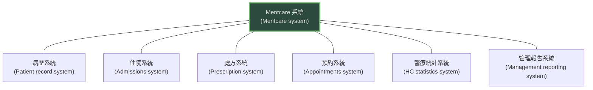
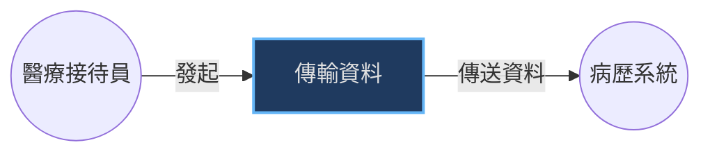
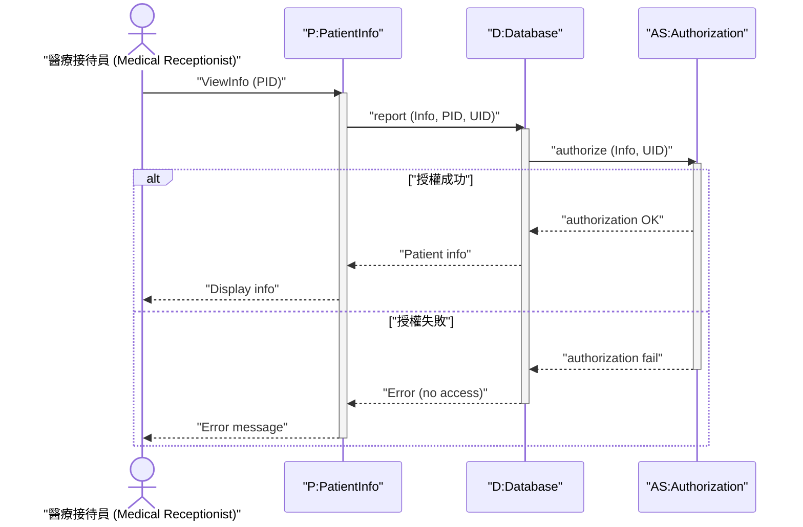
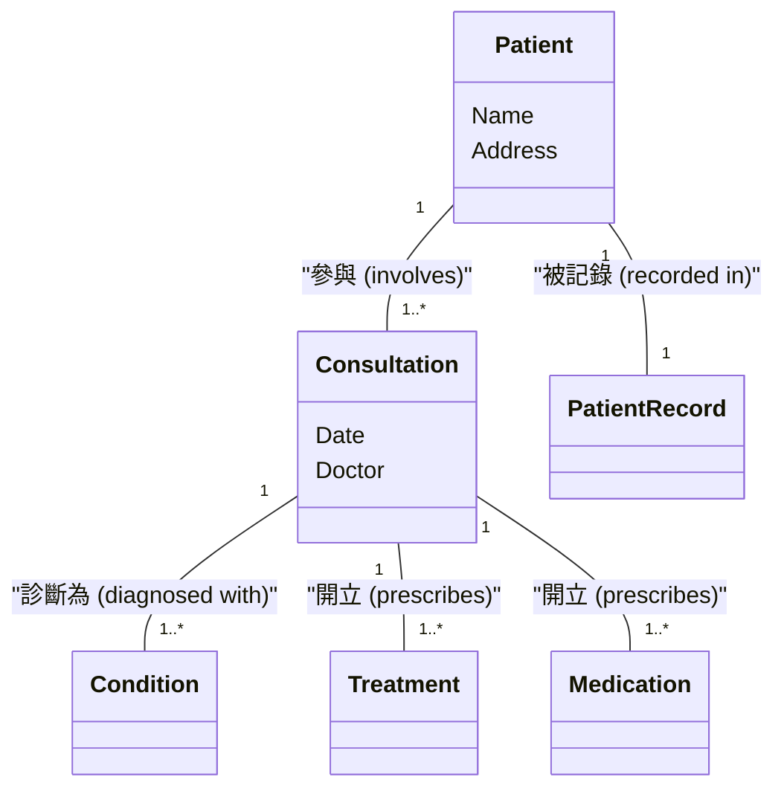
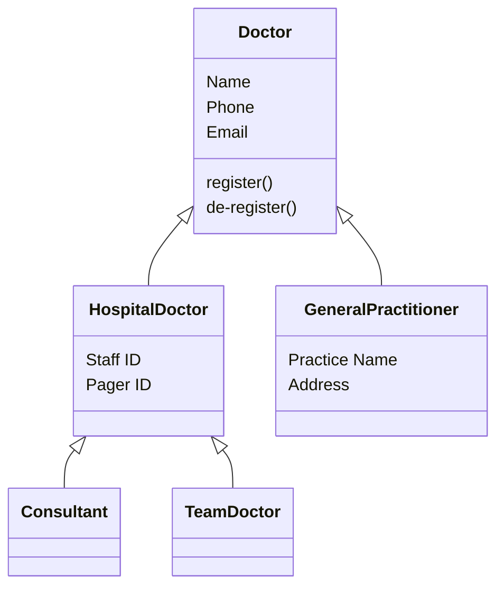
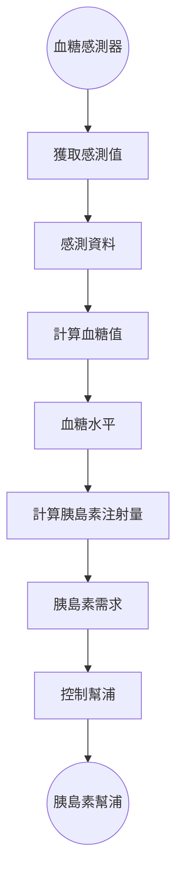
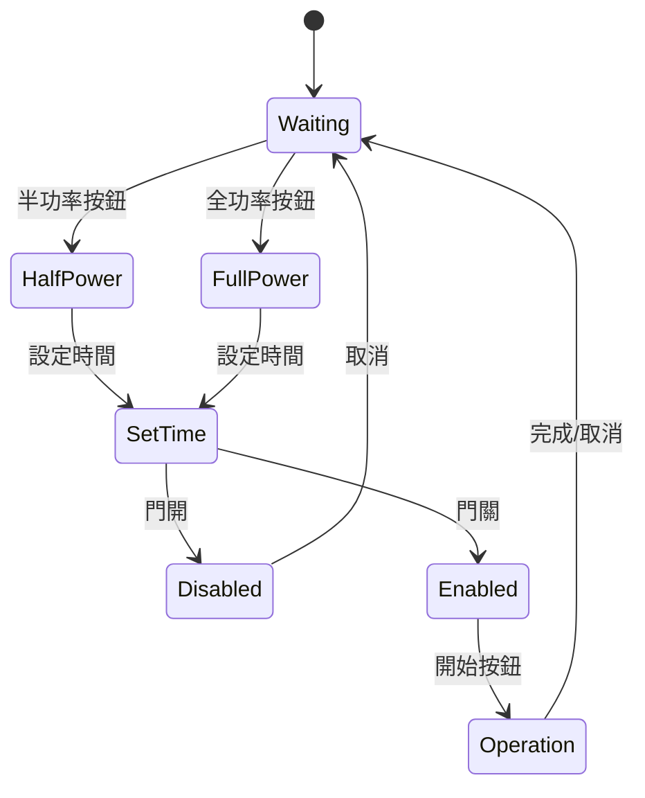
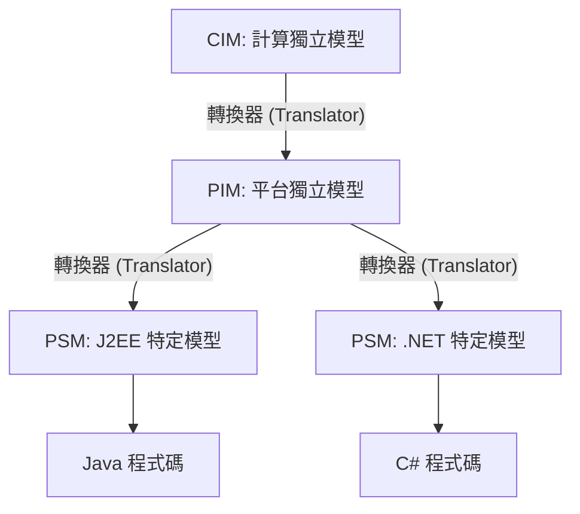

本章介紹了如何使用圖形化模型來描述軟體系統的不同面向，重點在於統一塑模語言 (UML) 的應用以及模型驅動工程 (MDE) 的概念。

### 1. 系統建模導論 (Introduction)

*   **定義：** 系統建模是開發系統抽象模型的過程，每個模型呈現系統的不同觀點 (View) 或視角 (Perspective)。
*   **用途：**
    *   在需求工程中，用於澄清系統功能。
    *   在設計過程中，用於向工程師描述系統。
    *   在實作後，用於記錄系統結構和操作。
*   **四種基本的建模視角 (System Modeling Perspectives)：**
    1.  **外部視角 (External perspective)：** 模擬系統的上下文 (context) 或環境。
    2.  **互動視角 (Interaction perspective)：** 模擬系統與環境之間，或系統組件之間的互動。
    3.  **結構視角 (Structural perspective)：** 模擬系統的組織結構或資料結構。
    4.  **行為視角 (Behavioral perspective)：** 模擬系統的動態行為及對事件的反應。
*   **UML 圖表 (UML Diagrams)：** 雖然 UML 有 13 種圖表，但本章重點介紹 5 種最常用的：
    *   **活動圖 (Activity diagrams)：** 顯示過程或資料處理中的活動。
    *   **使用案例圖 (Use case diagrams)：** 顯示系統與環境的互動。
    *   **序列圖 (Sequence diagrams)：** 顯示行動者 (Actors) 與系統，或系統組件間的互動。
    *   **類別圖 (Class diagrams)：** 顯示物件類別及彼此間的關聯。
    *   **狀態圖 (State diagrams)：** 顯示系統如何對內部和外部事件做出反應。

---

### 2. 情境模型 (Context Models)

*   **目的：** 在規格制定早期階段，決定**系統邊界 (System Boundaries)**，即區分什麼是系統內部，什麼是系統外部環境。
*   **情境模型 (Context Model)：** 通常顯示將要開發的系統以及其環境中的其他系統。

**Mentcare 系統的情境模型範例：**

*   **流程模型 (Process Models)：** 單純的情境模型只顯示了系統間的靜態關係。為了顯示系統如何在更廣泛的業務流程中使用，通常會結合 **UML 活動圖 (Activity Diagrams)** 來描述操作流程。

---

### 3. 互動模型 (Interaction Models)

用於模擬使用者與系統之間，或系統組件之間的互動。

#### 3.1 使用案例建模 (Use Case Modeling)
*   **定義：** 描述使用者（行動者，Actors）期望從系統獲得什麼。
*   **組成：** 每個使用案例代表一個離散的任務。
*   **圖示：** 橢圓形代表使用案例，火柴人代表行動者（可以是人或其他系統）。

**Mentcare 系統中的「傳輸資料」使用案例：**

#### 3.2 序列圖 (Sequence Diagrams)
*   **定義：** 顯示物件和行動者之間互動的順序。
*   **閱讀方式：** 從上到下閱讀。垂直虛線代表物件的生命線，箭頭代表訊息傳遞。

**Mentcare 系統中「檢視病患資訊」的序列圖範例：**

---

### 4. 結構模型 (Structural Models)

顯示系統的組件及其關係的靜態結構。

#### 4.1 類別圖 (Class Diagrams)
*   **定義：** 顯示系統中的物件類別 (Object Classes) 以及這些類別之間的關聯 (Associations)。
*   **關聯：** 類別之間的連結線，可標註多重性 (Multiplicity，如 1, 1..*)。

**Mentcare 系統的類別與關聯範例：**

#### 4.2 一般化 (Generalization)
*   **定義：** 即物件導向中的「繼承」關係。將共同的屬性和操作放在父類別 (Superclass)，特定屬性放在子類別 (Subclass)。
*   **UML 符號：** 空心三角形箭頭指向父類別。

#### 4.3 聚合 (Aggregation)
*   **定義：** 表示物件由其他物件組成的「整體-部分」(Whole-part) 關係。
*   **UML 符號：** 在「整體」的一端使用菱形符號。

---

### 5. 行為模型 (Behavioral Models)

描述系統在執行時的動態行為。

#### 5.1 資料驅動建模 (Data-driven modeling)
*   顯示資料如何被處理序列 (Sequence of actions) 轉換。
*   **UML 對應：** 通常使用 **活動圖 (Activity Diagrams)** 來呈現。

**胰島素幫浦的資料處理模型範例：**

#### 5.2 事件驅動建模 (Event-driven modeling)
*   顯示系統如何回應外部和內部事件。適用於即時系統 (Real-time systems)。
*   **UML 對應：** 使用 **狀態圖 (State Diagrams)**。
*   **組成：** 圓角矩形代表狀態 (State)，箭頭代表轉換 (Transition)，箭頭上的標籤代表觸發事件 (Stimuli)。

**微波爐的簡單狀態模型範例：**

---

### 6. 模型驅動工程 (Model-driven Engineering, MDE)

*   **核心概念：** 軟體開發的主要產出是**模型**，而不是程式碼。程式碼是由模型自動生成的。
*   **模型驅動架構 (Model-driven Architecture, MDA)：** OMG 提出的 MDE 標準，包括三種模型層次：
    1.  **計算獨立模型 (CIM, Computation Independent Model)：** 領域模型，不涉及計算實作。
    2.  **平台獨立模型 (PIM, Platform Independent Model)：** 描述系統操作，但不涉及具體平台（如 Java 或 .NET）。
    3.  **平台特定模型 (PSM, Platform Specific Model)：** 針對特定平台進行轉換後的模型。

**MDA 轉換過程：**

*   **優點：** 提高抽象層次，易於移植到新平台。
*   **缺點：** 專用工具昂貴，自動生成的程式碼效率可能較低，除錯困難（因為是在模型層級思考，但在程式碼層級執行）。
