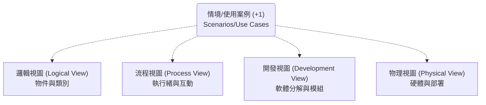
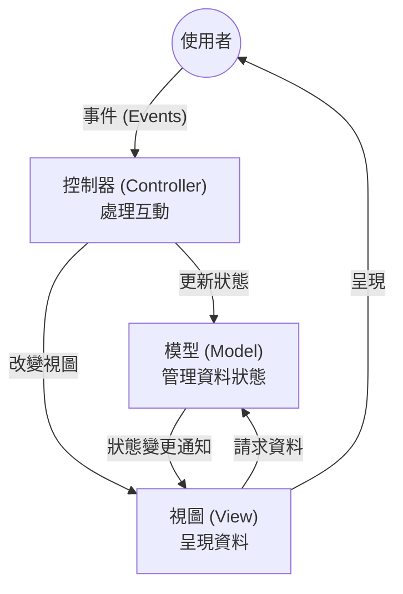
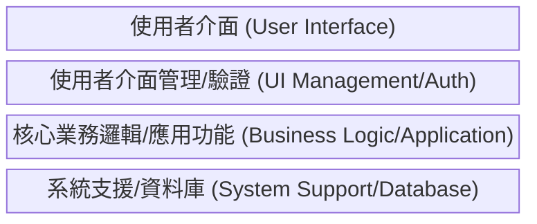
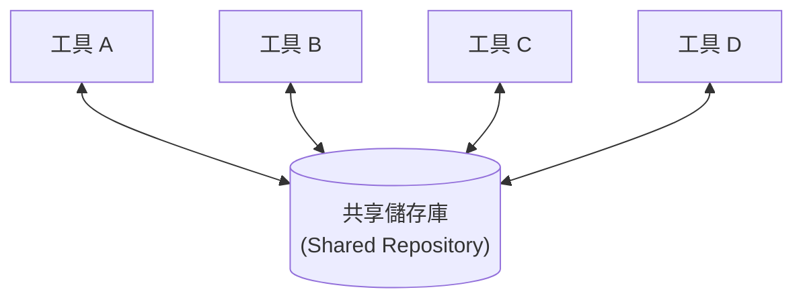
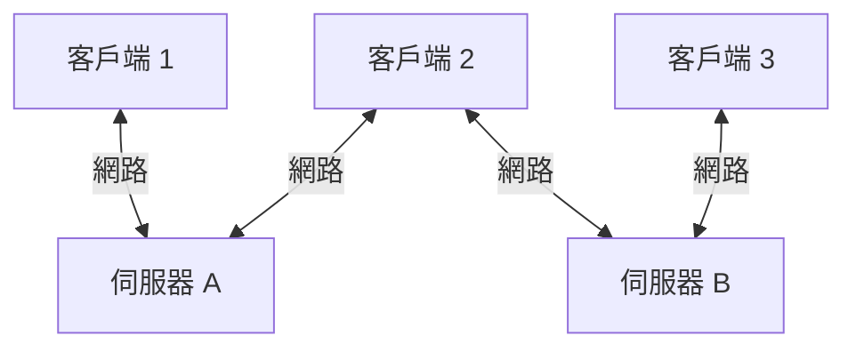
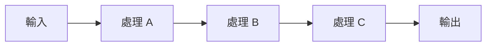

本章介紹了軟體架構的重要性、設計決策、架構視圖、常見的架構模式以及應用程式架構。

### 1. 架構設計基礎 (Architectural Design Basics)

*   **定義：** 架構設計是理解軟體系統應如何組織以及設計系統整體結構的過程。
*   **重要性：**
    *   架構是設計和需求工程之間的橋樑。
    *   它確定了主要的結構組件及其關係。
*   **兩個層次：**
    *   **小規模架構 (Architecture in the small)：** 關注單個程式的架構，將系統分解為物件。
    *   **大規模架構 (Architecture in the large)：** 關注複雜企業系統的架構，這些系統可能包括其他系統、程式和組件。
*   **優點：**
    1.  **利益相關者溝通：** 架構可以用作討論系統的高層次概念，便於不同背景的利益相關者理解。
    2.  **系統分析：** 在早期階段分析系統是否能滿足非功能性需求（如性能、可靠性）。
    3.  **大規模重用：** 架構模型可以跨系統重用（如產品線架構）。

---

### 2. 架構設計決策 (Architectural Design Decisions)

架構設計是一個創造性過程，需要根據系統的非功能性需求做出決策。

#### 2.1 關鍵設計問題
架構師需要回答以下基本問題：
*   是否有通用的應用架構可作為範本？
*   系統如何分佈在硬體核心或處理器上？
*   使用什麼架構模式（Pattern）？
*   如何控制組件之間的運作？
*   如何組織架構以滿足非功能性需求？

#### 2.2 架構與非功能性需求 (Performance vs. Maintainability etc.)
不同的架構結構會影響系統的不同屬性：

| 需求屬性                       | 架構策略                                                                         |
| :----------------------------- | :------------------------------------------------------------------------------- |
| **效能 (Performance)**         | 如果效能關鍵，應**減少組件通訊**，使用大粒度組件而非細粒度組件，以減少通訊開銷。 |
| **安全性 (Security)**          | 使用**分層架構**，將最關鍵的資產放在最內層，並在每層進行驗證。                   |
| **安全性 (Safety)**            | 將安全關鍵功能隔離在少數幾個子系統中，以降低驗證成本。                           |
| **可用性 (Availability)**      | 包含**冗餘組件**，以便在組件故障時可以熱切換。                                   |
| **可維護性 (Maintainability)** | 使用細粒度、自包含的組件，避免共享資料結構，以便於修改和替換。                   |

---

### 3. 架構視圖 (Architectural Views)

由於單一圖表無法呈現所有資訊，Krutchen 提出了 **4+1 視圖模型** 來從不同角度描述架構：

1.  **邏輯視圖 (Logical view)：** 顯示系統中的關鍵抽象（物件或類別）。
2.  **流程視圖 (Process view)：** 顯示系統在運行時如何由互動的進程組成（對效能和可用性判斷有用）。
3.  **開發視圖 (Development view)：** 顯示軟體如何分解為模組供開發者實作。
4.  **物理視圖 (Physical view)：** 顯示系統硬體和軟體組件如何分佈。
5.  **+1 (情境)：** 使用案例或場景將上述視圖聯繫起來。

---

### 4. 架構模式 (Architectural Patterns)

架構模式是經過驗證的解決方案，用於解決常見的架構問題。

#### 4.1 模型-視圖-控制器 (Model-View-Controller, MVC)
*   **描述：** 將展示（Presentation）、互動（Interaction）與資料（Data）分離。
*   **組成：**
    *   **Model：** 管理系統資料和操作。
    *   **View：** 定義資料如何呈現。
    *   **Controller：** 管理使用者互動（如按鍵）並傳遞給 View 和 Model。

*   **優點：** 資料可獨立於表現層變更；支援同一資料的多種視圖。
*   **缺點：** 對於簡單的資料模型可能過於複雜。
*   **適用：** 多種方式查看和互動資料的系統。

#### 4.2 分層架構 (Layered Architecture)
*   **描述：** 將系統組織成層次，每一層提供服務給上一層。
*   **特點：** 支援增量開發；如果介面不變，可替換整層。

*   **優點：** 支援替換整層；可提供多層次的安全防護。
*   **缺點：** 很難清晰地劃分層次；效能可能受影響（因為請求需穿過多層）。

#### 4.3 儲存庫架構 (Repository Architecture)
*   **描述：** 所有資料在中央儲存庫中管理，組件通過儲存庫進行互動，而不是直接互動。
*   **適用：** 需要長期儲存大量資料且多個工具需共享資料的系統（如 IDE、CAD 系統）。

*   **優點：** 組件獨立，不需要知道其他組件的存在；資料管理集中。
*   **缺點：** 儲存庫是單點故障風險；可能有效能瓶頸。

#### 4.4 客戶端-伺服器架構 (Client-Server Architecture)
*   **描述：** 系統作為一組服務（由伺服器提供）和使用這些服務的客戶端呈現。
*   **組成：** 伺服器（提供服務）、客戶端（呼叫服務）、網路。

*   **優點：** 伺服器可分散在網路中；易於添加新伺服器或升級。
*   **缺點：** 每個伺服器都是單點故障；網路效能不可預測。

#### 4.5 管道與過濾器架構 (Pipe and Filter Architecture)
*   **描述：** 處理組件（過濾器）是離散的，獨立進行資料轉換。資料像管道一樣從一個組件流向另一個組件。
*   **適用：** 資料處理應用（如批次處理、編譯器）。

*   **優點：** 易於理解並支持重用；符合許多業務流程結構。
*   **缺點：** 資料傳輸格式需統一，可能需要額外的解析與反解析開銷。

---

### 5. 應用程式架構 (Application Architectures)

應用程式架構是特定類型系統的通用架構模型，可作為設計的起點。

#### 5.1 交易處理系統 (Transaction Processing Systems)
*   **定義：** 處理使用者對資料庫的請求（讀取或更新）。
*   **結構：** I/O 處理 -> 應用邏輯 -> 交易管理器 -> 資料庫。
*   **範例：** ATM 系統、銀行系統。

#### 5.2 資訊系統 (Information Systems)
*   **定義：** 允許受控訪問大型資訊庫。通常是基於 Web 的系統。
*   **通用架構：** 通常採用分層架構。
    1.  使用者介面
    2.  使用者通訊/驗證
    3.  資訊檢索與修改
    4.  交易管理與資料庫

#### 5.3 語言處理系統 (Language Processing Systems)
*   **定義：** 將自然語言或人工語言轉換為另一種表示形式。
*   **範例：** 編譯器 (Compiler)。
*   **架構組件：** 詞法分析器、符號表、語法分析器、語法樹、語意分析器、程式碼生成器。
*   **模式應用：** 可以使用儲存庫模式（符號表作為中心）或管道與過濾器模式（批次編譯）。
