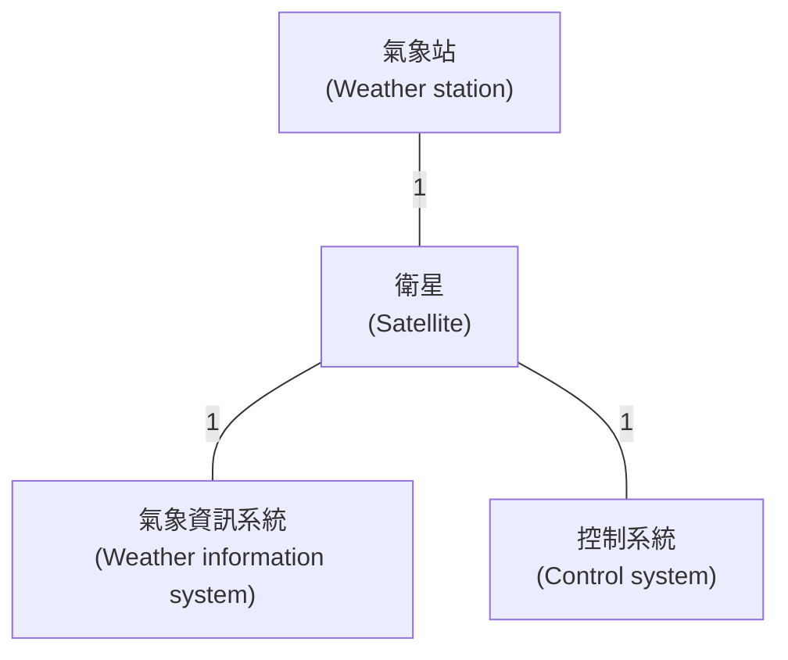
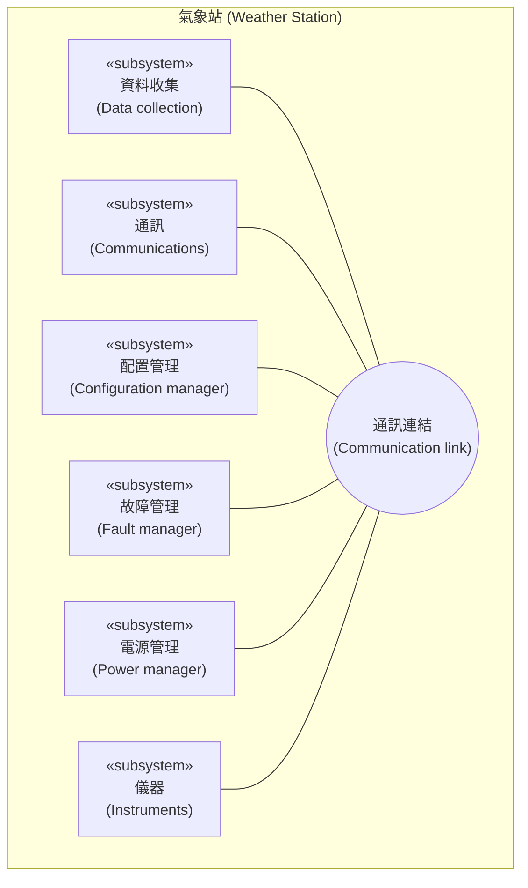
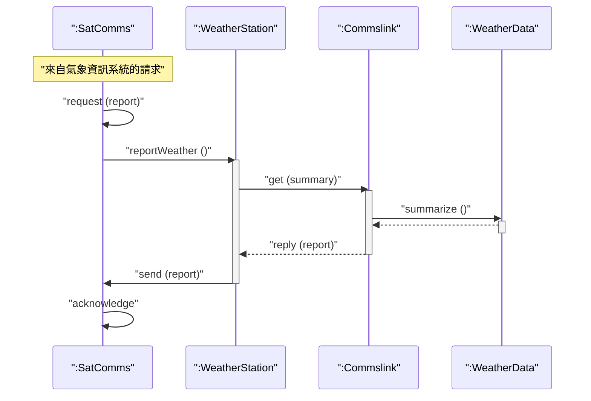
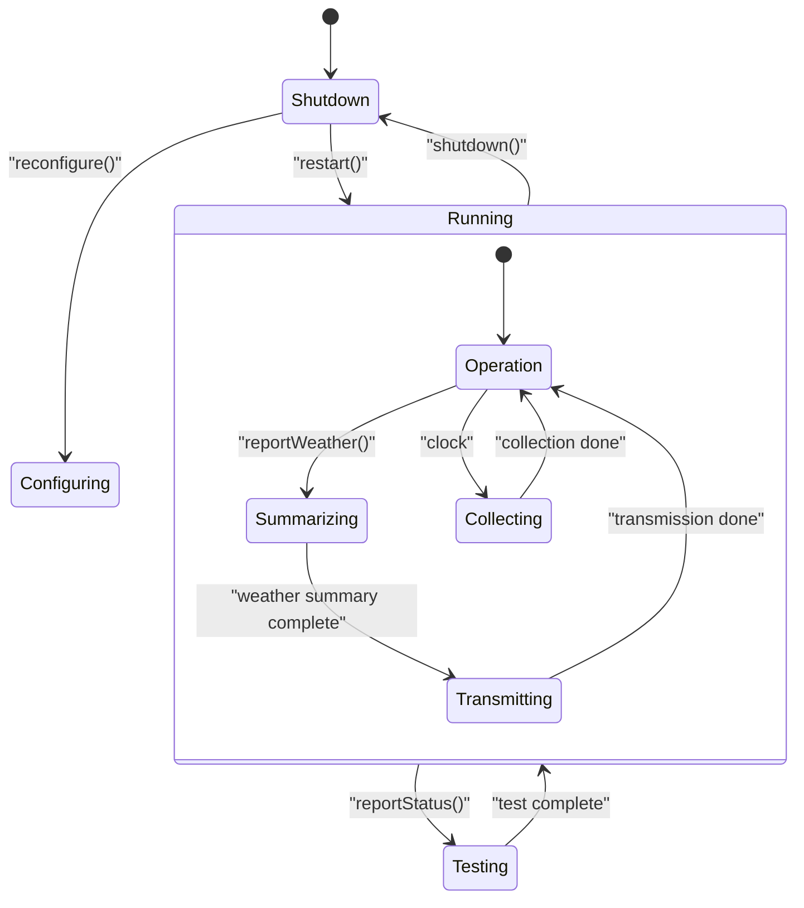
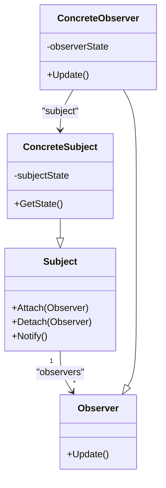
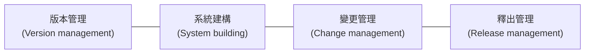

本章重點在於如何將系統需求轉化為可執行的軟體，特別關注物件導向設計 (Object-Oriented Design, OOD) 以及實作過程中的關鍵問題。

### 1. 物件導向設計與 UML (Object-Oriented Design using the UML)

設計與實作是緊密相關的活動。設計是解決問題的創造性過程，而實作則是將設計轉化為程式的過程。

**設計流程五大階段** (以荒野氣象站為例)：
雖然設計不是線性的，但通常包含以下活動：

1.  **理解並定義上下文與互動 (Context and Interaction):** 了解軟體與外部環境的關係。
2.  **設計系統架構 (System Architecture):** 識別主要組件及其互動。
3.  **識別主要物件 (Object Identification):** 找出系統中的關鍵物件。
4.  **開發設計模型 (Design Models):** 描述物件結構與動態行為。
5.  **指定介面 (Interface Specification):** 定義元件間的介面。

#### 1.1 系統上下文與互動 (System Context and Interactions)
*   **上下文模型 (Context Models):** 靜態模型，顯示系統與環境中其他系統的關係。
*   **互動模型 (Interaction Models):** 動態模型，顯示系統如何與環境互動。

**荒野氣象站的上下文 (Figure 7.1):**

**使用案例 (Use Cases):** 描述系統與外部實體（行動者）之間的互動。例如：報告氣象、報告狀態、重新啟動、關機等。

#### 1.2 架構設計 (Architectural Design)
識別系統的主要組成部分及其通訊方式。氣象站採用由獨立子系統組成的架構，透過廣播訊息進行通訊。

**氣象站的高層架構 (Figure 7.4):**

#### 1.3 物件類別識別 (Object Class Identification)
識別物件的方法包括：
1.  **語法分析 (Grammatical analysis):** 分析需求描述中的名詞（物件/屬性）和動詞（操作）。
2.  **實體識別:** 識別應用領域中的有形實體（如：溫度計、氣壓計）。
3.  **行為分析:** 分析場景（Scenarios）來識別所需的物件。

**氣象站的關鍵物件:** `WeatherStation` (系統介面), `WeatherData` (資料處理), `GroundThermometer`, `Anemometer` (儀器實體)。

#### 1.4 設計模型 (Design Models)
使用 UML 圖來橋接需求與實作。
*   **結構模型 (Structural models):** 如類別圖，描述靜態結構。
*   **動態模型 (Dynamic models):** 如序列圖和狀態圖，描述運行時的互動與狀態變化。

**序列圖範例：收集氣象資料 (Figure 7.7)**
顯示物件之間如何透過訊息傳遞來完成任務。

**狀態圖範例：氣象站狀態 (Figure 7.8)**
顯示系統如何響應外部刺激而改變狀態。

#### 1.5 介面規格 (Interface Specification)
定義元件之間如何呼叫。這允許不同物件並行開發。在 UML 中使用 `«interface»` 構型表示。

---

### 2. 設計模式 (Design Patterns)

*   **定義:** 設計模式是對常見問題的經過驗證的解決方案描述。它不是具體的程式碼，而是可以重用的設計智慧。
*   **四個基本要素:**
    1.  **名稱 (Name):** 有意義的模式參考。
    2.  **問題描述 (Problem description):** 何時應用此模式。
    3.  **解決方案描述 (Solution description):** 設計的組成部分及其關係（通常使用圖形表示）。
    4.  **後果 (Consequences):** 應用模式的結果和權衡。

**範例：觀察者模式 (Observer Pattern)**
用於將物件的狀態顯示與物件本身分離。

---

### 3. 實作議題 (Implementation Issues)

除程式設計外，軟體工程中的實作還關注以下三個關鍵問題：

#### 3.1 重用 (Reuse)
現代軟體大多是通過重用現有組件構建的。
*   **重用的層次 (Figure 7.13):**
    1.  **抽象層 (Abstraction level):** 重用知識（如設計模式）。
    2.  **物件層 (Object level):** 重用程式庫中的物件。
    3.  **組件層 (Component level):** 重用框架或子系統。
    4.  **系統層 (System level):** 重用完整的應用系統 (COTS)。
*   **優點:** 降低成本、加快開發速度、降低風險。

#### 3.2 配置管理 (Configuration Management)
管理變更的過程，確保開發者不會互相干擾，且能追蹤版本。
**四大活動 (Figure 7.14):**

1.  **版本管理:** 追蹤組件的不同版本。
2.  **系統建構:** 將組件、資料和函式庫編譯連結成可執行系統。
3.  **變更管理:** 處理變更請求，評估影響與成本。
4.  **釋出管理:** 準備軟體的外部發布版本。

#### 3.3 主機-目標開發 (Host-target Development)
*   **主機 (Host):** 開發軟體的電腦。
*   **目標 (Target):** 軟體執行的電腦。
*   兩者通常不同（例如嵌入式系統開發）。開發平台通常提供模擬器 (Simulators) 來在主機上測試軟體。

---

### 4. 開源開發 (Open-Source Development)

*   **概念:** 原始碼公開發布，志願者參與開發。
*   **授權 (Licensing):** 使用開源代碼需注意授權條款。
    *   **GPL (General Public License):** 互惠授權。如果使用 GPL 軟體，你的軟體也必須開源。
    *   **LGPL (Lesser GPL):** 允許動態連結而不強制開源專有代碼。
    *   **BSD/MIT:** 寬鬆授權，允許將代碼包含在專有系統中而無需開源。
*   **商業模式:** 許多公司基於開源核心開發產品，或透過提供服務與支援獲利。
