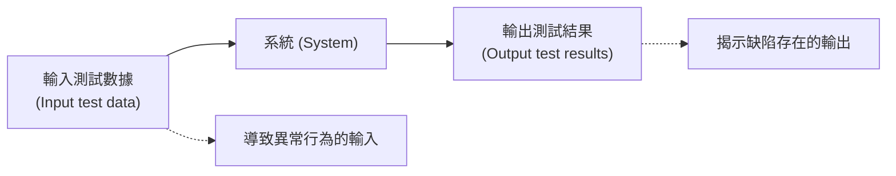
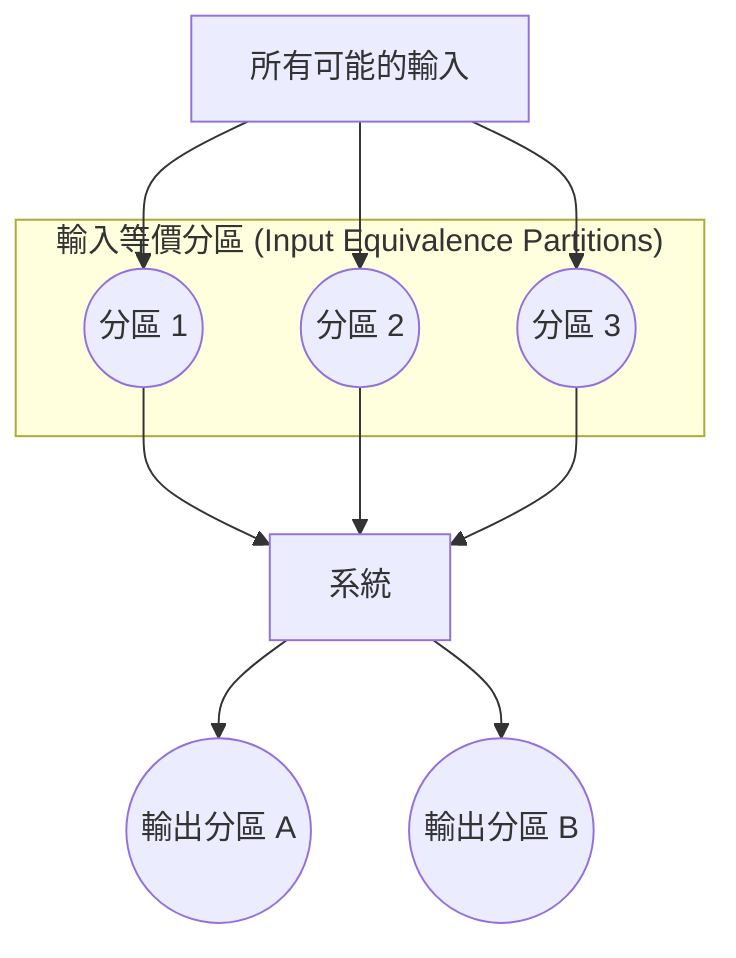
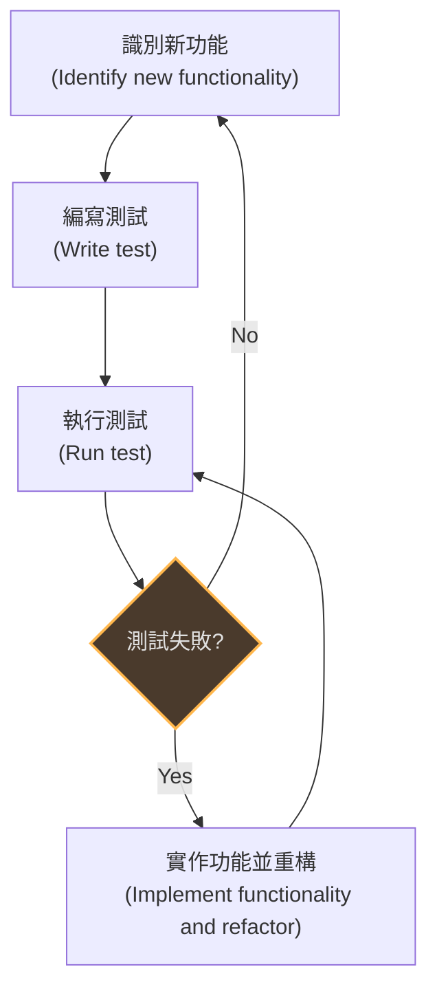
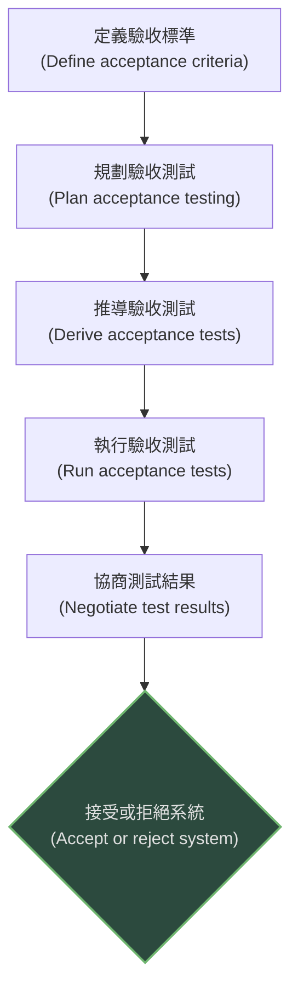

本章介紹了從開發測試到發布測試的各個階段，探討了測試案例的設計技術，並介紹了測試驅動開發 (TDD) 的概念。

### 1. 軟體測試基礎 (Introduction)

*   **目標：** 測試旨在證明程式能完成其預期功能，並在投入使用前發現程式缺陷。
*   **輸入輸出模型：** 測試是使用人工數據執行程式的過程。
    *   **驗證測試 (Validation testing)：** 證明系統符合客戶需求（"Are we building the right product?"）。
    *   **缺陷測試 (Defect testing)：** 旨在發現系統中的缺陷或錯誤，測試案例通常會故意設計得比較刁鑽。

*(參考圖 8.1：程式測試的輸入-輸出模型)*

*   **檢查與測試 (Inspections and Testing)：**
    *   **檢查 (Inspections)：** 是靜態的 V&V 技術，不需要執行程式。可以檢查需求、設計、原始碼等。優點包括：不需要等待系統完整即可進行、單次檢查可發現多個錯誤（不會因為一個錯誤導致程式崩潰而掩蓋後續錯誤）。
    *   **測試 (Testing)：** 是動態的，涉及執行系統。

### 2. 開發測試 (Development Testing)

開發測試是由開發團隊在系統開發過程中進行的測試活動。

#### 2.1 單元測試 (Unit Testing)
*   **定義：** 測試各個程式單元或物件類別。重點在於測試物件或方法的功能。
*   **物件類別測試：** 應覆蓋物件的所有特性，包括所有操作、屬性的設置與檢查，以及所有可能的狀態。
*   **自動化測試：** 使用如 JUnit 等框架。自動化測試包含三個部分：
    1.  **設置 (Setup)：** 初始化系統與輸入。
    2.  **呼叫 (Call)：** 呼叫要測試的方法。
    3.  **斷言 (Assertion)：** 比較執行結果與預期結果。
*   **模擬物件 (Mock Objects)：** 當被測物件依賴其他尚未實作的物件時，使用模擬物件來模擬外部互動。

#### 2.2 選擇單元測試案例 (Choosing Unit Test Cases)
*   **目標：** 證明組件按預期工作，並發現缺陷。
*   **分區測試 (Partition Testing / Equivalence Partitioning)：**
    *   將輸入和輸出數據視為具有共同特徵的集合（等價分區）。
    *   程式對分區內的所有成員行為應相同。
    *   **測試策略：** 選擇分區邊界上的值以及分區中間的值進行測試。

*(參考圖 8.5：等價分區)*

*   **基於指南的測試 (Guideline-based testing)：** 根據經驗法則選擇測試案例。例如：測試單一值的序列、測試不同大小的序列、強制產生緩衝區溢出。

#### 2.3 組件測試 (Component Testing)
*   **定義：** 測試由多個互動物件組成的複合組件。重點在於測試組件的**介面 (Interface)**。
*   **介面類型：**
    1.  **參數介面 (Parameter interfaces)：** 數據透過參數傳遞。
    2.  **共享記憶體介面 (Shared memory interfaces)：** 透過共享記憶體區塊交換數據。
    3.  **程序介面 (Procedural interfaces)：** 封裝一組可被呼叫的程序。
    4.  **訊息傳遞介面 (Message passing interfaces)：** 透過傳遞訊息請求服務。
*   **常見介面錯誤：** 介面誤用 (Interface misuse)、介面誤解 (Interface misunderstanding)、時序錯誤 (Timing errors)。

#### 2.4 系統測試 (System Testing)
*   **定義：** 將組件整合後進行測試，關注組件間的互動以及系統是否滿足功能和非功能需求。
*   **基於使用案例 (Use-case based)：** 使用案例模型和序列圖可以幫助識別需要測試的操作和設計具體的測試案例。

### 3. 測試驅動開發 (Test-Driven Development, TDD)

TDD 是一種將測試與程式碼開發交織進行的方法。先寫測試，再寫程式碼。

**TDD 流程圖：**

*(參考圖 8.9：測試驅動開發)*

**TDD 的優點：**
1.  **程式碼覆蓋率 (Code coverage)：** 原則上所有程式碼都有對應的測試。
2.  **回歸測試 (Regression testing)：** 建立了一套可以隨時執行的測試套件，確保新變更不會破壞現有功能。
3.  **簡化除錯 (Simplified debugging)：** 錯誤通常出現在剛寫的程式碼中，範圍較小。
4.  **系統文檔 (System documentation)：** 測試本身就是程式碼行為的描述。

### 4. 發布測試 (Release Testing)

*   **定義：** 由獨立的測試團隊在系統發布給客戶前進行的測試。目標是確信系統符合其需求。
*   **基於需求的測試 (Requirements-based testing)：** 系統地驗證每個需求是否已滿足。通常一個需求需要多個測試案例。
*   **情境測試 (Scenario testing)：** 設計典型的使用場景（故事），並以此開發測試案例。這能模擬系統的實際使用情況。
*   **效能測試 (Performance testing)：** 測試系統的湧現屬性（如可靠性、效能）。通常涉及**壓力測試 (Stress testing)**，即讓系統在超出正常負載的情況下運行，以檢查其崩潰點。

### 5. 使用者測試 (User Testing)

使用者或客戶提供輸入和建議的測試階段。

*   **類型：**
    *   **Alpha 測試：** 在開發者的場地，由選定的使用者小組進行測試。
    *   **Beta 測試：** 發布軟體的早期版本，讓更廣泛的使用者在實際環境中測試。
    *   **驗收測試 (Acceptance testing)：** 客戶使用自己的數據測試系統，以決定是否接受該系統（通常與付款掛鉤）。

**驗收測試流程：**

*(參考圖 8.11：驗收測試流程)*

*   **敏捷方法中的使用者測試：** 使用者/客戶是開發團隊的一部分，測試是持續進行的，而不僅僅是最後的階段。但在大型專案中，仍可能需要在最後進行獨立的驗收測試。
