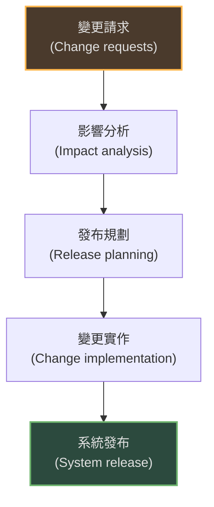
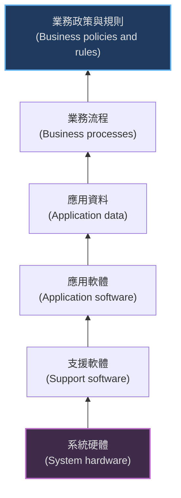
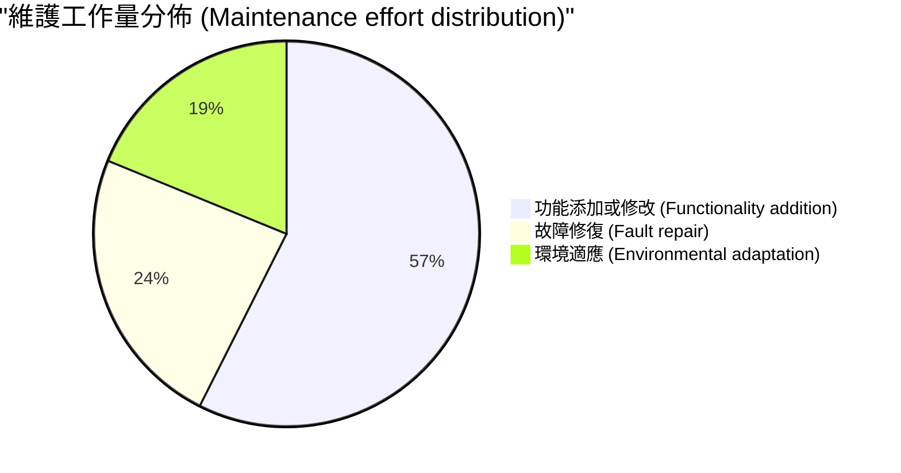
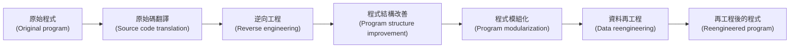

本章探討了軟體發布後的變更過程、舊系統（Legacy Systems）的管理以及軟體維護的各個面向。

### 1. 演進過程 (Evolution Processes)

軟體開發和演進應被視為一個整合的、迭代的過程。軟體系統在其生命週期中會經歷不同的階段：

-   **演進 (Evolution)：** 軟體處於營運使用中，並隨著新的需求提出而不斷演進。
-   **服務 (Servicing)：** 軟體仍在使用，但僅進行必要的錯誤修復或環境適應性修改，不再添加新功能。
-   **退役 (Retirement)：** 軟體從使用中撤除。

#### 1.1 一般演進流程
軟體演進是由變更請求（Change Requests）驅動的。

*(參考圖 9.4：軟體演進的一般模型)*

#### 1.2 緊急修復 (Emergency Repair)
有時為了修復嚴重的系統故障或應對突發的業務變化，必須進行緊急修復。
-   **問題：** 為了快速修復，通常會繞過正常的工程流程（如更新需求文件）。
-   **後果：** 導致程式碼與文件不一致，並加速軟體結構的退化（Software aging）。

#### 1.3 敏捷與演進
-   敏捷方法（如 Scrum）本質上是迭代的，因此從開發過渡到演進通常是無縫的。
-   **交接問題：** 如果開發團隊與維護團隊是分開的，敏捷開發缺乏詳細文件的特性可能會導致交接困難。

---

### 2. 舊系統 (Legacy Systems)

**定義：** 舊系統是依賴於過時的語言和技術，但對業務運作至關重要的舊軟體系統。它們不僅是軟體，而是更廣泛的**社會技術系統 (Sociotechnical systems)**。

#### 2.1 舊系統的層次 (Layers)
舊系統包括硬體、軟體、資料和業務流程。

*(參考圖 9.8：舊系統層次)*

#### 2.2 舊系統管理策略
組織需要評估其舊系統組合，以決定如何處理每個系統。決策基於兩個維度：**系統品質 (System Quality)** 和 **業務價值 (Business Value)**。

| 系統狀態               | 描述                                       | 建議策略                                                                         |
| :--------------------- | :----------------------------------------- | :------------------------------------------------------------------------------- |
| **低品質，低商業價值** | 系統不穩定且對業務貢獻不大。               | **報廢 (Scrap)**：完全停止使用。                                                 |
| **低品質，高商業價值** | 系統對業務至關重要，但維護成本高且不可靠。 | **再工程 (Re-engineer)**：重構系統以提高可維護性；或在合適時**替換 (Replace)**。 |
| **高品質，低商業價值** | 系統穩定但用途有限。                       | **維持/維護 (Maintain)**：繼續進行常規維護，若成本增加則考慮報廢。               |
| **高品質，高商業價值** | 系統對業務重要且易於維護。                 | **保留 (Leave unchanged)**：繼續正常運作和維護。                                 |

---

### 3. 軟體維護 (Software Maintenance)

軟體維護是指系統交付後進行修改的一般過程。

#### 3.1 維護的類型與成本分佈
通常維護成本高於初始開發成本。維護分為三種類型：

1.  **故障修復 (Fault repairs)：** 修復程式錯誤（24%）。
2.  **環境適應 (Environmental adaptation)：** 因應硬體、作業系統或支援軟體的變更而修改軟體（19%）。
3.  **功能添加 (Functionality addition)：** 為了適應新的業務需求而添加新功能。這通常是維護工作中佔比最大的部分（58%）。

*(參考圖 9.12：維護工作量分佈)*

#### 3.2 維護預測 (Maintenance Prediction)
管理者需要預測系統變更的影響及維護成本。
-   **預測系統變更：** 取決於系統介面的複雜度、需求的波動性以及業務流程的變化。
-   **預測可維護性：** 可透過指標（如程式碼複雜度）來評估。如果維護所需的努力增加（例如變更實作時間變長），則表明可維護性正在下降。

#### 3.3 軟體再工程 (Software Reengineering)
為了提高舊系統的可維護性，對其進行重組和重寫，而不改變其功能。

**再工程流程：**

*(參考圖 9.14：再工程流程)*

#### 3.4 重構 (Refactoring)
-   **定義：** 在不改變軟體功能的前提下，進行小的修改以改善程式結構（預防性維護）。
-   **與再工程的區別：** 重構是開發過程中的持續活動；再工程通常是在系統維護一段時間後，為了降低維護成本而進行的一次性專案。
-   **"壞味道" (Bad smells)：** 程式碼中需要重構的跡象，例如重複的程式碼、過長的方法、龐大的類別等。

### 關鍵點 (Key Points)
-   軟體演進與開發是一個連續的過程。
-   舊系統是依賴過時技術但在業務上仍具價值的系統。
-   維護包括修復錯誤、適應新環境和添加新功能。
-   再工程用於改善舊系統的結構和可理解性。
-   重構是持續改進軟體結構的過程，有助於降低長期維護成本。
