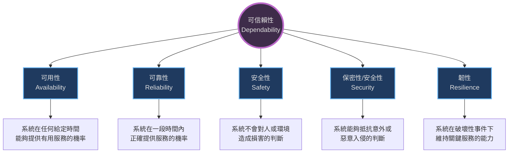

本章介紹了軟體可信賴性（Dependability）的概念、屬性，以及如何透過工程方法、流程和形式化方法來構建可信賴的系統。

### 1. 可信賴性屬性 (Dependability Properties)

隨著電腦系統深入生活的各個方面，系統故障的後果越來越嚴重（經濟損失、資訊遺失、實體損害）。因此，「可信賴性」成為關鍵的系統品質屬性。

-   **定義**：可信賴性反映了使用者對系統正常運作的信任程度。
-   **重要性**：
    -   系統故障可能影響大量人群。
    -   使用者通常會拒絕使用不可靠或不安全的系統。
    -   系統故障可能導致巨大的經濟損失或資訊遺失。

#### 1.1 五大核心屬性 (Principal Dimensions)
可信賴性是一個複合屬性，包含以下五個主要維度:

-   **其他屬性**：
    -   **可維修性 (Repairability)**：系統發生故障後能夠被修復的程度。
    -   **可維護性 (Maintainability)**：系統適應新需求的能力。
    -   **錯誤容忍度 (Error tolerance)**：系統避免或容忍使用者輸入錯誤的能力。

-   **成本與可信賴性 (Cost/Dependability Curve)**：
    -   隨著可信賴性要求的提高，成本呈指數級增長。
    -   對於極高可信賴性的系統，測試和驗證成本可能佔總開發成本的一半以上。

### 2. 社會技術系統 (Sociotechnical Systems)

軟體只是更廣泛系統的一部分。要實現真正的可信賴性，必須將系統視為**社會技術系統**，包含硬體、軟體、人員、流程和組織政策。

-   **系統層次**：
    -   系統不僅是技術組件，還包括操作人員、業務流程、組織政策，甚至受到社會法規的約束。
    -   故障可能在不同層次間傳播（例如：硬體故障導致操作員壓力過大，進而發生人為錯誤）。
-   **法規與合規性 (Regulation and Compliance)**：
    -   許多關鍵系統（如核能、航空、醫療）必須經過外部監管機構的認證才能投入使用。
    -   開發者必須製作**安全案例 (Safety Case)** 來證明系統的安全性。

### 3. 冗餘與多樣性 (Redundancy and Diversity)

這是實現可信賴系統的兩個基本機制:

-   **冗餘 (Redundancy)**：
    -   保留備用的容量或組件。如果部分系統發生故障，可以切換到備用組件。
    -   例如：多個處理器、備份資料庫。
-   **多樣性 (Diversity)**：
    -   使用不同類型的組件來執行相同的功能，以避免**共因故障 (Common Mode Failures)**。
    -   如果使用相同的軟體在冗餘硬體上運行，軟體錯誤會導致所有冗餘備份同時失敗。多樣性（如使用不同團隊開發的不同軟體版本）可降低這種風險。

### 4. 可信賴的流程 (Dependable Processes)

可信賴的軟體是由可信賴的流程開發出來的。對於關鍵系統，由於測試的局限性，我們往往需要透過「流程的可信賴性」來推斷「產品的可信賴性」。

#### 4.1 可信賴流程的屬性

| 屬性                        | 描述                                                                  |
| :-------------------------- | :-------------------------------------------------------------------- |
| **可記錄性 (Documentable)** | 流程應有定義好的模型，並規定活動中需產出的文件。                      |
| **標準化 (Standardized)**   | 應有一套涵蓋軟體生產和文件的綜合標準。                                |
| **可審計性 (Auditable)**    | 流程應能被外部人員理解和檢查，以確保標準被遵循。                      |
| **多樣性 (Diverse)**        | 流程應包含冗餘和多樣的驗證與確認 (V&V) 活動（如同時使用測試和檢查）。 |
| **強健性 (Robust)**         | 流程應能從個別活動的失敗中恢復。                                      |

*(參考來源:)*

#### 4.2 關鍵活動
可信賴的開發流程通常包括：
-   需求審查 (Requirements reviews)
-   需求管理 (Requirements management)
-   形式化規格 (Formal specification)
-   系統建模 (System modeling)
-   程式碼檢查 (Program inspections)
-   靜態分析 (Static analysis)
-   測試規劃與管理 (Test planning and management)

### 5. 形式化方法與可信賴性 (Formal Methods and Dependability)

形式化方法是使用數學模型來定義軟體規格，並透過數學轉換或分析來開發程式的方法。

-   **優勢**：
    -   **強制分析**：構建形式化規格強迫開發者對需求進行非常詳細的分析，有助於在早期發現需求錯誤（這是最昂貴的錯誤）。
    -   **一致性驗證**：可以數學化地證明程式碼與其規格的一致性。
    -   **減少錯誤**：研究顯示，使用形式化方法可以減少交付軟體中的錯誤，且成本與傳統方法相當。

-   **應用領域**：
    -   主要用於安全關鍵系統（如火車控制、飛航控制）的關鍵核心部分（Kernel）。
    -   例如：巴黎地鐵系統使用 B 方法開發，透過形式化證明消除了部分單元測試的需求。

-   **模型檢查 (Model Checking)**：
    -   這是一種自動化的形式化驗證形式。
    -   建立系統的有限狀態模型，並自動檢查該模型是否滿足某些屬性（如「系統永遠不會進入死鎖狀態」）。
    -   已被廣泛應用於硬體設計驗證，現在也逐漸應用於關鍵軟體系統。

-   **局限性**：
    -   難以理解：非技術性的利害關係人無法理解數學規格。
    -   成本高昂：開發形式化模型成本高，且難以擴展到大型系統。
    -   工具支援有限：大多依賴開源工具，缺乏商業級支援。
    -   與敏捷不相容：難以融入增量開發流程。
