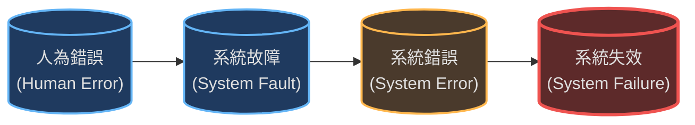
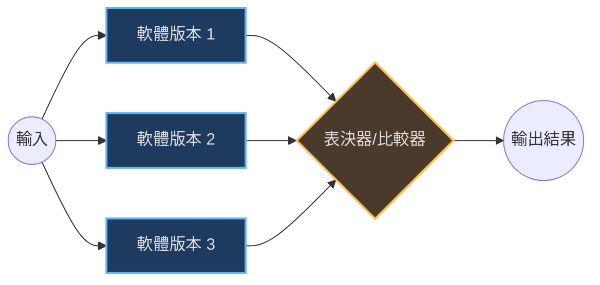
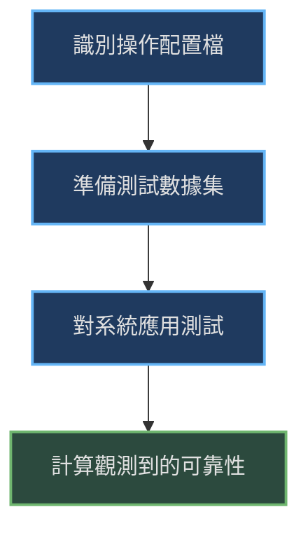

本章探討了軟體可靠性的定義、度量指標、容錯架構以及如何透過編程實踐與測試來提升可靠性。

### 1. 可靠性與可用性基礎 (Availability and Reliability)

可靠性不僅僅是沒有錯誤，它是系統動態行為的屬性。

-   **術語定義 (Terminology):**
    -   **人為錯誤 (Human error/Mistake):** 人類的行為導致了系統中的故障（Fault）。
    -   **系統故障 (System fault):** 軟體系統中的一個特徵（如錯誤的程式碼邏輯），可能導致系統錯誤。
    -   **系統錯誤 (System error):** 執行期間的錯誤系統狀態（如變數值錯誤），可能導致系統失效。
    -   **系統失效 (System failure):** 系統在某個時間點未能按照預期交付服務的事件。

-   **故障不一定導致失效：** 不是所有的故障都會被執行到；有些錯誤是暫時的，在導致失效前可能就被糾正了。
-   **可靠性的主觀性：** 可靠性取決於使用模式。如果使用者不使用包含故障的功能，對該使用者而言系統就是可靠的。

### 2. 可靠性需求 (Reliability Requirements)

可靠性需求分為功能性與非功能性兩類。

#### 2.1 可靠性度量指標 (Reliability Metrics)
用於定義非功能性可靠性需求。

| 度量指標 (Metric)                            | 解釋 (Explanation)                                                                              | 適用場景                                                                               |
| :------------------------------------------- | :---------------------------------------------------------------------------------------------- | :------------------------------------------------------------------------------------- |
| **POFOD** (Probability of failure on demand) | **按需失效機率**。系統接收到服務請求時發生失效的機率 (如 0.001 代表 1000 次請求中有 1 次失效)。 | 適用於**保護系統**等服務請求頻率較低或不定期的系統。                                   |
| **ROCOF** (Rate of occurrence of failures)   | **失效發生率**。單位時間內或單位交易次數內發生失效的頻率 (如每小時 2 次失效)。                  | 適用於**交易處理系統**等定期處理大量請求的系統。                                       |
| **MTTF** (Mean time to failure)              | **平均失效時間**。兩次失效之間的平均運作時間。                                                  | 適用於**長事務處理系統** (如 CAD 系統)，確保使用者在長時間工作中不會因失效而丟失數據。 |
| **AVAIL** (Availability)                     | **可用性**。系統在任何給定時間處於運作狀態並可提供服務的機率 (如 0.999)。                       | 適用於**持續運作系統** (如電話交換機、訊號系統)，服務的中斷損失大於服務品質下降。      |

#### 2.2 功能性可靠性需求
為了達到可靠性指標，系統需要具備特定的功能機制：
-   **檢查需求 (Checking requirements):** 檢測輸入或狀態的有效性。
-   **恢復需求 (Recovery requirements):** 幫助系統在失效後恢復服務。
-   **冗餘需求 (Redundancy requirements):** 指定冗餘功能以確保單點故障不會導致系統崩潰。
-   **流程需求 (Process requirements):** 指定開發過程中應遵循的標準和方法。

### 3. 容錯架構 (Fault-tolerant Architectures)

容錯是指系統在發生故障時仍能繼續運作的能力。這通常依賴**冗餘 (Redundancy)** 和 **多樣性 (Diversity)**。

#### 3.1 保護系統 (Protection Systems)
-   這是一個專門的系統，用於監控另一個控制系統。如果主系統失效，保護系統會將受控設備置於安全狀態。
-   **特點：** 保護系統通常比控制系統簡單，因此更容易驗證其可靠性。

#### 3.2 自我監控架構 (Self-monitoring Architectures)
-   系統包含多個通道（Channels）進行相同的計算。
-   如果通道的輸出不一致，系統會假設發生了故障並採取行動（如關機或報警）。
-   在空中巴士 (Airbus) 飛行控制系統中，使用了多樣化的硬體和軟體來實現自我監控。

#### 3.3 N-版本程式設計 (N-version Programming)
-   基於硬體的三模冗餘 (TMR) 概念。
-   **運作方式：** 多個不同版本的軟體（由不同團隊使用不同語言或方法開發）並行執行。輸出選擇器（Output Selector）比較結果，並採用多數決（Voting）的結果。
-   **假設：** 不同版本的軟體不太可能同時發生相同的故障（獨立失效假設）。但實際上，由於共同的需求誤解或算法困難，實現完全的獨立性很困難。

*(參考圖 11.10 N-版本程式設計)*

### 4. 可靠性編程 (Programming for Reliability)

為了減少程式中的故障，建議遵循以下良好實踐指南：

1.  **控制資訊的可見性 (Limit visibility):** 使用資訊隱藏（封裝），只允許組件訪問其需要的數據，減少數據被意外破壞的風險。
2.  **檢查所有輸入的有效性 (Check all inputs):** 包括範圍檢查、大小檢查、表示檢查和合理性檢查。
3.  **為所有例外提供處理常式 (Provide exception handlers):** 確保程式能捕捉並處理錯誤，而不是直接崩潰。
4.  **最小化易錯結構的使用 (Minimize error-prone constructs):** 避免使用如浮點數比較、指標（Pointer）、動態記憶體分配等容易出錯的特性。
5.  **提供重啟能力 (Provide restart capabilities):** 對於長事務系統，應定期儲存狀態（Checkpoints），以便在失敗後從最近的狀態恢復。
6.  **檢查陣列邊界 (Check array bounds):** 防止緩衝區溢位漏洞。
7.  **呼叫外部組件時包含超時機制 (Include timeouts):** 避免因外部組件無回應而導致系統掛起。
8.  **命名所有常數 (Name all constants):** 使用有意義的名稱代替硬編碼的數值，減少輸入錯誤並提高可維護性。

### 5. 可靠性測量 (Reliability Measurement)

可靠性測量通常透過**統計測試 (Statistical Testing)** 進行。

-   **流程：**
    1.  定義**操作配置檔 (Operational Profile)**：描述系統在實際使用中可能的輸入分佈（哪些輸入最常用，哪些很少用）。
    2.  根據操作配置檔生成測試數據集。
    3.  執行測試並計算失效次數和時間。
    4.  計算可靠性指標。

*(參考圖 11.13 可靠性測量的統計測試)*

-   **困難點：**
    -   **操作配置檔的不確定性：** 系統可能有不同的使用者群體，其使用方式各不相同，難以定義單一的配置檔。
    -   **高可靠性驗證成本：** 對於要求極高可靠性的系統（如失效機率極低），需要極大量的測試時間才能在統計上驗證其可靠性。
