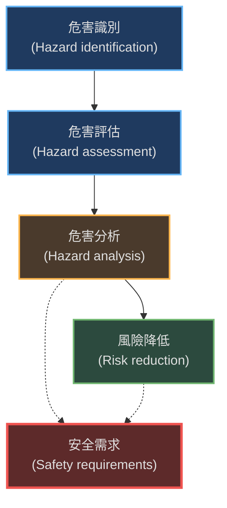
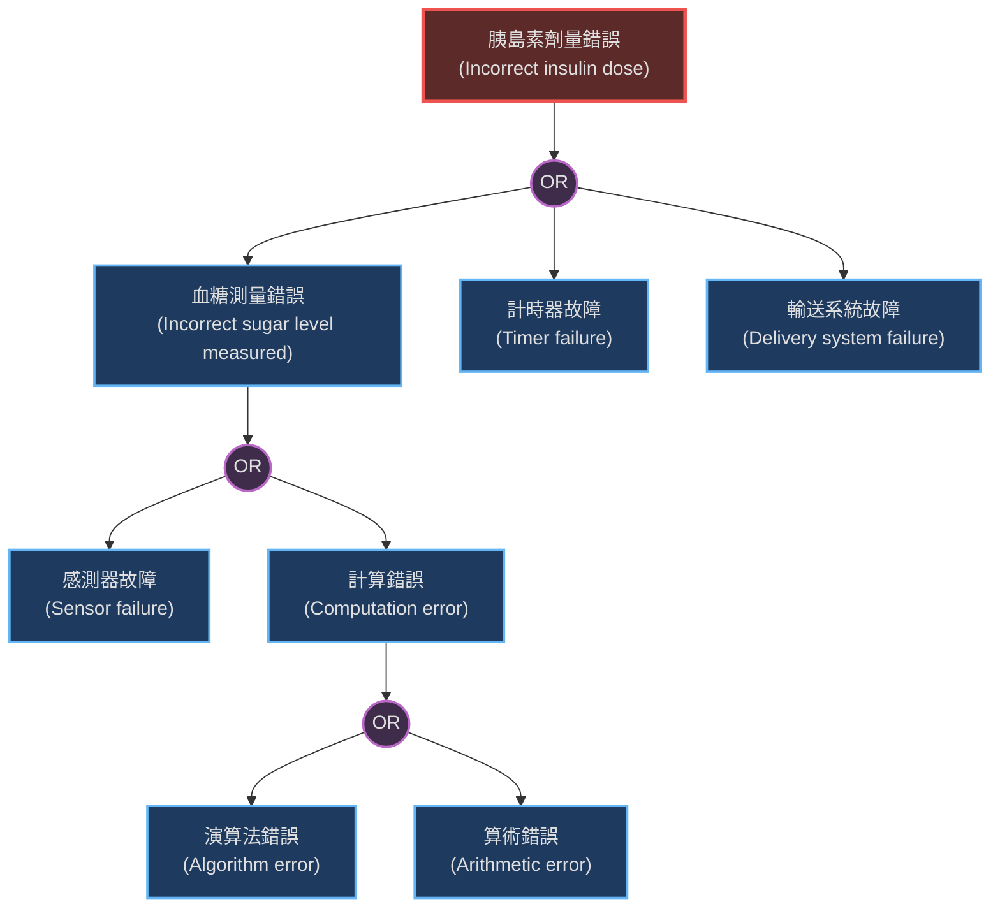
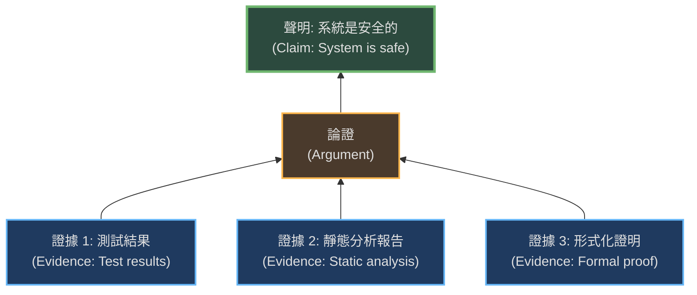

本章區分了安全性 (Safety) 與可靠性 (Reliability)，並介紹了用於開發安全關鍵系統 (Safety-critical systems) 的技術，包括危害分析、安全需求導出及安全案例的建立。

### 1. 安全關鍵系統 (Safety-Critical Systems)

安全關鍵系統是指一旦失效可能導致人員傷亡、環境嚴重破壞或設備嚴重損毀的系統。

-   **主要類型：**
    -   **主要安全關鍵系統 (Primary safety-critical systems)：** 軟體直接嵌入並控制系統，其失效直接導致事故（例如：胰島素幫浦軟體）。
    -   **次要安全關鍵系統 (Secondary safety-critical systems)：** 軟體失效可能間接導致傷害（例如：電腦輔助設計軟體設計出有缺陷的結構，或醫療資料庫錯誤導致給藥錯誤）。

-   **安全性 vs. 可靠性 (Safety vs. Reliability)：**
    -   可靠性關注系統是否符合規格。
    -   安全性關注系統是否會導致事故。
    -   **關鍵區別：** 系統可能在滿足規格的情況下（可靠）仍然是不安全的（例如：使用者操作錯誤但系統未防止）。

-   **危害管理策略：**
    1.  **危害避免 (Hazard avoidance)：** 設計系統以防止危害發生。
    2.  **危害檢測與移除 (Hazard detection and removal)：** 在危害導致事故前檢測並消除之。
    3.  **損害限制 (Damage limitation)：** 若事故發生，將後果降至最低。

#### 1.1 安全性術語 (Safety Terminology)

| 術語 (Term)                       | 定義 (Definition)                                      |
| :-------------------------------- | :----------------------------------------------------- |
| **事故 (Accident / Mishap)**      | 導致傷亡或破壞的意外事件（如：胰島素過量）。           |
| **危害 (Hazard)**                 | 可能導致事故的系統狀態（如：感測器故障導致讀數錯誤）。 |
| **損害 (Damage)**                 | 事故造成的損失度量。                                   |
| **危害嚴重性 (Hazard severity)**  | 對危害可能造成的最大損害的評估。                       |
| **危害機率 (Hazard probability)** | 危害事件發生的可能性估計。                             |
| **風險 (Risk)**                   | 結合危害機率與嚴重性的綜合評估。                       |

---

### 2. 安全需求 (Safety Requirements)

安全需求通常是**避免發生**的需求（"Shall not" requirements），定義系統不應該做什麼，或是保護系統不受故障影響的需求。

#### 2.1 危害驅動的需求規格流程
安全需求通常透過分析潛在危害來導出。

1.  **危害識別 (Hazard identification)：** 找出可能導致事故的潛在危害（如：物理、電氣、生物失效）。
2.  **危害評估 (Hazard assessment)：** 評估每個危害的風險（機率與嚴重性），決定是否可接受。常用的模型是**風險三角形 (Risk Triangle)**。
    -   **不可容忍區 (Intolerable)：** 必須設計系統以排除此風險。
    -   **ALARP 區 (As Low As Reasonably Practicable)：** 盡可能降低風險，直到成本過高。
    -   **可接受區 (Acceptable)：** 風險極低，無需額外設計。
3.  **危害分析 (Hazard analysis)：** 找出危害的根本原因 (Root Causes)。常用技術為**故障樹分析 (Fault Tree Analysis)**。
4.  **風險降低 (Risk reduction)：** 根據分析結果制定安全需求。

#### 2.2 故障樹分析 (Fault Tree Analysis)
這是一種由上而下的技術，從危害開始，反向推導可能導致該狀態的原因。

**胰島素幫浦潛在故障樹範例：**

---

### 3. 安全工程流程 (Safety Engineering Processes)

開發安全關鍵系統需要**可信賴的流程 (Dependable processes)**，並包含特定的安全保證活動。

-   **安全保證 (Safety Assurance)：** 建立**危害登記表 (Hazard Register)**，記錄所有識別出的危害、分析結果及對應的安全需求。這在發生事故時可作為盡職調查的證據。
-   **形式化驗證 (Formal Verification)：**
    -   使用數學模型證明程式碼與規格的一致性。
    -   雖然成本高，但能發現傳統測試難以發現的錯誤（如死鎖）。
-   **模型檢查 (Model Checking)：**
    -   建立系統的有限狀態模型 (Finite state model)。
    -   自動檢查模型是否滿足某些屬性（如：系統永遠可達「傳輸」狀態）。
    -   **流程：** 建立模型 -> 指定屬性 -> 模型檢查器 -> 確認或反例。
-   **靜態程式分析 (Static Program Analysis)：**
    -   不執行程式，而是自動掃描原始碼以查找異常（如變數未初始化、陣列邊界違規）。
    -   這對於發現潛在的記憶體洩漏或指標錯誤特別有效。

---

### 4. 安全案例 (Safety Cases)

安全案例是一份結構化的文件，用於向監管機構（如航空或醫療器材監管局）證明系統是安全的。

-   **目的：** 提供合理的信心，證明系統在特定環境下操作是安全的。
-   **結構化論證 (Structured Arguments)：** 安全案例通常基於**聲明 (Claim)**、**論證 (Argument)** 和 **證據 (Evidence)** 的結構。

-   **軟體安全論證 (Software Safety Arguments)：**
    -   一種常見的技術是「反證法」：假設系統處於不安全狀態，然後證明導致該狀態的所有程式路徑在邏輯上都是矛盾的（不可能發生）。
    -   例如：證明胰島素計算程式碼中，變數 `currentDose` 永遠不可能大於 `maxDose`。

### 關鍵點 (Key Points)
-   安全關鍵系統的軟體失效可能導致巨大的生命財產損失。
-   危害分析是用於識別潛在危險及其根源的關鍵技術。
-   安全需求通常採用「系統不應...」的形式。
-   安全工程依賴於嚴謹的流程、形式化方法和靜態分析工具。
-   安全案例是用於證明系統安全性的結構化文件。
