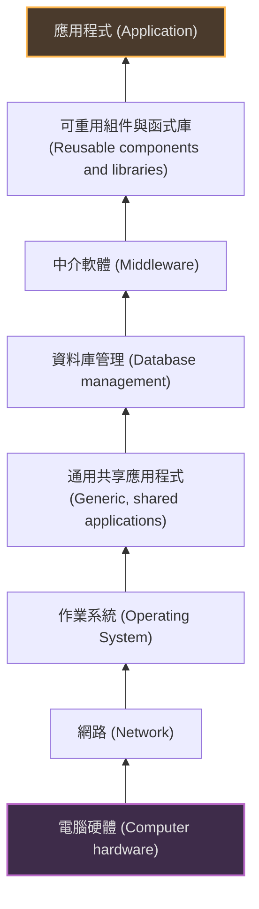
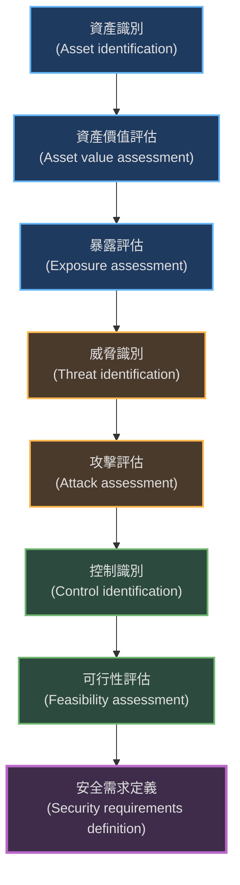
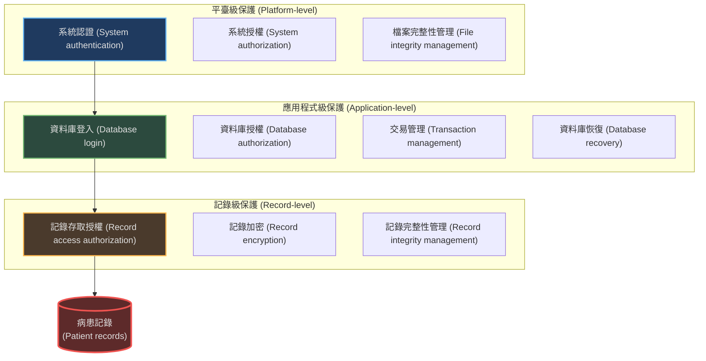

> 此章節在繁體中文譯版中使用**保全工程**一詞。文章標題跟隨譯本，但內容則用**安全**來表示。

> 與前一章節不同的點在於：本章節的**安全**是針對於系統內部的運作，而不是系統帶來的安全性問題。

本章重點介紹了應用程式安全性的開發，包括風險評估、安全需求導出、安全系統設計及安全測試。

### 1. 安全性工程基礎 (Security Engineering Basics)

安全性工程的重點在於確保系統能夠保護自己免受惡意攻擊，並確保系統的可用性、完整性和機密性。

-   **安全性的三個層次：**
    1.  **基礎設施安全性 (Infrastructure security)：** 關注所有應用程式運行的系統和網路環境（如作業系統、路由器）。
    2.  **應用程式安全性 (Application security)：** 關注個別應用系統或相關系統群組的安全性。
    3.  **營運安全性 (Operational security)：** 關注組織中系統的安全操作和使用（人與流程）。

*(參考圖 13.1：可能受損的系統層次)*

#### 1.1 安全性與可信賴性 (Security and Dependability)
安全性反映了系統保護自身免受惡意內部或外部攻擊的能力。
-   **CIA 三角模型 + 其他屬性：**
    -   **機密性 (Confidentiality)：** 資訊不被洩漏給未授權的人。
    -   **完整性 (Integrity)：** 系統和資料不被損壞或篡改。
    -   **可用性 (Availability)：** 系統在需要時可供使用。
    -   **安全性 (Safety) 與 可靠性 (Reliability)：** 雖然不同，但在安全性受損時（如遭受 DoS 攻擊或數據被篡改），可能會導致系統失效（不可靠）或造成危害（不安全）。

#### 1.2 安全性術語 (Security Terminology)

| 術語 (Term)              | 定義 (Definition)                            | 範例                     |
| :----------------------- | :------------------------------------------- | :----------------------- |
| **資產 (Asset)**         | 必須受到保護的有價值之物（系統本身或資料）。 | 病患記錄資料庫。         |
| **攻擊 (Attack)**        | 利用系統漏洞的行為。                         | 偽裝成授權用戶。         |
| **控制 (Control)**       | 為減少漏洞或降低風險而採取的保護措施。       | 禁止弱密碼的密碼檢查器。 |
| **暴露 (Exposure)**      | 攻擊造成的可能損失或傷害。                   | 財務損失、聲譽損失。     |
| **威脅 (Threat)**        | 可能造成傷害的情況或事件。                   | 未經授權的用戶試圖登錄。 |
| **漏洞 (Vulnerability)** | 系統中可被威脅利用的弱點。                   | 弱密碼策略。             |

---

### 2. 安全性與組織 (Security and Organizations)

-   **安全性風險評估 (Security Risk Assessment)：**
    -   **初步風險評估 (Preliminary risk assessment)：** 在需求工程階段進行，目的是導出安全需求。
    -   **設計風險評估 (Design risk assessment)：** 在設計和實作階段進行，根據具體技術決策識別新的漏洞。
-   **組織政策：** 安全性不僅僅是技術問題，必須基於組職的安全性政策。

---

### 3. 安全需求 (Security Requirements)

安全需求通常分為功能性（如檢查密碼）和非功能性（如系統必須具備的屬性）。

-   **需求類型：**
    -   **識別 (Identification) 與 認證 (Authentication)：** 確認使用者是誰。
    -   **授權 (Authorization)：** 使用者能做什麼。
    -   **免疫性 (Immunity)：** 抵抗病毒/蠕蟲。
    -   **完整性 (Integrity)：** 防止資料損壞。
    -   **入侵檢測 (Intrusion detection)：** 偵測攻擊。
    -   **不可否認性 (Non-repudiation)：** 交易方不能否認參與。
    -   **隱私 (Privacy)：** 資料保密。
    -   **稽核 (Auditing)：** 檢查系統使用情況。

#### 3.1 風險驅動的需求規範流程
這是一個迭代過程，用於導出安全需求。

*(參考圖 13.5：風險驅動的安全需求規範)*

-   **誤用案例 (Misuse cases)：**
    -   類似於使用案例 (Use Cases)，但描述的是惡意互動。
    -   用於識別威脅和可能的攻擊模式。
    -   例如：在 Mentcare 系統中，「攔截傳輸」(Intercept transfer) 是一個誤用案例，攻擊者試圖在資料傳輸過程中竊取病患資料。

---

### 4. 安全系統設計 (Secure Systems Design)

設計階段必須考慮如何透過架構選擇和遵循最佳實踐來降低風險。

#### 4.1 設計風險評估
設計決策（如選擇現成軟體 COTS、特定的資料庫結構）會引入新的漏洞。必須重新評估風險並可能產生新的需求（例如：如果選擇了只能用密碼認證的 COTS，可能需要增加每日密碼強度檢查的需求）。

#### 4.2 架構設計 (Architectural Design)
-   **分層保護 (Layered protection)：** 使用多層防禦，攻擊者必須突破多層才能接觸到關鍵資產。

**Mentcare 系統的分層保護架構範例：**

-   **資產分佈 (Asset distribution)：** 在分散式系統中，關鍵資產（如存取控制資料）應該被複製到多個節點，以提高可用性並防止單點故障導致的阻斷服務（DoS）。

#### 4.3 安全設計指南 (Design Guidelines for Security)
書中列出了 10 條關鍵的設計準則：

1.  **基於明確的安全政策 (Base security decisions on an explicit security policy)。**
2.  **使用縱深防禦 (Use defense in depth)：** 不要依賴單一防禦機制。
3.  **失效安全 (Fail securely)：** 系統失效時應處於安全狀態（不洩漏數據），而不是開放狀態。
4.  **平衡安全性與可用性 (Balance security and usability)：** 過於繁瑣的安全措施會導致用戶尋找繞過的方法（如寫下密碼），反而降低安全性。
5.  **記錄使用者行為 (Log user actions)：** 用於檢測入侵和事後取證。
6.  **使用冗餘和多樣性 (Use redundancy and diversity)：** 降低單點故障風險。
7.  **指定輸入格式 (Specify the format of system inputs)：** 驗證所有輸入以防止緩衝區溢位或 SQL 注入。
8.  **資產區隔 (Compartmentalize your assets)：** 限制用戶只能訪問其需要的資訊（最小權限原則）。
9.  **考慮部署 (Design for deployment)：** 避免部署時的配置錯誤（如忘記更改預設密碼）。
10. **考慮恢復 (Design for recovery)：** 假設攻擊會成功，設計系統以便能從攻擊中恢復。

#### 4.4 安全系統編程 (Secure Systems Programming)
許多漏洞源於實作錯誤。
-   **輸入驗證：** 檢查所有輸入（範圍、大小、表示形式）。
-   **避免易錯結構：** 減少使用指標 (pointers)、動態記憶體分配等容易導致緩衝區溢位的結構。

---

### 5. 安全性測試與保證 (Security Testing and Assurance)

證明系統是安全的非常困難（無法證明「沒有」漏洞）。

-   **靜態分析 (Static Analysis)：** 使用工具掃描原始碼以查找潛在的安全漏洞（如緩衝區溢位）。
-   **動態測試 (Dynamic Testing)：**
    -   **基於經驗的測試 (Experience-based testing)：** 使用已知攻擊模式（如 SQL 注入）的清單進行測試。
    -   **滲透測試 (Penetration testing)：** 聘請外部專家模擬攻擊者，試圖突破系統防禦。
    -   **工具分析 (Tool-based analysis)：** 使用密碼破解工具或網絡掃描器來查找配置漏洞。

### 關鍵點 (Key Points)
-   安全性工程涉及三個層次：基礎設施、應用程式和營運。
-   風險管理是關鍵，需識別資產、威脅並採取控制措施。
-   設計應採用縱深防禦和資產區隔。
-   安全性與可用性經常衝突，需取得平衡。
-   輸入驗證是防禦常見攻擊（如注入攻擊）的關鍵編程實踐。
