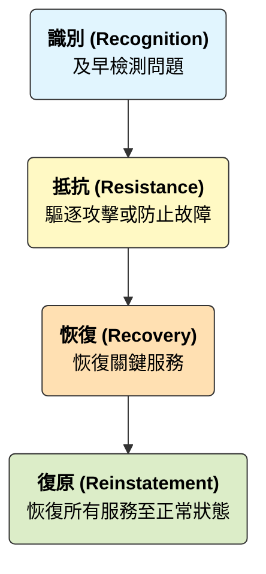
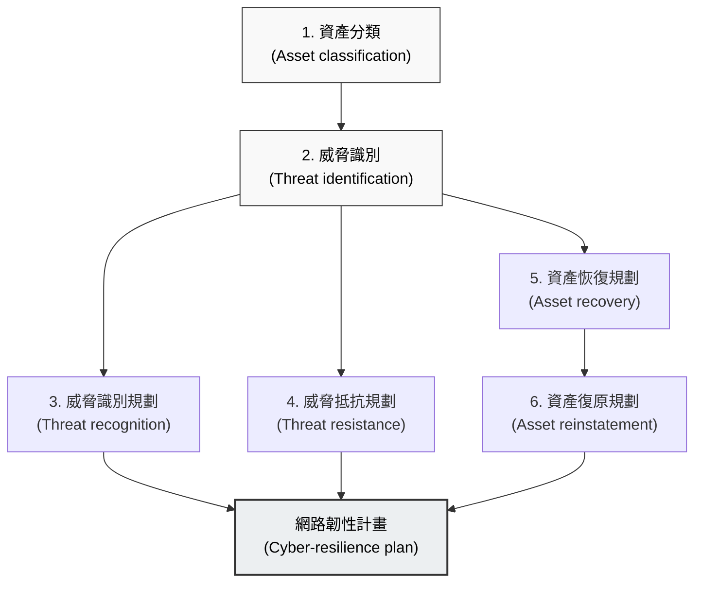
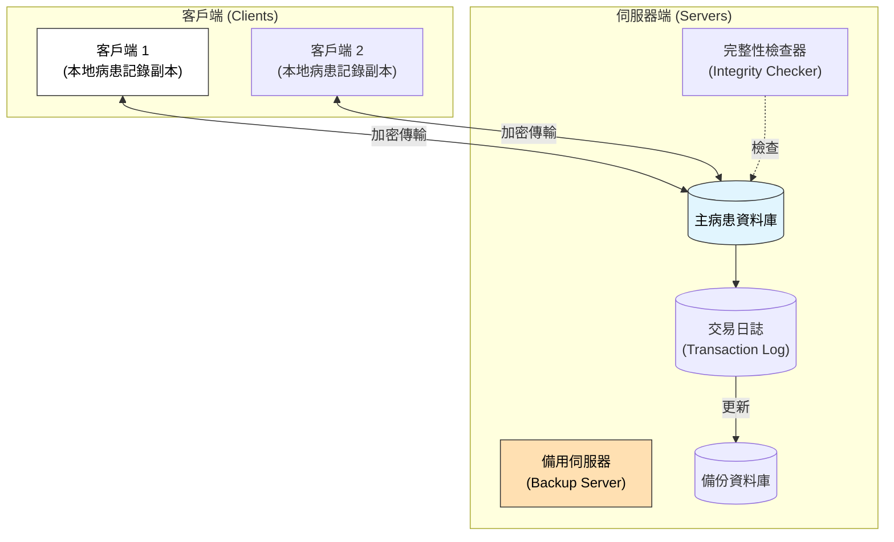

本章介紹瞭如何設計系統以承受外部的不利事件（如操作錯誤和網路攻擊），並強調韌性是一個社會技術問題，而不僅僅是技術問題。

### 1. 韌性工程導論 (Introduction)

*   **定義：** 韌性 (Resilience) 是判斷系統在遭遇破壞性事件（如設備故障、網路攻擊）時，維持**關鍵服務 (Critical services)** 連續性的能力,。
*   **與其他屬性的區別：**
    *   **可靠性 (Reliability)** 關注系統在正常情況下無故障運行的能力。
    *   **安全性 (Security)** 關注保護系統免受入侵。
    *   **韌性** 假設系統**將會**失敗或被攻破，重點在於如何恢復和維持服務。

#### 1.1 韌性的四個 R (The 4 Rs)
韌性工程基於四個基本活動：

1.  **識別 (Recognition)：** 識別正在發生的異常或攻擊。
2.  **抵抗 (Resistance)：** 採取措施防止系統失效（如拒絕惡意流量）。
3.  **恢復 (Recovery)：** 確保關鍵服務盡快恢復，即使非關鍵服務仍不可用。
4.  **復原 (Reinstatement)：** 將系統完全恢復到正常運作狀態。

---

### 2. 網路安全性 (Cybersecurity)

網路安全性是韌性的一個關鍵方面，重點在於保護系統免受網路攻擊，確保系統的可用性、完整性和機密性。

#### 2.1 網路韌性規劃 (Cyber-resilience planning)
這是一個識別資產、威脅並設計恢復機制的過程。

*(參考圖 14.2)*

*   **關鍵步驟：**
    -   **資產分類：** 區分關鍵資產（對運作至關重要）和其他資產。
    -   **威脅抵抗：** 例如使用身分驗證、加密和防火牆。
    -   **資產恢復：** 規劃在攻擊成功後如何恢復資產（如數據備份）。

---

### 3. 社會技術韌性 (Sociotechnical Resilience)

韌性不僅是技術問題，還包括人員、流程和組織文化。人員在處理未預見的情況時提供了靈活性和適應性。

#### 3.1 韌性組織的特徵
Hollnagel 提出韌性組織具備四種能力：
-   **回應能力 (Ability to respond)：** 適應風險並調整流程。
-   **監控能力 (Ability to monitor)：** 監控內部運作和外部環境的威脅。
-   **預期能力 (Ability to anticipate)：** 預測未來的威脅和機會。
-   **學習能力 (Ability to learn)：** 從經驗（包括成功和失敗）中學習。

#### 3.2 縱深防禦與瑞士起司模型 (Swiss Cheese Model)
為了提高韌性，應使用多層防禦（技術層 + 社會層）。
-   **瑞士起司模型 (James Reason)：**
    -   每一層防禦（起司片）都有漏洞（孔洞）。
    -   這些「孔洞」代表系統中的**潛在條件 (Latent conditions)**。
    -   當不同層的孔洞對齊時，威脅就能穿透防禦導致事故。
-   **策略：**
    -   增加防禦層數。
    -   使用多樣化的防禦（使孔洞位置不同）。
    -   減少潛在條件（修補漏洞）,。

---

### 4. 韌性系統設計 (Resilient Systems Design)

設計目標是確保系統即使在部分受損時，也能維持關鍵服務的運作。

#### 4.1 生存能力系統分析 (Survivable Systems Analysis)
這是一種用於識別系統弱點並提高生存能力的方法。

1.  **系統理解 (System understanding)：** 審查目標和需求。
2.  **識別關鍵服務 (Identify critical services)：** 必須維持的服務。
3.  **識別攻擊 (Identify attacks)：** 模擬攻擊場景。
4.  **識別軟肋與策略 (Identify softspots & survivability strategies)：** 找出脆弱組件並設計防禦。

#### 4.2 韌性工程設計模式：Mentcare 系統範例
為了提高醫療系統的韌性，設計必須確保即使伺服器不可用，醫生仍能存取病患記錄。

**Mentcare 的韌性架構特徵：**

| 特徵           | 韌性策略  | 描述                                                                         |
| :------------- | :-------- | :--------------------------------------------------------------------------- |
| **本地副本**   | 抵抗/恢復 | 在客戶端（筆記型電腦）保留當日病患記錄的副本。即使伺服器斷線，也能繼續看診。 |
| **備用伺服器** | 恢復      | 使用異地備份伺服器。如果主伺服器故障，可切換至備用伺服器。                   |
| **交易日誌**   | 復原      | 記錄所有資料庫變更。可用於重建資料庫狀態。                                   |
| **完整性檢查** | 識別      | 背景程式定期檢查資料庫是否被破壞或篡改。                                     |

**Mentcare 韌性架構圖 (Figure 14.12 概念)：**

*(參考來源:)*

#### 4.3 設計原則
-   **關鍵服務優先：** 識別並優先保護對業務生存至關重要的服務。
-   **冗餘與多樣性：** 使用備份硬體和不同的軟體實作來避免單點故障。
-   **針對恢復的設計：** 系統應設計成能從備份或降級模式中快速恢復。
