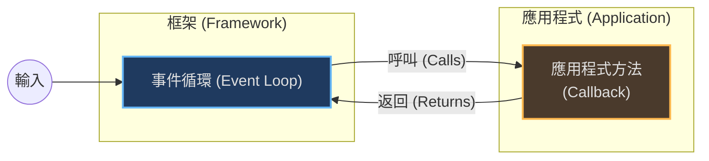
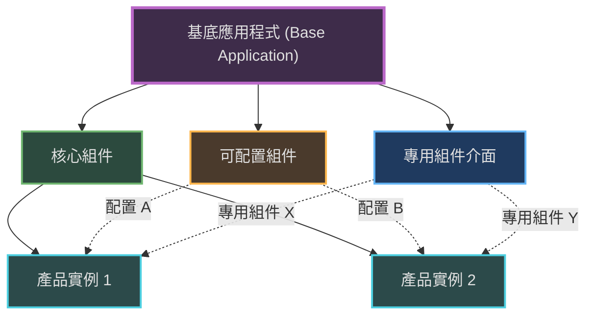
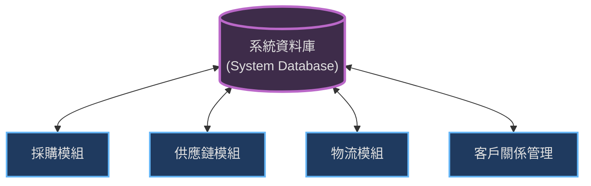

本章介紹了軟體重用的不同層次、技術（如應用程式框架和軟體產品線）以及如何通過配置和整合現有應用系統來進行開發。

### 1. 軟體重用導論 (Introduction)

軟體重用是使用現有軟體來開發新系統的策略。這已成為現代商業系統開發的主要方式，旨在降低成本、加快交付速度並提高軟體品質。

-   **重用的層次 (Levels of Reuse)**：
    -   **抽象層 (Abstraction level)**：重用軟體設計的知識，例如設計模式 (Design patterns) 或架構模式。
    -   **物件層 (Object level)**：直接重用程式庫中的物件或類別（如 Java 或 .NET 類別庫）。
    -   **組件層 (Component level)**：重用物件的集合或子系統（如 COTS 或 Web 服務）。
    -   **系統層 (System level)**：重用整個應用系統（如 ERP 系統）。

-   **重用的優缺點**：

| 優點 (Benefits)  | 描述                                                                     |
| :--------------- | :----------------------------------------------------------------------- |
| **提高可靠性**   | 重用的軟體已經過測試和使用，比新軟體更可靠。                             |
| **降低過程風險** | 開發成本的不確定性降低，因為只需估算配置或整合成本，而非從頭開發的成本。 |
| **有效利用專家** | 專家可以專注於開發可重用的組件，而不是重複做相同的工作。                 |
| **符合標準**     | 重用標準組件（如使用者介面）有助於確保符合介面標準。                     |
| **加速開發**     | 減少了開發和驗證的時間，加快產品上市。                                   |

| 問題 (Problems)        | 描述                                                               |
| :--------------------- | :----------------------------------------------------------------- |
| **維護成本增加**       | 如果重用的軟體原始碼不可用或不再受支援，維護將變得困難。           |
| **缺乏工具支援**       | 可能缺乏工具來編目和尋找可重用的軟體組件。                         |
| **"非此處發明"症候群** | 工程師可能認為自己寫的程式碼比重用的更好，或者認為重用缺乏挑戰性。 |
| **尋找與適應的困難**   | 尋找合適組件並使其適應新環境可能比從頭開發更費時。                 |

---

### 2. 重用全景 (The Reuse Landscape)

軟體重用有多種不同的技術和途徑。選擇哪種技術取決於開發時程、軟體預期壽命、團隊技能、系統關鍵性以及應用領域。

**重用技術概覽：**

```mermaid
graph TD
    Reuse["軟體重用技術"]
    
    Reuse --> Arch["架構與設計模式"]
    Reuse --> Comp["基於組件的開發"]
    Reuse --> AppFramework["應用程式框架"]
    Reuse --> Legacy["舊系統包裝"]
    Reuse --> Service["服務導向系統"]
    Reuse --> AppProduct["應用程式產品"]
    Reuse --> Gen["程式生成器"]
    Reuse --> ProductLine["軟體產品線"]
    Reuse --> ERP["ERP 系統"]
    Reuse --> COTS["COTS 整合"]

    style Reuse fill:#3E2C4A,stroke:#BA68C8,stroke-width:3px,color:#E0E0E0
    style Arch fill:#1F3A5F,stroke:#64B5F6,stroke-width:2px,color:#E0E0E0
    style Comp fill:#1F3A5F,stroke:#64B5F6,stroke-width:2px,color:#E0E0E0
    style AppFramework fill:#1F3A5F,stroke:#64B5F6,stroke-width:2px,color:#E0E0E0
    style Legacy fill:#1F3A5F,stroke:#64B5F6,stroke-width:2px,color:#E0E0E0
    style Service fill:#1F3A5F,stroke:#64B5F6,stroke-width:2px,color:#E0E0E0
    style AppProduct fill:#1F3A5F,stroke:#64B5F6,stroke-width:2px,color:#E0E0E0
    style Gen fill:#1F3A5F,stroke:#64B5F6,stroke-width:2px,color:#E0E0E0
    style ProductLine fill:#1F3A5F,stroke:#64B5F6,stroke-width:2px,color:#E0E0E0
    style ERP fill:#1F3A5F,stroke:#64B5F6,stroke-width:2px,color:#E0E0E0
    style COTS fill:#1F3A5F,stroke:#64B5F6,stroke-width:2px,color:#E0E0E0
```

-   **關鍵規劃因素**：
    -   **開發時程**：時間緊迫時，應優先考慮重用現成系統 (COTS)。
    -   **預期軟體壽命**：長壽命系統應專注於可維護性，可能需要擁有源代碼（如開放原始碼）。
    -   **團隊技能**：選擇團隊熟悉的技術。
    -   **關鍵性 (Criticality)**：對於安全關鍵系統，可能需要對重用代碼進行認證，這通常很困難。
    -   **應用領域**：某些領域（如醫療、製造）有成熟的通用產品可供重用。

---

### 3. 應用程式框架 (Application Frameworks)

應用程式框架是比起單一物件更粗粒度的重用。它提供了一個骨架架構和一組具體及抽象類別，開發者可以通過繼承和實例化來建立特定的應用程式。

-   **特點**：
    -   **控制反轉 (Inversion of Control)**：與傳統程式庫不同，框架通常控制主事件循環，並在特定事件發生時呼叫應用程式的代碼（回調/Callback）。
    -   **基於設計模式**：框架通常實現了如 MVC (Model-View-Controller)、Observer、Strategy 等設計模式。

-   **Web 應用程式框架 (WAF)**：這是目前最常見的框架類型（如 Django, Ruby on Rails, Spring），支援安全、動態網頁、資料庫整合和會話管理。

**控制反轉示意圖：**

---

### 4. 軟體產品線 (Software Product Lines)

軟體產品線是一組具有公共架構和共享組件的應用程式，每個應用程式針對特定的客戶或需求進行了專門化。這在印表機控制、行動裝置等嵌入式系統中非常常見。

-   **基底應用程式 (Base Application)**：產品線的核心，包含：
    1.  **核心組件**：所有成員都使用的基礎設施。
    2.  **可配置組件**：可根據需求修改的組件。
    3.  **專用組件**：針對特定產品實例開發的組件。

**產品線架構概念：**

-   **專門化類型 (Types of Specialization)**：
    -   **平台專門化**：針對不同硬體或作業系統。
    -   **環境專門化**：針對不同操作環境（如不同的通訊設備）。
    -   **功能專門化**：針對不同客戶需求增加或修改功能。
    -   **流程專門化**：適應不同的業務流程。

-   **配置 (Configuration)**：
    -   **設計時配置 (Design-time)**：修改源代碼或組件來創建新版本（適用於產品線）。
    -   **部署時配置 (Deployment-time)**：使用配置檔案設定參數（適用於通用軟體）。

---

### 5. 應用系統重用 (Application System Reuse)

這涉及重用整個應用系統，通常稱為 COTS (Commercial Off-The-Shelf) 系統。

#### 5.1 可配置應用系統 (Configurable Application Systems)
這些是通用的系統，可以透過參數設置或內建腳本語言來適應特定業務需求。
-   **ERP 系統 (Enterprise Resource Planning)**：如 SAP 或 Oracle，是大規模的整合系統，支援採購、庫存、製造等多種業務功能。
-   **架構**：通常包含一個共享資料庫和多個業務模組。

**ERP 系統架構：**

#### 5.2 整合應用系統 (Integrated Application Systems)
當單一系統無法滿足需求時，可以整合多個不同的應用系統。
-   **挑戰**：
    -   系統間的數據交換格式可能不同。
    -   系統可能對環境有不相容的假設（如都想獨佔某個資源）。
-   **服務包裝 (Service Wrapping)**：通常需要編寫適配器 (Adaptors) 或包裝器 (Wrappers) 來隱藏應用系統的細節，並提供標準介面供其他系統呼叫。

**應用系統包裝：**

### 關鍵點 (Key Points)
-   **軟體重用**是降低開發成本和提高軟體品質的關鍵策略。
-   **應用程式框架**提供了應用程式的骨架，透過繼承和回調機制進行擴展。
-   **軟體產品線**共享通用架構，通過配置和專門化來創建針對不同客戶的系統版本。
-   **ERP 系統**是可配置的大型應用系統，通過參數設置來適應不同組織的業務流程。
-   **整合應用系統**涉及將多個現成系統（如 COTS）組合成一個新系統，通常需要使用包裝器來解決介面不相容問題。
