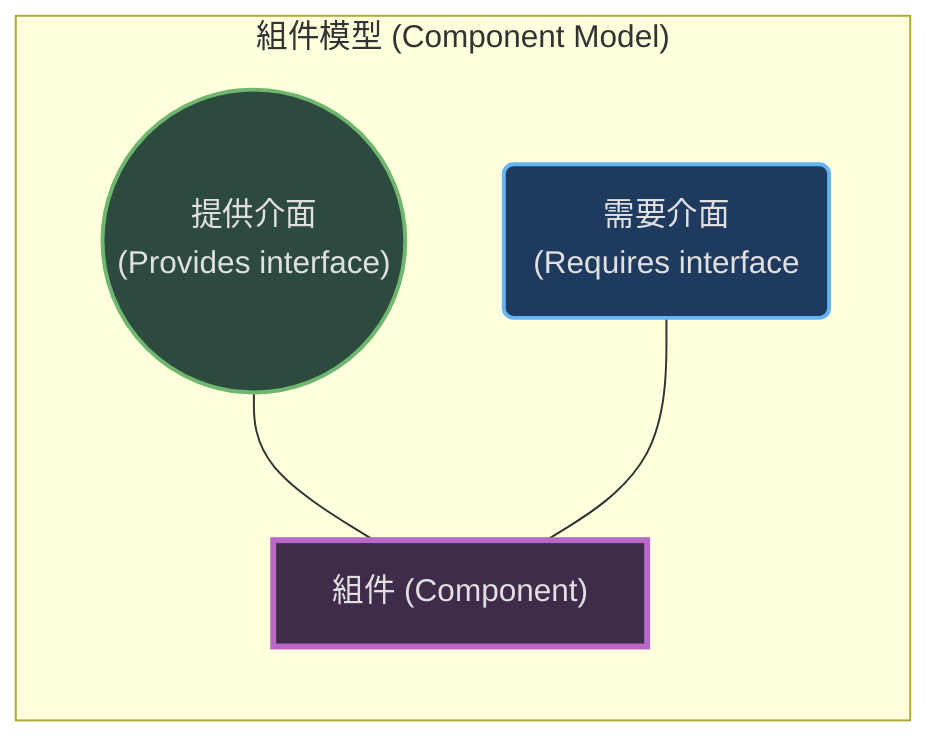
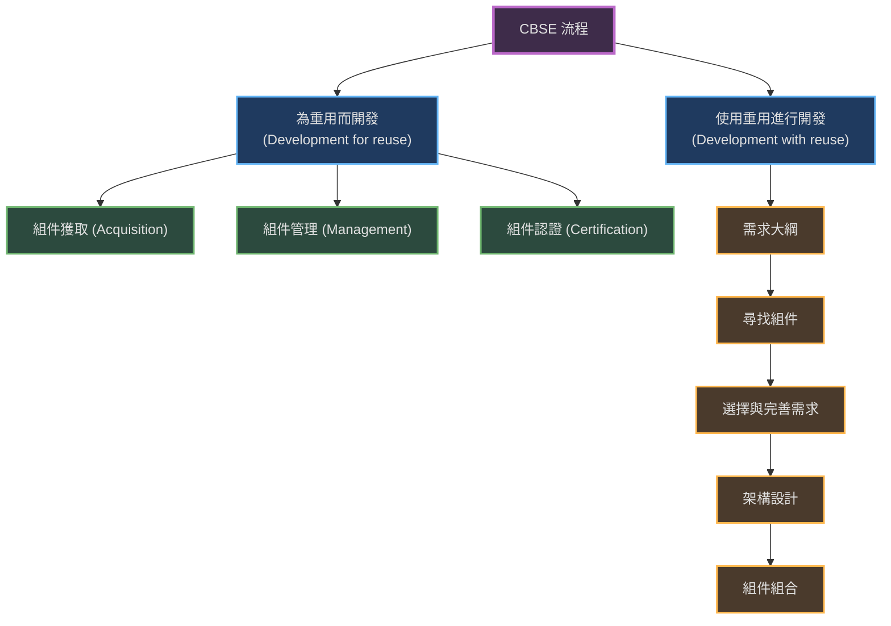
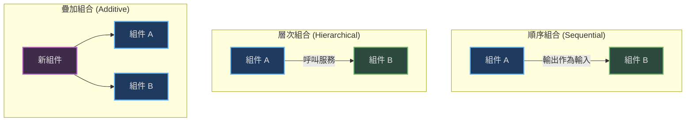

本章介紹了將軟體開發視為組件（Components）的組合，而非從頭開始編寫程式碼的過程。

### 1. 組件與組件模型 (Components and Component Models)

基於組件的軟體工程 (CBSE) 是一種基於重用 (Reuse) 的方法，用於定義、實作和組合鬆散耦合的獨立組件以形成系統。

#### 1.1 什麼是組件？
*   **定義：** 軟體組件是一個獨立的軟體單元，可以與其他組件組合以創建軟體系統。
*   **作為服務提供者：** 組件可以被視為服務的提供者。當系統需要執行某項功能時，它會呼叫組件來提供該服務。
*   **組件介面 (Interfaces)：** 組件透過介面進行互動，主要分為兩類：
    1.  **提供介面 (Provides interface)：** 定義了組件提供給其他使用者的服務（API）。
    2.  **需要介面 (Requires interface)：** 指定了該組件為了正常運作，需要系統中其他組件提供的服務。

#### 1.2 組件的特徵 (Component Characteristics)
為了使組件有效重用，它們應具備以下特徵:

| 特徵                      | 描述                                             |
| :------------------------ | :----------------------------------------------- |
| **可組合 (Composable)**   | 所有外部互動必須透過公開定義的介面進行。         |
| **可部署 (Deployable)**   | 組件必須是獨立的二進制單元，不需要編譯即可部署。 |
| **已記錄 (Documented)**   | 組件必須有完整的文檔，說明其功能及使用方法。     |
| **獨立 (Independent)**    | 組件應盡可能獨立於特定的與其他組件的依賴關係。   |
| **標準化 (Standardized)** | 組件必須符合標準的組件模型（如 EJB, .NET）。     |

#### 1.3 組件模型 (Component Models)
組件模型定義了組件實作、文檔和部署的標準，確保組件之間可以互動。組件模型的基本要素包括:

-   **介面 (Interfaces)：** 定義介面的結構和內容。
-   **使用資訊 (Usage information)：** 定義如何命名組件以及如何存取組件的元數據。
-   **部署與使用 (Deployment and use)：** 定義組件如何打包、部署以及在此過程中如何配置。

---

### 2. CBSE 流程 (CBSE Processes)

CBSE 流程是支援基於組件開發的軟體流程。主要分為兩種類型:

1.  **為重用而開發 (Development for reuse)：** 開發將在其他應用程式中重用的組件或服務。
2.  **使用重用進行開發 (Development with reuse)：** 使用現有組件來開發新應用程式。

#### 2.1 為重用而開發 (CBSE for reuse)
這涉及開發通用組件，使其適用於不同的應用場景。關鍵活動包括：
-   **組件獲取：** 獲取組件以進行重用或開發。
-   **組件管理：** 確保組件被正確編目、存儲並可供重用。
-   **組件認證：** 檢查組件並證明其符合規範，這對於建立使用者的信心至關重要。

#### 2.2 使用重用進行開發 (CBSE with reuse)
這與傳統軟體開發的主要區別在於：
-   **需求靈活性：** 使用者需求最初只是大綱，並根據可用的組件進行細化和修改。
-   **組件搜尋與選擇：** 在架構設計前後，都需要搜尋和評估候選組件。
-   **權衡 (Trade-offs)：** 經常需要在理想需求和可用組件的功能之間做出妥協。

---

### 3. 組件組合 (Component Composition)

組件組合是將組件與其他組件以及專門編寫的「膠水程式碼」(glue code) 整合在一起，以創建系統或新組件的過程。

#### 3.1 組合類型 (Types of Composition)

1.  **順序組合 (Sequential composition)：** 依序呼叫組件，前一個組件的輸出作為後一個組件的輸入。
2.  **層次組合 (Hierarchical composition)：** 一個組件直接呼叫另一個組件提供的服務。
3.  **疊加組合 (Additive composition)：** 將兩個或多個組件放在一起（疊加）以創建一個結合其功能的新組件。

#### 3.2 介面不相容性 (Interface Incompatibility)
當重用的組件介面不匹配時，會發生不相容性。主要有三種類型:
-   **參數不相容 (Parameter incompatibility)：** 操作名稱相同，但參數類型或數量不同。
-   **操作不相容 (Operation incompatibility)：** 提供介面和需要介面中的操作名稱不同。
-   **操作不完整 (Operation incompleteness)：** 一個組件的提供介面是另一個組件需要介面的子集（或反之）。

#### 3.3 適配器組件 (Adaptor Components)
為了解決不相容性，需要編寫**適配器 (Adaptor)** 組件來協調兩個重用組件的介面。適配器將一個介面轉換為另一個介面，處理參數轉換和操作對應。

#### 3.4 組合的權衡 (Composition Trade-offs)
在組合組件時，需要在不同因素間進行權衡，例如**適應性 (Adaptability)** 與 **效能 (Performance)** 之間的衝突。例如，使用單個多功能組件可能比組合多個單一功能組件效能更好，但適應性較差。
