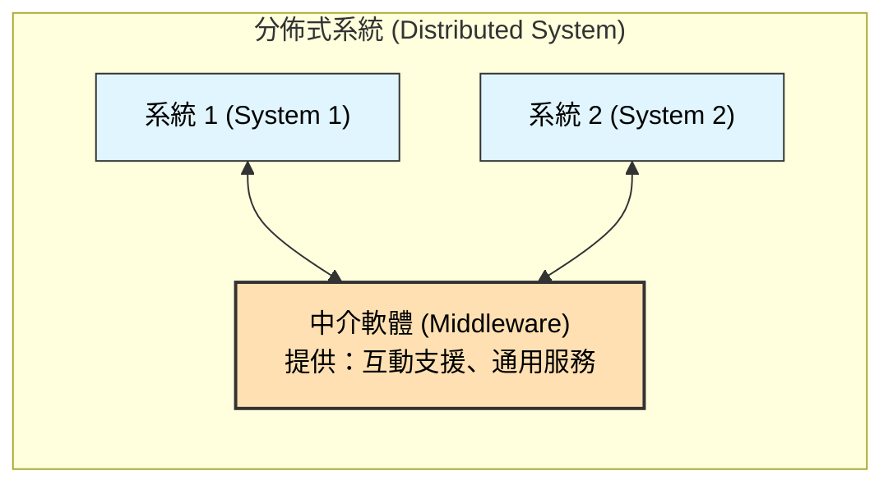
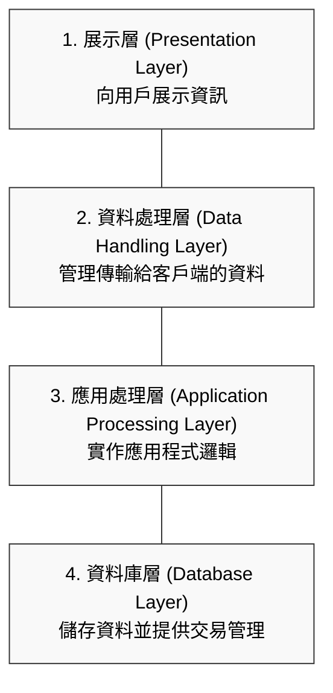
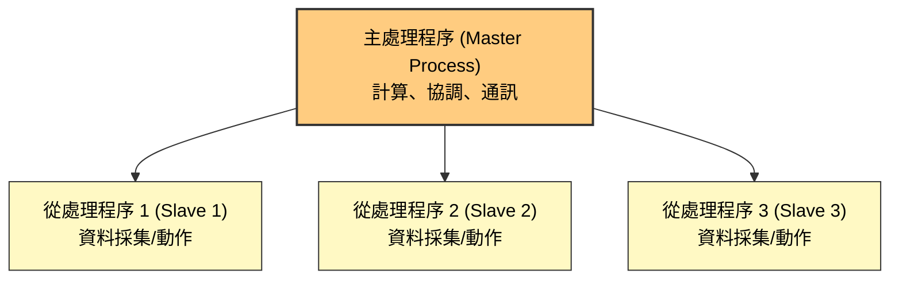
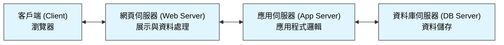

本章介紹了分佈式系統的設計問題、客戶端-伺服器運算、架構模式以及軟體即服務 (SaaS)。

### 1. 分佈式系統 (Distributed Systems)

分佈式系統是指軟體在多個電腦上執行，而非單一機器上的單一系統。即便是看似獨立的單機應用程式（如相片編輯器），如果它依賴遠端服務（如備份或分享），也是分佈式系統的一部分。

-   **優點：**
    -   **資源共享 (Resource sharing)：** 允許分享硬體和軟體資源。
    -   **開放性 (Openness)：** 使用標準協定，允許不同廠商的硬體和軟體互通。
    -   **並行處理 (Concurrency)：** 多個處理程序可同時運作。
    -   **可擴展性 (Scalability)：** 可透過增加資源來提升系統處理能力。
    -   **容錯性 (Fault tolerance)：** 部分故障不一定導致整個系統崩潰。

#### 1.1 設計議題 (Design Issues)
分佈式系統設計比集中式系統更複雜，需考量以下六個關鍵議題：

| 議題                              | 描述                                                                                         |
| :-------------------------------- | :------------------------------------------------------------------------------------------- |
| **透明性 (Transparency)**         | 用戶應在不知情的情況下使用分佈式資源。完全透明很難達成，因為網路故障和速度差異是顯而易見的。 |
| **開放性 (Openness)**             | 系統應使用標準協定，以便不同供應商的組件可以互操作。                                         |
| **可擴展性 (Scalability)**        | 系統應能透過增加資源來應對增加的工作負載（規模、分佈、可管理性）。                           |
| **安全性 (Security)**             | 需定義並實施跨系統的安全政策（機密性、完整性、可用性）。                                     |
| **服務品質 (Quality of service)** | 需保證系統的回應時間和吞吐量，這取決於網路速度和處理能力。                                   |
| **故障管理 (Failure management)** | 需偵測、容忍並從故障中恢復。分佈式系統的故障部分不應影響整體服務。                           |

#### 1.2 互動模型 (Models of Interaction)
電腦間的互動主要有兩種類型：
-   **程序互動 (Procedural interaction)：** 一台電腦呼叫另一台電腦的已知服務並等待結果（如 RPC）。這是同步的。
-   **訊息互動 (Message-based interaction)：** 發送端傳送關於所需服務的訊息，接收端解析並處理。這是非同步的，且解耦程度較高。

#### 1.3 中介軟體 (Middleware)
中介軟體是用於管理分佈式系統中各組件間互動的軟體。它提供通用的服務，並處理異質性（不同的作業系統、硬體、語言）。

---

### 2. 客戶端-伺服器運算 (Client–Server Computing)

這是最廣泛使用的分佈式架構。系統被建模為一組提供服務的伺服器和使用這些服務的客戶端。

-   **邏輯分層 (Logical Layers)：** 為了設計分佈式應用，通常將應用程式結構化為四個邏輯層，這些層可以分佈在不同的電腦上：

---

### 3. 分佈式系統的架構模式 (Architectural Patterns for Distributed Systems)

本章介紹了五種常用的架構模式。

#### 3.1 主從架構 (Master-Slave Architecture)
-   **適用場景：** 即時系統 (Real-time systems)，需要保證回應時間。
-   **運作方式：** 一個「主」處理程序控制多個「從」處理程序。「從」處理程序通常負責專門的任務（如資料採集）。

#### 3.2 雙層客戶端-伺服器架構 (Two-tier Client-Server Architecture)
-   **瘦客戶端 (Thin-client)：** 展示層在客戶端，其他所有層在伺服器。易於管理，但在伺服器和網路上有重負載。
-   **胖客戶端 (Fat-client)：** 展示層和應用處理層（部分或全部）在客戶端。利用客戶端運算能力，但管理（如軟體更新）較困難。

#### 3.3 多層客戶端-伺服器架構 (Multi-tier Client-Server Architecture)
-   **適用場景：** 高交易量的系統（如銀行系統）。
-   **運作方式：** 將邏輯層分佈在多個伺服器上（如網頁伺服器、應用伺服器、資料庫伺服器）。這提高了可擴展性。

#### 3.4 分佈式組件架構 (Distributed Component Architecture)
-   **適用場景：** 資源來自不同系統，或作為多層架構的實作模型。
-   **運作方式：** 系統是一組透過中介軟體（如 CORBA, EJB）通訊的分佈式組件。允許延遲綁定和靈活的重構。

#### 3.5 點對點架構 (Peer-to-Peer Architecture)
-   **適用場景：** 客戶端交換本地儲存的資訊，不需要中心伺服器管理資料（如 BitTorrent）。
-   **運作方式：** 節點既是客戶端也是伺服器。
    -   **去中心化 (Decentralized)：** 完全沒有中心伺服器，節點直接通訊。
    -   **半中心化 (Semi-centralized)：** 使用「超級節點」或伺服器來幫助建立連線或索引，但資料交換直接進行。

---

### 4. 軟體即服務 (Software as a Service, SaaS)

SaaS 是一種在遠端伺服器上託管軟體，並透過瀏覽器讓用戶存取的模式。用戶不擁有軟體，而是按使用付費或透過廣告支持。

-   **關鍵實作議題：**
    1.  **可配置性 (Configurability)：** 軟體如何為不同客戶進行配置（品牌、業務規則、資料庫擴充）？
    2.  **多租戶 (Multi-tenancy)：** 許多用戶使用同一個軟體實例，但感覺像是獨佔使用。
    3.  **可擴展性 (Scalability)：** 系統如何應對無法預測的用戶增長？

-   **多租戶資料庫 (Multi-tenant Databases)：** 為了效率，SaaS 供應商通常使用單一資料庫，透過「租戶識別碼 (Tenant ID)」來區分不同客戶的資料，而不是為每個客戶建立獨立的資料庫。

**多租戶資料庫示意圖：**

| Transaction ID | Tenant ID     | User  | Transaction Details |
| :------------- | :------------ | :---- | :------------------ |
| 101            | **Company_A** | Alice | Order #999          |
| 102            | **Company_B** | Bob   | Order #100          |
| 103            | **Company_A** | Alice | Payment #999        |

*(所有客戶的資料存在同一張表中，透過 Tenant ID 邏輯隔離)*
