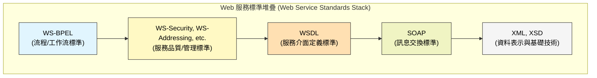
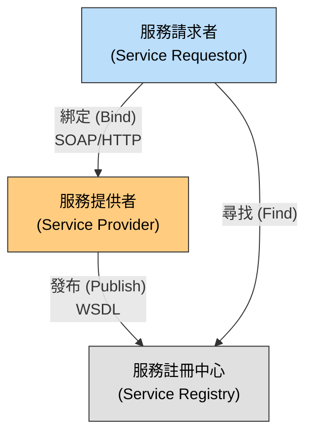
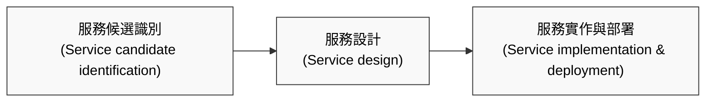
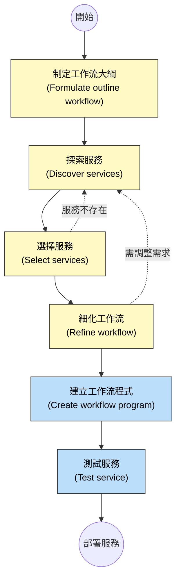

本章介紹了如何使用可重複使用的服務來建構分散式軟體系統，重點涵蓋了 SOAP 與 RESTful 兩種主要的架構風格，以及服務工程與服務組合的流程。

### 1. 服務導向架構 (Service-oriented Architecture, SOA)

**核心概念：**
-   **服務 (Service)：** 是一種鬆散耦合、可重複使用的軟體元件，透過標準介面提供功能。服務是獨立的，提供者可以在不影響使用者的情況下更改服務實作。
-   **優勢：** 允許跨組織的應用程式進行互動（例如供應鏈系統），促進資訊交換。

#### 1.1 Web 服務標準 (Web Service Standards)
SOA 依賴於一系列 XML 的標準來確保互通性。

-   **SOAP (Simple Object Access Protocol)：** 訊息交換標準。定義了服務之間傳遞訊息的包裝方式。
-   **WSDL (Web Service Description Language)：** 介面定義標準。定義服務提供什麼操作、輸入/輸出訊息格式以及如何綁定。
-   **WS-BPEL：** 流程標準。用於定義涉及多個服務的工作流（Workflow）。

#### 1.2 SOA 的互動模型
SOA 涉及三個主要角色：服務提供者、服務請求者和服務註冊中心（雖然現代應用中 UDDI 註冊中心已較少公開使用，但概念仍存在於企業內部）。

---

### 2. RESTful 服務 (RESTful Services)

由於 SOAP/WSDL 標準過於繁重（Heavyweight），REST (Representational State Transfer) 作為一種輕量級架構風格被廣泛採用，特別是在 Web 應用中。

-   **資源 (Resources)：** 在 REST 中，一切都被視為「資源」，每個資源都有一個唯一的識別符（URL）。
-   **操作：** 使用標準的 HTTP 動詞來操作資源。

**RESTful 資源操作對照表 (Resources and Actions)：**

| HTTP 動詞  | 資源操作 | 描述 (Description)                                   |
| :--------- | :------- | :--------------------------------------------------- |
| **POST**   | Create   | 建立一個新資源。                                     |
| **GET**    | Read     | 讀取資源的值（回傳資源的表示形式，如 JSON 或 XML）。 |
| **PUT**    | Update   | 更新資源的值。                                       |
| **DELETE** | Delete   | 刪除資源，使其無法存取。                             |

-   **優點：** 低開銷（Low overhead）、易於實作、直接利用現有的 Web 基礎設施。
-   **缺點：** 較難處理複雜的介面定義和服務品質（QoS）控制。

---

### 3. 服務工程 (Service Engineering)

服務工程是開發可重複使用服務的過程。

#### 3.1 服務工程流程 (Figure 18.8)

#### 3.2 服務分類 (Service Classification)
為了識別可重複使用的服務，可以將服務分為不同類型（基於 Erl 的分類）：

| 服務類型                       | 描述                                       | 範例                         |
| :----------------------------- | :----------------------------------------- | :--------------------------- |
| **功能型服務 (Utility)**       | 實作通用的業務功能，可被許多應用程式使用。 | 貨幣轉換、員工定位檢查。     |
| **業務服務 (Business)**        | 與特定的業務功能相關。                     | 處理費用報銷、檢查信用評等。 |
| **協調服務 (Coordination)**    | 負責更大規模業務流程中的順序控制。         | 訂購流程協調。               |
| **任務導向 (Task-oriented)**   | 對應特定的業務活動。                       | 驗證申請表。                 |
| **實體導向 (Entity-oriented)** | 對應業務資料實體（如資源）。               | 文件翻譯、申請表單處理。     |

#### 3.3 服務介面設計
-   **SOAP 服務：** 需設計 WSDL，定義操作、訊息類型和錯誤處理。
-   **RESTful 服務：** 需設計 URL 結構和 HTTP 動詞的對應，並定義資源的 JSON 或 XML 格式。

---

### 4. 服務組合 (Service Composition)

服務組合是將多個現有服務整合在一起以建立新應用程式或複合服務的過程。這通常透過**工作流 (Workflow)** 來實現。

#### 4.1 服務建構流程 (Service Construction by Composition)

這是透過組合現有服務來開發軟體的流程：

#### 4.2 工作流設計 (Workflow Design)
-   使用 **BPMN (Business Process Modeling Notation)** 等圖形化語言來描述業務流程。
-   **關鍵元素：**
    -   活動 (Activities)：圓角矩形，代表由人或系統執行的工作。
    -   事件 (Events)：圓形，代表開始、結束或中間發生的事。
    -   閘道 (Gateways)：菱形，代表決策點（例如：檢查是否有空房）。
    -   流向 (Flows)：箭頭，代表執行順序或訊息傳遞。

#### 4.3 測試服務組合 (Testing Service Compositions)
測試由外部服務組成的系統非常困難，原因包括：
-   **外部服務是黑箱：** 無法查看原始碼。
-   **非功能性行為不確定：** 外部服務的效能和可靠性可能隨時間變化。
-   **成本：** 呼叫外部服務可能需要付費。
-   **補償操作 (Compensation actions)：** 如果交易失敗（例如機票訂了但飯店沒訂到），需要測試「復原」機制（取消機票）是否正常運作。

### 關鍵點 (Key Points)
-   **服務導向架構 (SOA)** 是一種基於鬆散耦合服務的架構風格，支援跨組織計算。
-   **Web 服務標準** (SOAP, WSDL, WS-BPEL) 支援重量級的服務定義與協調。
-   **RESTful 服務** 使用 HTTP 協定和 URL 資源操作，是一種輕量級的替代方案。
-   **服務工程** 涉及識別候選服務、設計介面和實作。
-   **服務組合** 是透過工作流將現有服務整合，BPMN 是常用的工作流設計語言。
