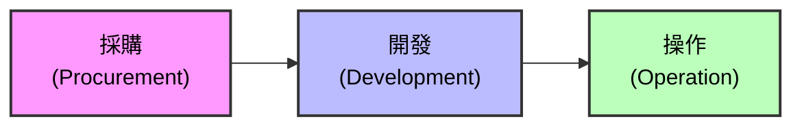
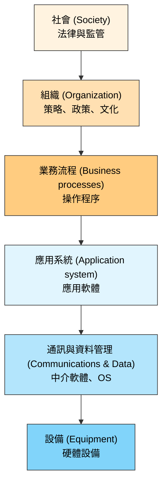
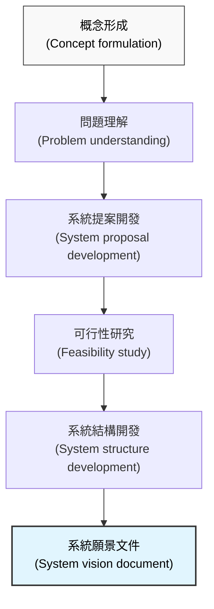
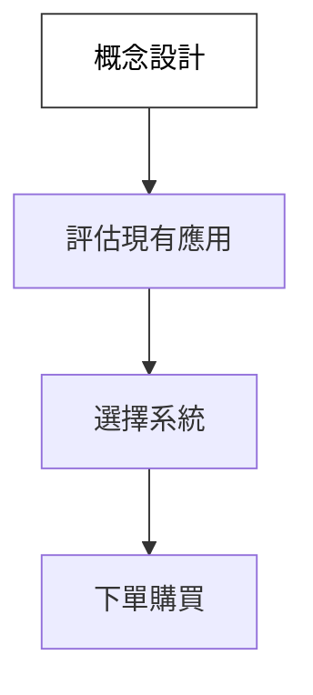
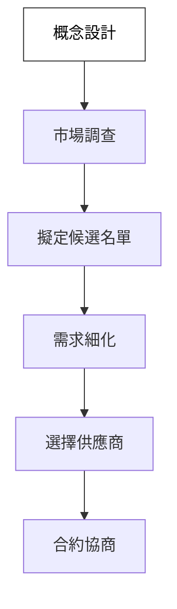
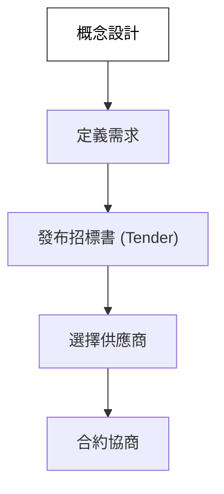
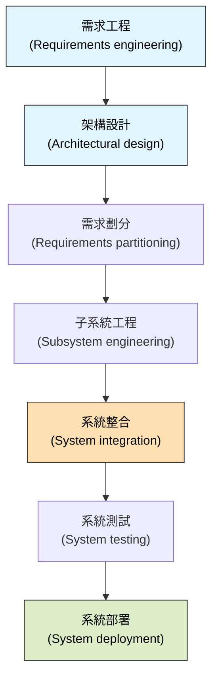

本章強調了軟體工程師理解更廣泛的系統工程背景的重要性，特別是對於大型、複雜的社會技術系統。

### 1. 系統工程基礎 (Systems Engineering Basics)

系統工程是設計、實作、部署和操作包含硬體、軟體及人員的系統的活動。

-   **系統的定義：** 系統是一組相互關聯的組件，它們協同工作以實現某個目的。系統大於其各部分的總和。
-   **系統的類型：**
    -   **技術計算機系統 (Technical computer-based systems)：** 包括硬體和軟體，但不包括操作人員和操作過程（例如：文書處理軟體本身）。
    -   **社會技術系統 (Sociotechnical systems)：** 包括技術系統，加上操作系統的人員、操作過程、組織政策及外部監管環境。

**系統工程的階段 (Stages of Systems Engineering):**

---

### 2. 社會技術系統 (Sociotechnical Systems)

社會技術系統的行為不僅受技術影響，還受組織和社會因素影響。

#### 2.1 系統層次 (System Layers)
社會技術系統可以視為分層結構，每一層都依賴於其下層。

*(參考圖 19.3：社會技術系統的分層結構)*

-   **組織因素：** 影響系統設計與運作的組織因素包括：
    -   **流程變更 (Process changes)：** 新系統是否要求人們改變工作方式？
    -   **工作變更 (Job changes)：** 是否會導致技能過時或裁員？
    -   **組織政治 (Organizational politics)：** 系統是否改變了權力結構？

#### 2.2 湧現屬性 (Emergent Properties)
湧現屬性是整個系統的屬性，而不是個別組件的屬性。它們只有在系統組件整合後才會顯現。

| 屬性類型             | 描述                                             | 範例                                                                           |
| :------------------- | :----------------------------------------------- | :----------------------------------------------------------------------------- |
| **功能性湧現屬性**   | 只有在組件整合後才能實現的系統功能。             | 腳踏車作為交通工具的功能。                                                     |
| **非功能性湧現屬性** | 系統在其環境中的行為表現。對計算機系統至關重要。 | 可靠性 (Reliability)、安全性 (Safety)、保密性 (Security)、可用性 (Usability)。 |

-   **不可靠性的來源：**
    -   硬體故障。
    -   軟體故障。
    -   操作失敗（人為錯誤）。
    -   **故障傳播 (Failure propagation)：** 一個組件的故障可能導致其他組件的連鎖反應。

-   **非確定性 (Non-determinism)：** 社會技術系統通常是非確定性的。相同的輸入並不總是產生相同的輸出，因為系統包含人員（行為不可預測）且系統狀態經常變化。

---

### 3. 概念設計 (Conceptual Design)

概念設計發生在決定購買或開發系統之前。目的是建立系統的高層次願景。

**概念設計活動：**

*(參考圖 19.7)*

-   **可行性研究：** 評估提出的系統是否能夠使用現有技術、在預算範圍內及時開發出來。
-   **系統願景文件：** 包含兩部分：
    1.  給決策者的高層次摘要（可使用用戶故事）。
    2.  用於採購和需求的詳細附錄。

---

### 4. 系統採購 (System Procurement)

採購是決定購買一個或多個系統的過程。大型複雜系統通常由現成軟體 (COTS) 和客製化軟體混合而成。

**不同類型的採購流程：**

*(參考圖 19.9：系統採購流程)*

-   **關鍵問題：** 需求通常需要根據可用系統進行調整。如果堅持特定需求，可能會排除更具成本效益的現成解決方案。

---

### 5. 系統開發 (System Development)

系統開發通常遵循 V 模型或瀑布模型，因為需要協調硬體和軟體開發，且通常涉及多個分包商。

**系統開發流程：**

*(參考圖 19.10)*

-   **需求劃分 (Requirements Partitioning)：** 決定哪些需求由硬體處理，哪些由軟體處理，哪些由人工操作處理。
-   **需求與設計螺旋 (The Spiral)：** 在系統層次，需求和架構設計是緊密交織的。開發過程像螺旋一樣，從抽象到詳細不斷迭代。

---

### 6. 系統操作與演進 (System Operation and Evolution)

-   **系統操作：** 人員使用系統的方式可能與設計者預期的不同。操作員經常會為了處理由於設計疏忽導致的問題而「發明」新的流程。
-   **系統演進：** 大型系統壽命很長，必須演進。演進成本高昂的原因包括：
    -   **相互依賴性：** 更改一個子系統可能影響其他子系統。
    -   **隱性知識流失：** 原始設計決策的原因可能未被記錄，且原設計團隊已離開。
    -   **遺留系統 (Legacy Systems)：** 舊技術難以維護。

### 關鍵點 (Key Points)
-   系統工程關注社會技術系統的規範、採購、設計和測試。
-   社會技術系統包括硬體、軟體和人員，並位於組織環境中。
-   **湧現屬性**（如安全性、可靠性）是整個系統的特性，不能單純歸因於個別組件。
-   **概念設計**是在詳細開發前確定系統高層次願景的關鍵階段。
-   **採購**決策直接影響系統架構和需求。
-   系統開發通常涉及硬體和軟體的並行開發與最後的整合。
