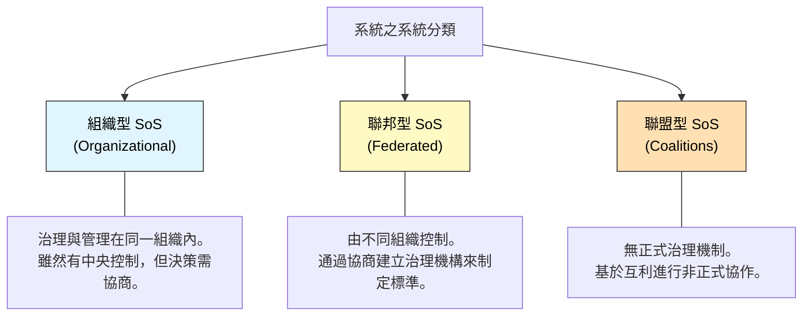
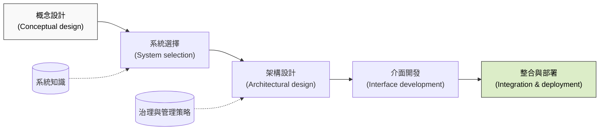
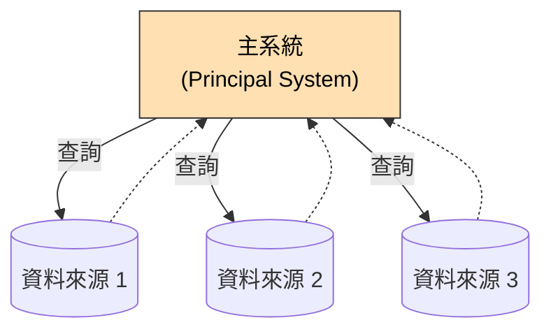
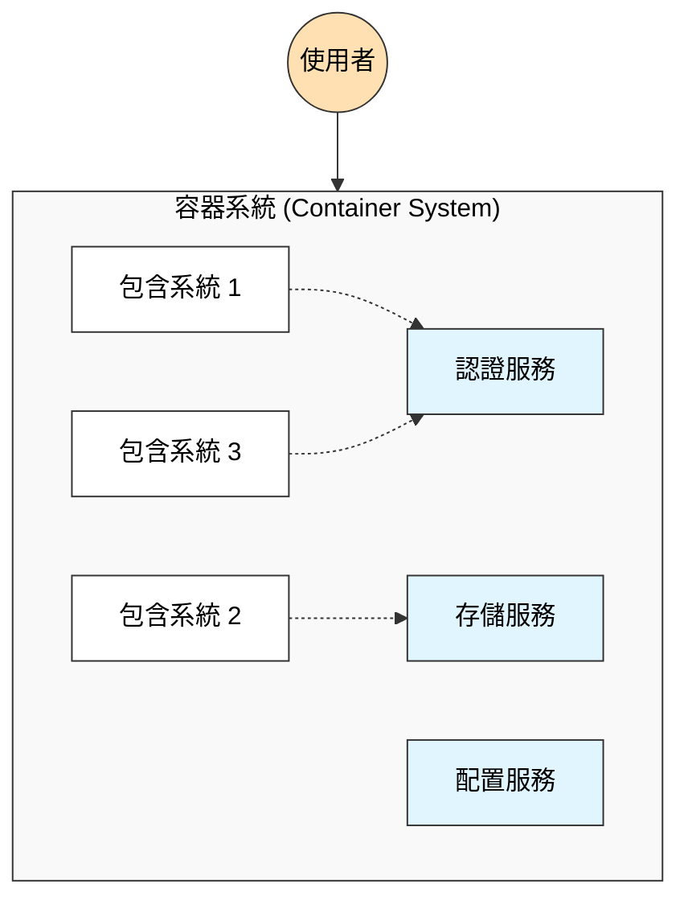
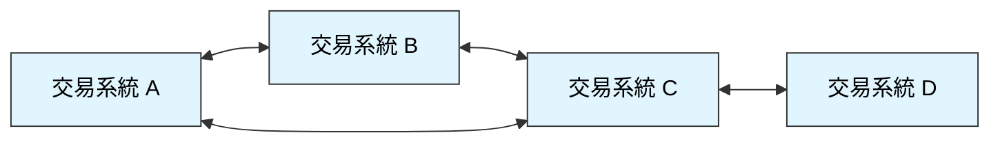

本章探討了當系統由多個獨立管理、操作的系統組成時所面臨的複雜性與工程挑戰。

### 1. 系統之系統基礎 (Systems of Systems Basics)

隨著軟體重用的發展，現代大型系統很少是從零開始構建的，而是通過整合現有的複雜系統來創建的。

-   **定義：** 系統之系統 (SoS) 是一個其組成元素本身就是有用系統的系統。這些組成系統通常由不同的機構獨立擁有和管理。
-   **關鍵區別：** 區分 SoS 與一般大型系統的關鍵在於**管理獨立性 (Managerial Independence)**。SoS 的部分系統由不同的組織或組織內的不同部門擁有，因此適用不同的規則和策略。

**Maier 的 SoS 五大特徵：**

| 特徵                                      | 描述                                                        |
| :---------------------------------------- | :---------------------------------------------------------- |
| **運作獨立性 (Operational independence)** | 系統的組成部分在不作為 SoS 一部分時，仍能作為獨立系統運作。 |
| **管理獨立性 (Managerial independence)**  | 組成系統由不同的組織實體管理。這是 SoS 的核心特徵。         |
| **演進式開發 (Evolutionary development)** | SoS 不是一次性開發完成的，而是隨著時間演進。                |
| **湧現 (Emergence)**                      | SoS 整體具有其組成系統所不具備的特性。                      |
| **地理分佈 (Geographical distribution)**  | 元素通常分佈在不同地點，依賴網路通訊。                      |

---

### 2. 系統複雜性 (System Complexity)

SoS 的工程問題主要源於其固有的複雜性。複雜性取決於系統元素之間的關係數量和類型。

#### 2.1 複雜性的類型
在 SoS 中，複雜性不僅是技術性的，還包括管理和治理層面：

| 複雜性類型                             | 來源                                                         |
| :------------------------------------- | :----------------------------------------------------------- |
| **技術複雜性 (Technical complexity)**  | 源於系統組件之間的關係（API、數據交換等）。                  |
| **管理複雜性 (Managerial complexity)** | 源於系統與其管理者之間的關係，以及不同系統管理者之間的互動。 |
| **治理複雜性 (Governance complexity)** | 源於影響系統的法律、法規、政策以及決策過程之間的關係。       |

---

### 3. 系統之系統的分類 (SoS Classification)

書中提出了一種基於**治理 (Governance)** 模型的分類方式，這比傳統的分類（Directed, Collaborative, Virtual）更具描述性。

-   **組織型 (Organizational)：** 類似於 Maier 的 "Directed"。所有系統歸同一組織擁有，但由不同部門管理。
-   **聯邦型 (Federated)：** 類似於 "Collaborative"。不同組織合作，並建立一個治理機構（如空中交通管制系統）。
-   **聯盟型 (Coalitions)：** 類似於 "Virtual"。沒有正式的治理機構，依賴自我規範和共同利益（如網際網路）。

---

### 4. 簡化論與複雜系統 (Reductionism and Complex Systems)

傳統軟體工程基於**簡化論 (Reductionism)**，即通過將系統分解為組件來處理複雜性。然而，這種方法在 SoS 中往往失效。

-   **簡化論的假設 vs. SoS 的現實：**

| 簡化論假設               | SoS 現實 (Wicked Problems)     |
| :----------------------- | :----------------------------- |
| 系統擁有者控制開發       | 沒有單一的系統擁有者或控制者   |
| 決策基於技術標準理性制定 | 決策常受政治動機驅動           |
| 問題可定義，邊界清晰     | 邊界不斷重新協商的「棘手問題」 |

-   **結論：** 對於 SoS，自上而下 (Top-down) 的設計和嚴格的控制通常行不通。需要採用更靈活、基於協商的方法。

---

### 5. 系統之系統工程 (Systems of Systems Engineering)

SoS 工程是整合現有系統以創造新功能的過程。這通常不是從頭設計，而是發現集成機會的過程。

#### 5.1 SoS 工程流程 (Figure 20.6)

#### 5.2 關鍵活動
-   **系統選擇：** 評估和選擇現有系統。標準通常是商業性的（成本、功能）而非純技術性的。
-   **介面開發：** 這是 SoS 的核心。現有系統通常有自己的介面，需要開發代碼來協調這些差異。
    -   **服務導向介面：** 最佳做法是為每個子系統開發服務介面 (Service interfaces)。
    -   **統一使用者介面 (Unified UI)：** 試圖為 SoS 建立單一的統一介面通常不僅昂貴，而且因為會掩蓋底層系統的特性而導致操作困難。
-   **整合與部署：** 通常採用分階段部署。
    -   **iLearn 案例：** 
        1.  第一階段：基礎功能（認證、管理）。
        2.  第二階段：學科特定工具、存儲系統。
        3.  第三階段：配置功能、用戶自定義擴展。

---

### 6. 系統之系統架構 (Systems of Systems Architecture)

SoS 架構設計更關注於系統間的互動和協議，而不是組件內部的實作。

#### 6.1 設計原則
1.  **為不完整性設計 (Design for incompleteness)：** 系統應在部分組件缺失時仍能提供價值。
2.  **務實的控制 (Be realistic about control)：** 承認無法完全控制所有組成系統。
3.  **專注於介面 (Focus on interfaces)：** 設計鬆散耦合的介面，允許系統獨立演進。

#### 6.2 架構模式 (Architectural Patterns)
書中介紹了三種在 SoS 中常見的架構模式：

**1. 作為資料來源的系統 (Systems as data feeds)**
一個主系統查詢其他獨立系統以獲取數據。適用於需要整合分散資訊的場景。

**2. 容器中的系統 (Systems in a container)**
一個系統充當虛擬容器，提供公共服務（如單一登入、存儲），其他系統被「放入」容器中。這在 iLearn 案例中被使用。

**3. 交易系統 (Trading systems)**
系統之間作為對等體 (Peers) 進行互動，買賣雙方（或資訊供需雙方）直接交易。沒有中央控制節點，類似於 P2P 結構。

### 關鍵點 (Key Points)
-   **管理獨立性**是 SoS 與單一大型系統的主要區別。
-   **複雜性**在 SoS 中包括技術、管理和治理三個維度。
-   SoS 開發面臨**棘手問題 (Wicked problems)**，傳統的簡化論方法往往不適用。
-   **架構模式**（如資料來源、容器、交易）有助於理解和組織 SoS 的結構。
-   SoS 的**治理**（組織、聯邦、聯盟）決定了系統整合的難度和策略。
