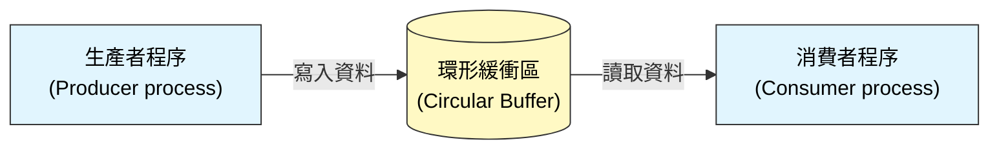
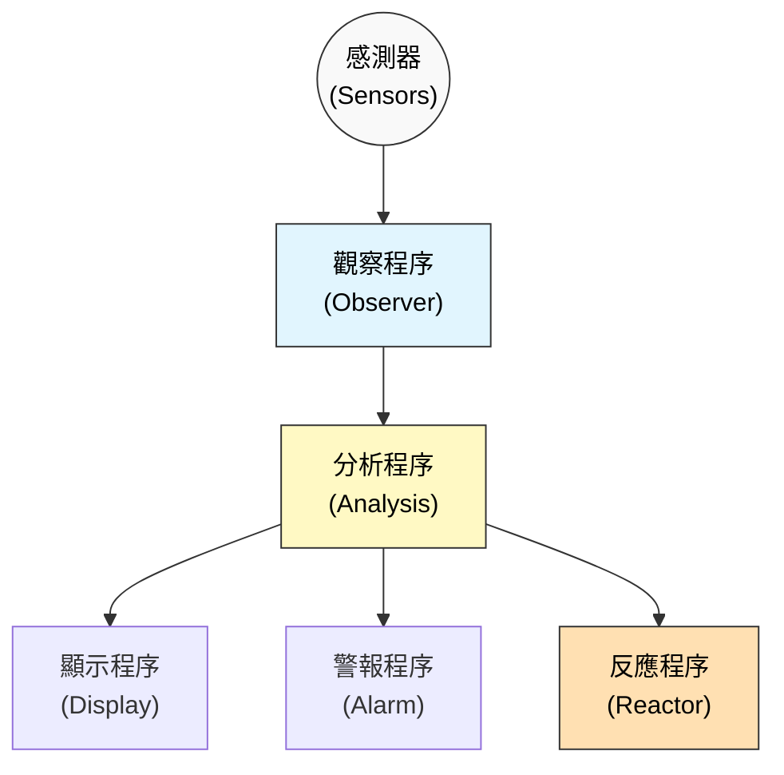
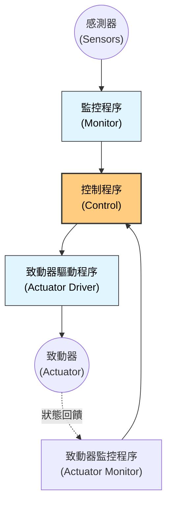
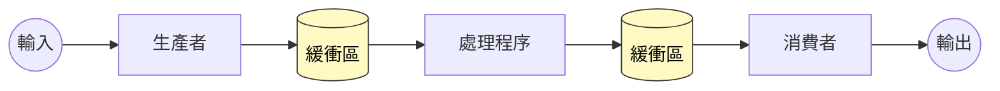
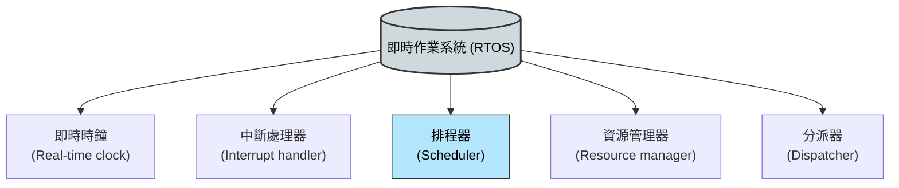

本章重點介紹了嵌入式系統的特性、設計流程、架構模式、時序分析以及即時作業系統 (RTOS) 的角色。

### 1. 嵌入式系統設計 (Embedded System Design)

嵌入式系統是硬體與軟體整合的系統，通常用於控制設備或機器。

-   **即時系統 (Real-time systems) 的定義：**
    -   系統的正確性不僅取決於運算結果的邏輯正確性，還取決於產生結果的**時間**。
    -   **軟即時 (Soft real-time)：** 如果未能在截止時間內完成，服務品質會下降，但系統仍可運作（例如：視訊串流）。
    -   **硬即時 (Hard real-time)：** 錯過截止時間會導致整個系統失效，甚至造成災難（例如：汽車煞車系統、航空電子設備）。

-   **激勵 (Stimuli) 的類型：**
    -   **週期性 (Periodic)：** 在可預測的時間間隔發生（例如：每 50 毫秒檢查一次感測器）。
    -   **非週期性 (Aperiodic)：** 發生時間不可預測，由外部事件觸發（例如：按鈕按下、感測器偵測到異常）。

-   **設計流程模型：**
    即時系統通常採用**生產者/消費者 (Producer/Consumer)** 模型，並透過**共用緩衝區 (Shared Buffer)** 交換資料，以解決處理速度不一致的問題。

*(參考圖 21.4：共用環形緩衝區的生產者/消費者程序)*

-   **狀態機模型 (State Machine Models)：**
    -   由於即時系統是對事件做出反應，**狀態模型**（如 UML Statecharts）是描述系統行為的重要工具。
    -   系統根據輸入的激勵 (Stimuli) 在不同狀態間轉換。

---

### 2. 即時軟體的架構模式 (Architectural Patterns for Real-time Software)

本章介紹了三種常用的即時系統架構模式：

#### 2.1 觀察與反應 (Observe and React)
-   **用途：** 監控系統（Monitoring systems）。
-   **描述：** 收集感測器數據，分析這些數據，並在檢測到異常時採取行動（如發出警報）。
-   **組成：** 觀察者 (Observer)、分析 (Analysis)、顯示 (Display)、警報 (Alarm)、反應器 (Reactor)。

*(參考圖 21.7：觀察與反應程序結構)*

#### 2.2 環境控制 (Environmental Control)
-   **用途：** 控制系統（Control systems）。
-   **描述：** 監控環境狀態並透過致動器 (Actuators) 發送控制訊號來改變環境。
-   **特點：** 包含感測器與致動器程序。通常有兩個回饋迴路：一個監控感測器，另一個監控致動器本身的狀態。

*(參考圖 21.10：環境控制程序結構)*

#### 2.3 程序管線 (Process Pipeline)
-   **用途：** 資料獲取系統、多媒體系統。
-   **描述：** 資料從一種表示形式轉換為另一種形式。處理步驟是順序的，但可以並行執行（管線化），以提高吞吐量。

*(參考圖 21.13：程序管線結構)*

---

### 3. 時序分析 (Timing Analysis)

在即時系統中，必須證明系統能滿足其時序限制（Deadlines）。

-   **時序需求：**
    -   **激勵處理時間：** 從感測器讀取到產生回應的時間。
    -   **週期性頻率：** 系統必須多快執行一次（例如：每秒 50 次）。
-   **分析要素：**
    -   **截止時間 (Deadline)：** 處理必須完成的時間點。
    -   **頻率 (Frequency)：** 程序每秒需要執行的次數。
    -   **執行時間 (Execution time)：** 處理單次激勵所需的時間（通常取最壞情況執行時間，WCET）。
-   **排程能力 (Schedulability)：** 系統是否能在所有程序都滿足截止時間的情況下運行。如果總處理負載超過 100% CPU 時間，則系統不可排程。

---

### 4. 即時作業系統 (Real-time Operating Systems, RTOS)

即時系統通常需要特殊的作業系統來管理程序和資源，確保時序需求得到滿足。

-   **RTOS 的關鍵組件：**

*(參考圖 21.18：RTOS 的組件)*

-   **組件功能：**
    -   **即時時鐘：** 提供精確的定時資訊，用於排程週期性程序。
    -   **中斷處理器：** 管理外部事件（激勵）引起的中斷，將控制權轉移給相應的處理程序。
    -   **排程器：** 決定下一個要執行的程序。
    -   **資源管理器：** 管理記憶體和 I/O 設備。
    -   **分派器：** 實際啟動程序執行。

-   **程序排程策略 (Process Scheduling)：**
    -   **不可搶佔式 (Non-preemptive)：** 程序一旦執行，直到完成或主動放棄 CPU（例如等待 I/O）才停止。缺點是無法保證高優先級任務的快速響應。
    -   **搶佔式 (Preemptive)：** 高優先級程序可以隨時中斷低優先級程序並搶佔 CPU。這是即時系統最常用的策略。

-   **排程演算法：**
    -   **速率單調排程 (Rate Monotonic Scheduling, RMS)：** 靜態優先級。執行頻率越高的程序，優先級越高。
    -   **最早截止時間優先 (Earliest Deadline First, EDF)：** 動態優先級。截止時間最近的程序優先執行。
