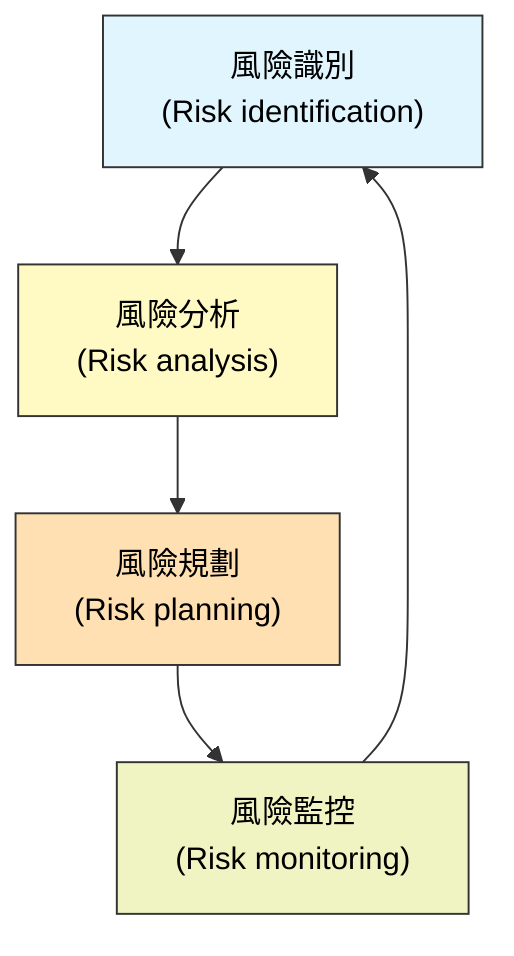
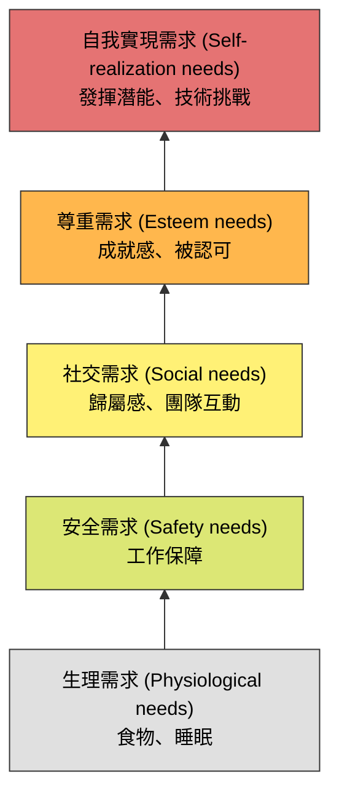

本章重點在於介紹軟體專案管理的基礎，特別是風險管理與人員管理。

### 1. 軟體專案管理導論 (Introduction)

軟體專案管理是軟體工程的重要組成部分，因為專業軟體開發總是受限於預算和時程。專案經理的工作是確保軟體專案在這些限制下，達到預期的標準。

-   **軟體管理的特殊性**：與其他工程管理相比，軟體管理有其獨特的困難點：
    -   **產品是無形的 (The product is intangible)**：無法像土木工程那樣看到進度（如橋樑的建設）。
    -   **沒有標準的軟體流程 (No standard software processes)**：不同組織、不同專案的流程差異很大。
    -   **大型軟體專案往往是「一次性」的 (One-off projects)**：過去的經驗不一定能完全套用到新專案。

---

### 2. 風險管理 (Risk Management)

風險管理是預測風險、了解其影響並採取措施以避免或減輕其後果的過程。

#### 2.1 風險管理流程
風險管理是一個迭代的過程，貫穿整個專案週期。

*(參考圖 22.2 風險管理流程)*

#### 2.2 風險分類
-   **專案風險 (Project risks)**：影響專案時程或資源（如：人員流失）。
-   **產品風險 (Product risks)**：影響軟體的品質或效能（如：買來的組件無法運作）。
-   **商業風險 (Business risks)**：影響開發軟體的組織（如：競爭對手推出了新產品）。

#### 2.3 風險分析 (Risk Analysis)
評估風險發生的**機率 (Probability)** 和**後果 (Effects)**。

| 風險範例                     | 類型      | 機率          | 後果                  |
| :--------------------------- | :-------- | :------------ | :-------------------- |
| 組織財務問題導致預算削減     | 商業      | 低 (Low)      | 災難性 (Catastrophic) |
| 無法招聘到具備所需技能的員工 | 專案      | 高 (High)     | 災難性 (Catastrophic) |
| 關鍵員工在關鍵時刻生病       | 專案      | 中 (Moderate) | 嚴重 (Serious)        |
| 需求變更導致重大設計重做     | 專案/產品 | 中 (Moderate) | 嚴重 (Serious)        |
| 資料庫效能不如預期           | 技術      | 中 (Moderate) | 嚴重 (Serious)        |
| 開發時間被低估               | 專案      | 高 (High)     | 嚴重 (Serious)        |

*(參考圖 22.4 風險類型與範例)*

#### 2.4 風險規劃 (Risk Planning)
針對已識別的風險制定策略：
-   **規避策略 (Avoidance strategies)**：降低風險發生的機率（例如：為了避免效能風險，購買更快的硬體）。
-   **最小化策略 (Minimization strategies)**：降低風險發生後的影響（例如：為了應對人員生病，確保工作有重疊，讓多人熟悉同一工作）。
-   **應變計畫 (Contingency plans)**：當風險發生時的應對措施（例如：如果發生財務危機，準備一份向高層展示專案商業價值的報告）。

#### 2.5 風險監控 (Risk Monitoring)
透過觀察**風險指標 (Risk Indicators)** 來評估風險是否即將發生。

| 風險類型                  | 潛在指標 (Potential indicators)                      |
| :------------------------ | :--------------------------------------------------- |
| **估算 (Estimation)**     | 未能按時程完成、未能修復已報告的缺陷。               |
| **組織 (Organizational)** | 組織內部的流言蜚語、高層管理缺乏行動。               |
| **人員 (People)**         | 士氣低落、團隊成員關係不佳、人員流動率高。           |
| **需求 (Requirements)**   | 大量的需求變更請求、客戶投訴。                       |
| **技術 (Technology)**     | 硬體或支援軟體延遲交付、大量回報的技術問題。         |
| **工具 (Tools)**          | 團隊成員不願使用工具、抱怨工具效能、要求更快的電腦。 |

*(參考圖 22.6 風險指標)*

---

### 3. 人員管理 (Managing People)

人員是軟體組織最大的資產。管理者必須尊重並激勵員工。

#### 3.1 關鍵因素
-   **一致性 (Consistency)**：對待團隊成員要在平等的基礎上，不能偏袒。
-   **尊重 (Respect)**：尊重不同的技能和差異，給予每個人貢獻的機會。
-   **包容 (Inclusion)**：傾聽所有人的意見，即使是資歷較淺的員工。
-   **誠實 (Honesty)**：對專案狀況（即使是壞消息）要誠實，建立信任。

#### 3.2 激勵 (Motivation) - 馬斯洛需求層次
了解需求有助於激勵員工。

*(參考圖 22.7 人類需求層次)*

-   對於軟體工程師，**社交、尊重和自我實現**通常是最重要的激勵因素。
-   滿足社交需求：提供公共空間、舉辦團隊活動。
-   滿足尊重需求：認可其貢獻、公開表揚。
-   滿足自我實現：提供具有挑戰性的工作、培訓機會。

#### 3.3 人格類型 (Personality Types)
Bass 和 Dunteman 提出了三種專業工作者的人格分類：
1.  **任務導向 (Task-oriented)**：被工作本身的智力挑戰所激勵。
2.  **自我導向 (Self-oriented)**：被個人成功和認可所激勵。
3.  **互動導向 (Interaction-oriented)**：被團隊合作和社交互動所激勵。

---

### 4. 團隊合作 (Teamwork)

成功的團隊不僅僅是技能的組合，還需要是一個具有**凝聚力 (Cohesive)** 的群體。

#### 4.1 團隊凝聚力的優點
-   **團隊品質標準 (Group quality standard)**：團隊建立自己的高品質標準，這通常比外部強加的標準更有效。
-   **互相學習 (Mutual learning)**：成員之間互相學習和支持。
-   **知識共享 (Knowledge sharing)**：即使有人離開，知識仍留在團隊中。
-   **鼓勵重構 (Refactoring)**：團隊會共同努力改進程式碼品質。

#### 4.2 團隊組成 (Group Composition)
-   應努力在技能和人格類型之間取得平衡。
-   如果團隊全部由**任務導向**的人組成，可能會缺乏凝聚力。
-   如果團隊全部由**自我導向**的人組成，可能會發生衝突。
-   **互動導向**的人有助於促進溝通和化解緊張。

#### 4.3 團隊溝通 (Group Communications)
影響溝通效率的因素：
-   **團隊規模**：隨著規模增加，溝通管道呈幾何級數增加。小團隊 (4-6人) 最有效率。
-   **團隊結構**：
    -   **非正式 (Informal)**：適合小團隊，每個人都參與討論。
    -   **階層式 (Hierarchical)**：適合大型專案，但溝通可能受阻（由上而下）。
-   **團隊組成**：混合性別和性格的團隊通常溝通較好。
-   **物理工作環境**：開放式辦公室有利於溝通，但也可能造成干擾。
