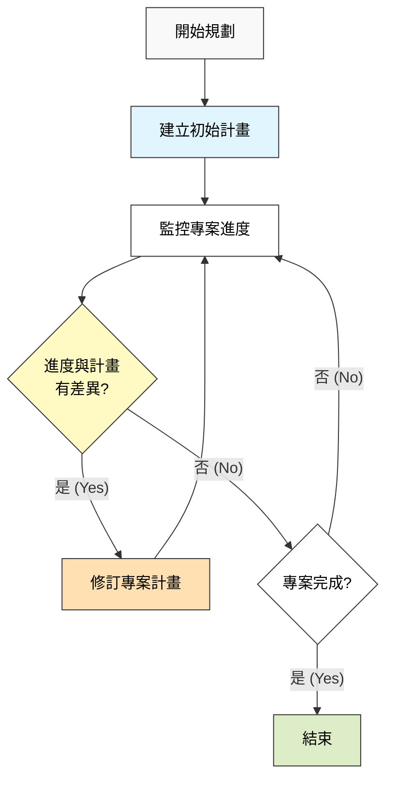
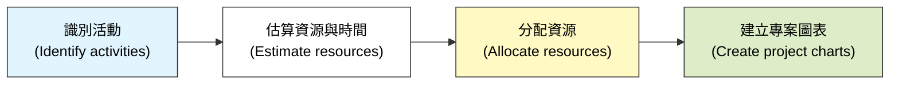
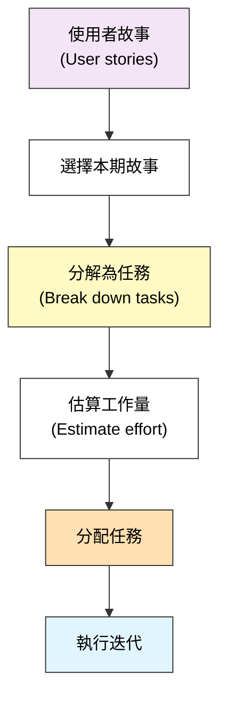

本章探討了軟體專案管理的規劃層面，包括定價、排程、敏捷規劃以及成本估算技術（特別是 COCOMO II 模型）。

### 1. 軟體定價 (Software Pricing)

在專案規劃中，估算成本是一回事，但決定價格是另一回事。價格不僅取決於開發成本，還受商業與經濟因素影響。

-   **成本 (Cost)：** 開發軟體所需的資源支出（主要是人力成本、硬體、軟體授權等）。
-   **價格 (Price)：** 客戶實際支付的金額。$價格 = 成本 + 利潤$。

**影響軟體定價的因素：**

| 因素 (Factor)                                      | 描述 (Description)                                                                                       |
| :------------------------------------------------- | :------------------------------------------------------------------------------------------------------- |
| **市場機會 (Market opportunity)**                  | 為了進入新市場，可能會以低於成本的價格（虧本）銷售，以獲取市佔率或累積經驗。                             |
| **成本估算的不確定性 (Cost estimate uncertainty)** | 如果需求不明確，為了規避風險，通常會提高價格以覆蓋潛在的意外成本。                                       |
| **合約條款 (Contractual terms)**                   | 如果合約要求開發者保留原始碼所有權，價格可能會降低（因為開發者可以重用）；如果所有權歸客戶，價格會較高。 |
| **需求變動性 (Requirements volatility)**           | 如果預期需求會頻繁變更，可能會收取較高價格或採用不同的計價模式。                                         |
| **財務健康狀況 (Financial health)**                | 如果公司急需現金流，可能會降低價格以確保拿下合約。                                                       |

---

### 2. 計畫驅動開發 (Plan-driven Development)

在計畫驅動（傳統）的方法中，專案計畫是在專案開始時制定的，並隨著專案進行而不斷更新。

#### 2.1 專案規劃流程
這是一個迭代的過程。隨著獲得更多資訊，計畫會變得更詳細。

#### 2.2 專案計畫的內容
一份標準的專案計畫通常包含：
1.  **簡介 (Introduction)**：專案目標與限制。
2.  **專案組織 (Project organization)**：團隊結構與角色。
3.  **風險分析 (Risk analysis)**：潛在風險與應對措施。
4.  **硬體與軟體資源需求 (Hardware and software resource requirements)**。
5.  **工作分解 (Work breakdown)**：將專案分解為活動 (Activities)。
6.  **專案時程 (Project schedule)**：活動的時間安排與相依性。
7.  **監控與報告機制 (Monitoring and reporting mechanisms)**。

---

### 3. 專案排程 (Project Scheduling)

排程是決定如何組織活動以及配置資源的過程。

-   **活動 (Activity)：** 專案中的一個單元，有持續時間（Duration）、需要資源，並產生可交付成果。
-   **里程碑 (Milestone)：** 專案中的一個時間點，標誌著一組活動的完成。

#### 3.1 排程表示法
-   **長條圖 (Bar charts / Gantt charts)：** 顯示活動的開始與結束時間，以及並行情況。最常用於管理與追蹤。
-   **活動網路圖 (Activity networks)：** 顯示活動之間的相依性 (Dependencies) 和關鍵路徑 (Critical Path)。

**簡單的專案排程活動流程圖：**

---

### 4. 敏捷規劃 (Agile Planning)

敏捷方法（如 Scrum）採用不同的規劃方式，因為它們假設需求會變更。

-   **特點：**
    -   不制定長期的詳細計畫。
    -   規劃是增量式的（Incremental）。
    -   讓客戶參與規劃過程。

#### 4.1 規劃階段
敏捷規劃分為兩個層次：
1.  **發布規劃 (Release planning)：** 展望未來幾個月，決定包含哪些功能。
2.  **迭代規劃 (Iteration planning)：** 展望未來幾週（通常 2-4 週），為下一個增量做詳細規劃。

-   **故事點 (Story Points)：** 敏捷中常用「點數」而非「工時」來估算工作量，這代表相對的複雜度或工作量。
-   **速度 (Velocity)：** 團隊在一個迭代中能完成的平均故事點數。用來預測未來的進度。

---

### 5. 軟體估算技術 (Software Estimation Techniques)

估算軟體開發所需的**工作量 (Effort)** 和**成本 (Cost)** 是極具挑戰性的。沒有單一的技術是完美的，通常會混合使用。

#### 5.1 基於經驗的技術 (Experience-based techniques)
-   依靠專家根據過去的經驗進行判斷。
-   **優點：** 如果專案與過去類似，估算會很準確。
-   **缺點：** 如果缺乏經驗或專案採用新技術，估算會偏差很大。

#### 5.2 演算法成本建模 (Algorithmic cost modeling)
使用數學公式來預測專案成本。最基本的公式形式為：

$$ Effort = A \times Size^B \times M $$

-   **Effort (工作量)：** 通常以人月 (Person-Months, PM) 為單位。
-   **A：** 組織特定的常數。
-   **Size：** 軟體規模（通常是程式碼行數 LOC 或功能點 FP）。
-   **B：** 反映規模不經濟 (Diseconomies of scale) 的指數。通常 $1 < B < 1.5$。隨著專案變大，溝通成本增加，導致生產力下降。
-   **M：** 一組乘數，反映過程、產品和人員屬性（如團隊能力、工具支援）。

---

### 6. COCOMO II 模型 (The COCOMO II Model)

COCOMO (Constructive Cost Model) 是最著名的演算法成本模型。COCOMO II 針對現代軟體開發進行了更新，支援螺旋模型等迭代開發。

它包含四個子模型，對應不同的開發階段或類型：

1.  **應用程式組裝模型 (Application composition model)：** 適用於使用現成組件或腳本語言快速開發原型的階段。基於「物件點 (Object points)」。
2.  **早期設計模型 (Early design model)：** 在需求已定但設計未定時使用。基於功能點 (Function points)。
3.  **重用模型 (Reuse model)：** 用於計算整合可重用組件所需的工作量。
    -   如果生成的代碼是黑箱（不修改）：工作量主要在於配置與測試。
    -   如果生成的代碼是白箱（需修改）：工作量較高。
4.  **後架構模型 (Post-architecture model)：** 在系統架構設計完成後使用，是最詳細的模型。基於程式碼行數 (Source Lines of Code, SLOC)。

#### 6.1 COCOMO II 的專案時程公式
除了估算工作量 (PM)，COCOMO 也可以估算所需的時間 (TDEV - Time to Develop)：

$$ TDEV = 3 \times (PM)^{(0.33 + 0.2 \times (B-1.01))} $$

這表明開發時間與總工作量並非線性關係，且增加人手並不一定能等比例縮短時間（布魯克斯法則）。

#### 6.2 專案持續時間與人員配置 (Project Duration and Staffing)
-   **瑞利曲線 (Rayleigh Curve)：** 傳統專案的人力需求通常呈現瑞利曲線分佈（開始少，中間多，結尾少）。
-   **日曆時間 (Calendar time)：** 不能簡單地用 `總人月 / 團隊人數` 來計算。由於溝通開銷，專案持續時間通常由系統的複雜度和依賴關係決定。

### 關鍵點 (Key Points)
-   **價格與成本不同**，價格受市場和商業策略影響。
-   **計畫驅動開發**有明確的計畫階段，而**敏捷開發**採用迭代規劃，依賴**速度 (Velocity)** 來預測。
-   **排程**涉及將專案分解為活動並估算資源。長條圖 (Gantt) 和網路圖是主要工具。
-   **估算**是不確定的。應結合經驗法和演算法模型。
-   **COCOMO II** 是一個綜合的成本估算模型，考慮了軟體規模、重用、人員能力和開發工具等多種因素。
