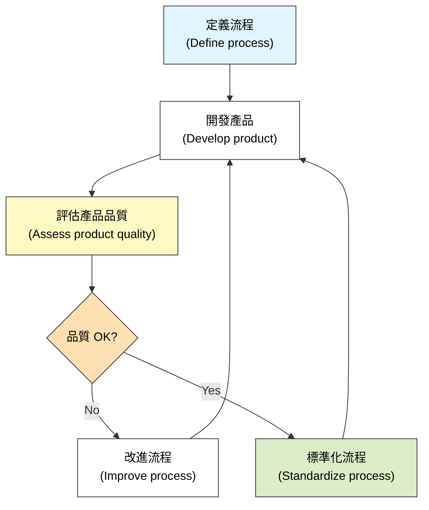
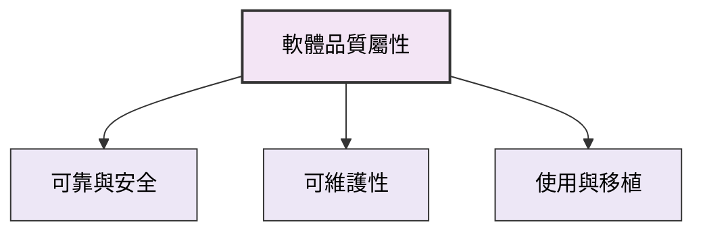
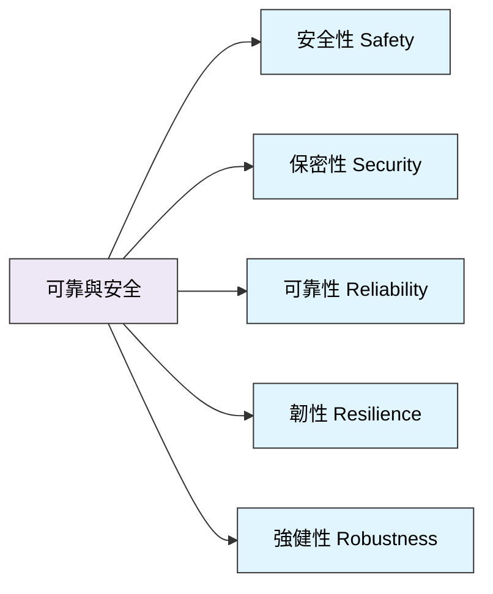
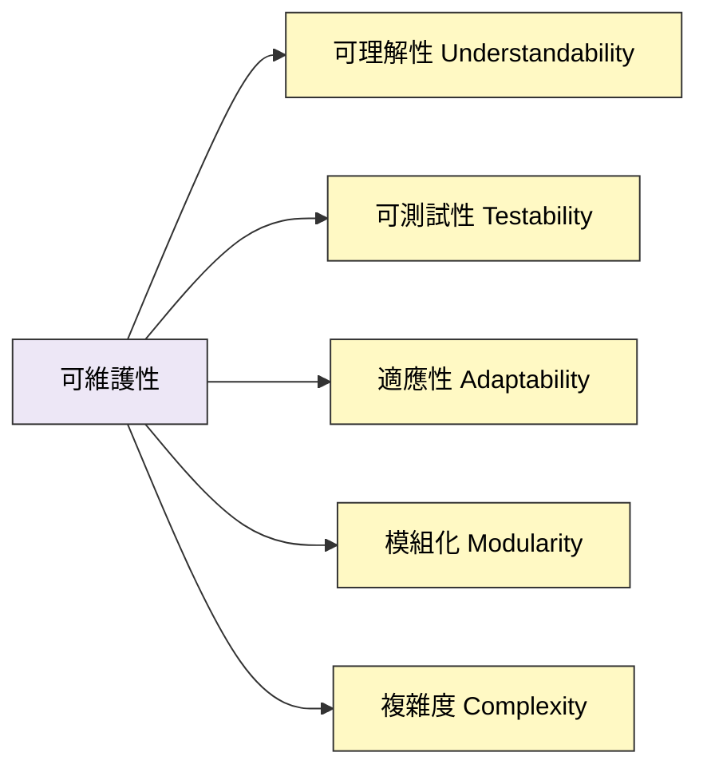
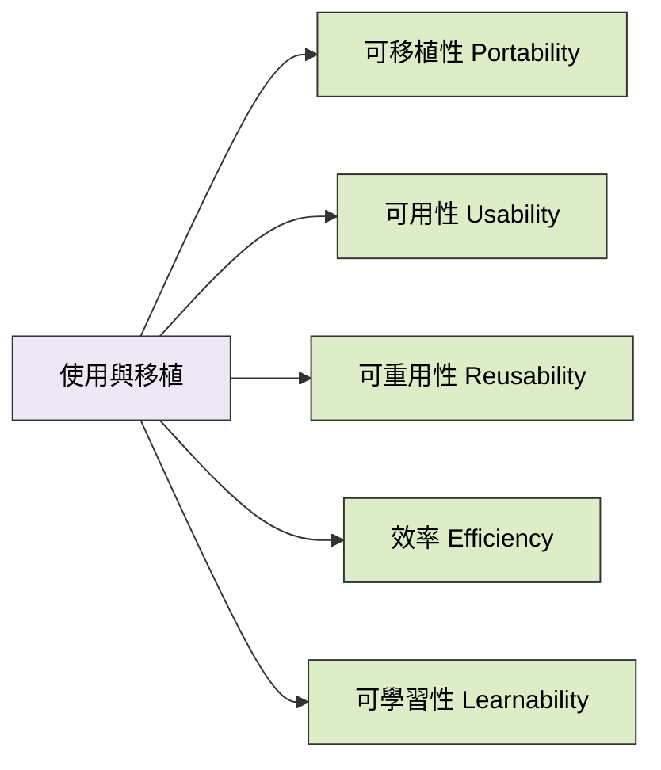
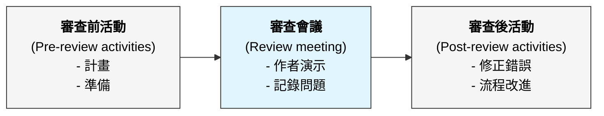

本章介紹了軟體品質管理的概念、標準的重要性、審查與檢查過程，以及如何透過測量與分析來評估軟體品質。

### 1. 軟體品質 (Software Quality)

軟體品質管理 (SQM) 的目標是確保開發的軟體系統「符合目的」(Fit for purpose)。這不僅意味著軟體沒有錯誤，還包括滿足用戶需求、可靠性、交付時間和預算等多個方面。

-   **品質計畫 (Quality Plan)**：
    定義了產品所需的品質屬性以及如何評估這些屬性。Humphrey 建議的品質計畫結構包括：
    1.  產品介紹。
    2.  產品計畫 (發布日期、責任)。
    3.  流程描述 (開發標準)。
    4.  品質目標 (關鍵屬性)。
    5.  風險與風險管理。

-   **基於流程的品質 (Process-based Quality)**：
    由於軟體品質的主觀性和測量困難，品質管理通常關注「開發流程」的品質，假設好的流程會產出好的產品。

*(參考圖 24.3：基於流程的品質)*

-   **軟體品質屬性 (Software Quality Attributes)**：
    軟體品質不是單一指標，而是多個屬性的集合。這些屬性通常無法同時最佳化（例如，提高安全性可能會降低效能）。

*(參考圖 24.2：軟體品質屬性)*

---

### 2. 軟體標準 (Software Standards)

標準是品質管理的基礎，因為它們封裝了最佳實踐，並提供了檢查工作的框架。

-   **標準的重要性**：
    1.  封裝了組織的最佳實踐，避免重複錯誤。
    2.  提供了連續性框架，使新員工能快速上手。
-   **標準的類型**：

| 類型                             | 描述                                               | 範例                                          |
| :------------------------------- | :------------------------------------------------- | :-------------------------------------------- |
| **產品標準 (Product standards)** | 適用於開發過程中產出的軟體產品（如文件或程式碼）。 | 設計審查表、需求文件結構、Java 程式設計風格。 |
| **流程標準 (Process standards)** | 定義軟體開發過程中應遵循的流程。                   | 設計審查流程、版本發布流程、變更控制流程。    |

*(參考圖 24.4：產品與流程標準)*

-   **ISO 9001 標準框架**：
    這是一套通用的品質管理標準，不僅適用於軟體。它要求組織定義其品質流程並證明這些流程被遵循。ISO 9001 認證是許多合約的先決條件。

---

### 3. 審查與檢查 (Reviews and Inspections)

審查是主要的品質保證活動，涉及檢查軟體、文件和流程記錄。

-   **審查流程 (The Review Process)**：

*(參考圖 24.7：軟體審查流程)*

-   **程式檢查 (Program Inspections)**：
    這是一種同儕審查 (Peer Review)，團隊成員逐行檢查程式碼以發現缺陷。
    -   **優點**：不需要執行程式；可以在測試前發現錯誤；一個檢查可以發現多個錯誤（不像測試，一個錯誤可能導致崩潰而掩蓋其他錯誤）。
    -   **檢查清單 (Inspection Checklists)**：使用清單來驅動檢查，關注常見錯誤。

**檢查清單範例 (Inspection Checklist)**：

| 錯誤類別          | 檢查項目範例                                         |
| :---------------- | :--------------------------------------------------- |
| **資料錯誤**      | 變數是否初始化？常數是否命名？陣列邊界是否正確？     |
| **控制錯誤**      | 條件判斷是否正確？迴圈是否會終止？                   |
| **輸入/輸出錯誤** | 所有輸入變數都使用了嗎？所有輸出變數都賦值了嗎？     |
| **介面錯誤**      | 函數呼叫的參數數量、類型、順序是否匹配？             |
| **儲存管理錯誤**  | 動態記憶體是否正確分配和釋放？連結結構是否正確更新？ |
| **例外管理錯誤**  | 是否考慮了所有可能的錯誤情況？                       |

*(參考圖 24.8：檢查清單)*

---

### 4. 品質管理與敏捷開發 (QM and Agile Development)

敏捷方法依賴於建立品質文化，而不是正式的文檔和流程。

-   **敏捷品質實踐**：
    -   **簽入前檢查 (Check before check-in)**：程式設計師在整合程式碼前負責組織自己的程式碼審查。
    -   **永不破壞建構 (Never break the build)**：確保簽入的程式碼不會導致系統建構失敗。
    -   **見錯即修 (Fix problems when you see them)**：鼓勵主動修復發現的問題。
-   **配對程式設計 (Pair Programming)**：
    作為一種非正式的程式碼審查機制，兩個人一起工作，即時檢查每一行程式碼。

---

### 5. 軟體測量 (Software Measurement)

軟體測量是量化軟體系統屬性（如大小、複雜度）的過程。

-   **度量指標類型**：
    -   **控制度量 (Control metrics)**：支持流程管理（如修復缺陷所需的時間）。
    -   **預測度量 (Predictor metrics)**：幫助預測軟體特性（如程式碼複雜度預測可維護性）。
-   **靜態軟體產品度量 (Static Software Product Metrics)**：
    基於系統的靜態表示（如原始碼）進行測量。

| 度量指標                               | 描述                                                                                                  |
| :------------------------------------- | :---------------------------------------------------------------------------------------------------- |
| **扇入/扇出 (Fan-in/Fan-out)**         | 函數被呼叫次數 (Fan-in) 和呼叫其他函數次數 (Fan-out)。高 Fan-in 表示高耦合；高 Fan-out 表示高複雜度。 |
| **程式碼長度 (Length of code)**        | 程式的大小。通常代碼越多，越複雜且容易出錯。                                                          |
| **循環複雜度 (Cyclomatic complexity)** | 程式控制流的複雜度。與可理解性相關。                                                                  |
| **識別字長度 (Length of identifiers)** | 變數/函數名稱的平均長度。越長通常意味著越有意義，可讀性越好。                                         |
| **條件嵌套深度**                       | if 語句的嵌套深度。深層嵌套難以理解。                                                                 |

*(參考圖 24.11：靜態軟體產品度量)*

-   **物件導向度量 (CK Metrics Suite)**：
    Chidamber 和 Kemerer 提出的常用 OO 度量。

| 度量                      | 描述                                                             |
| :------------------------ | :--------------------------------------------------------------- |
| **WMC (類別加權方法數)**  | 類別中方法的數量/複雜度。值越大，類別越複雜。                    |
| **DIT (繼承樹深度)**      | 繼承層級的深度。越深設計越複雜。                                 |
| **NOC (子類別數量)**      | 直接子類別的數量。值高可能意味著更多的重用，但也需要更多的驗證。 |
| **CBO (物件類別耦合度)**  | 一個類別與其他類別耦合的數量。高耦合降低獨立性。                 |
| **RFC (類別回應數)**      | 對類別物件的訊息可能執行的方法數量。                             |
| **LCOM (方法缺乏內聚性)** | 測量方法之間缺乏共享屬性的程度。                                 |

*(參考圖 24.12：CK 物件導向度量套件)*

-   **軟體分析 (Software Analytics)**：
    使用資料探勘和機器學習技術自動分析大量的軟體產品和流程數據，以發現關係並提供洞察（例如，預測哪些模組最可能包含缺陷）。
