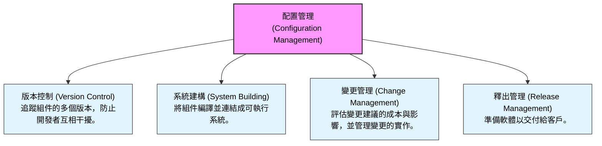
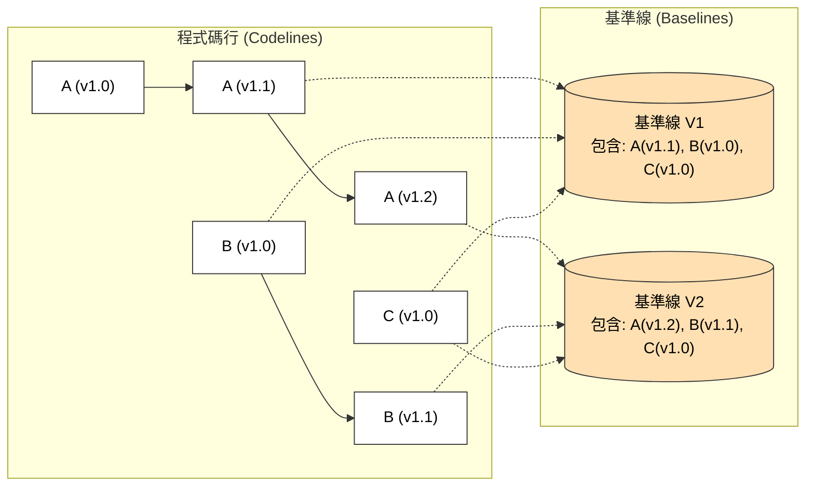
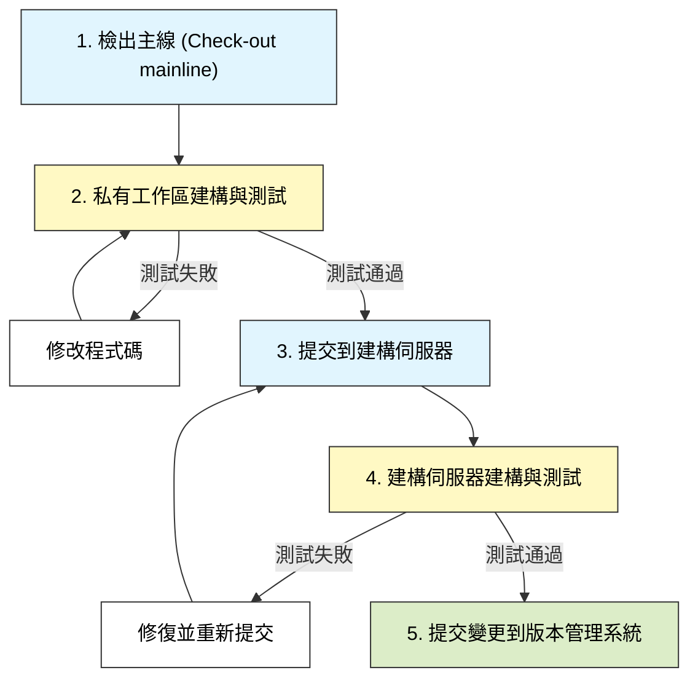
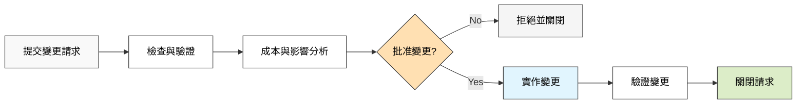

本章介紹了管理軟體系統變更的策略、流程與工具。

### 1. 配置管理導論 (Configuration Management)

配置管理 (CM) 是關於管理變更中的軟體系統的政策、流程和工具。由於軟體系統在開發和使用過程中不斷變更（修復錯誤、需求變更、新硬體/平台適應等），CM 是必不可少的。

-   **配置管理的四個核心活動：**

*(參考圖 25.1：配置管理活動)*

-   **敏捷開發中的 CM：** 由於敏捷開發涉及頻繁的變更和建構（每天多次），如果沒有 CM 工具支援是不可能實現的。

#### 1.1 關鍵術語 (CM Terminology)

| 術語 (Term)                            | 解釋 (Explanation)                                                                       |
| :------------------------------------- | :--------------------------------------------------------------------------------------- |
| **基準線 (Baseline)**                  | 組成系統的一組組件版本。基準線是受控的，這意味著一旦建立，其中包含的組件版本就不能更改。 |
| **分支 (Branching)**                   | 從現有程式碼行中的某個版本創建一個新的程式碼行。新舊程式碼行可以獨立發展。               |
| **程式碼行 (Codeline)**                | 軟體組件的一系列版本序列。                                                               |
| **配置控制 (Configuration Control)**   | 確保系統和組件的版本被記錄和維護的過程。                                                 |
| **配置項目 (Configuration Item, SCI)** | 任何被納入配置控制的項目（如設計、程式碼、測試數據、文件）。每個項目都有唯一識別碼。     |
| **主線 (Mainline)**                    | 代表系統不同版本的基準線序列。                                                           |
| **合併 (Merging)**                     | 通過結合不同程式碼行中的版本來創建新版本。                                               |
| **儲存庫 (Repository)**                | 儲存配置項目所有版本的共享資料庫。                                                       |
| **工作區 (Workspace)**                 | 開發者的私人工作區域，在此處修改軟體不會影響其他開發者。                                 |

*(參考圖 25.3：CM 術語)*

---

### 2. 版本管理 (Version Management)

版本管理是追蹤軟體組件不同版本以及使用這些組件的系統的過程。

#### 2.1 程式碼行與基準線 (Codelines and Baselines)
-   **程式碼行 (Codeline)：** 是一個組件的版本序列（例如 A1.0 -> A1.1 -> A1.2）。
-   **基準線 (Baseline)：** 是系統的一個定義，指定了該系統版本中包含的具體組件版本。

*(概念參考圖 25.4)*

#### 2.2 版本控制系統 (VC Systems)
現代版本控制系統（如 Git, Subversion）通常提供兩個核心功能：
1.  **儲存庫 (Repository)：** 儲存所有檔案的「主」版本。
2.  **工作區 (Workspace)：** 開發者從儲存庫檢出 (Check-out) 檔案到私有工作區進行修改，完成後再檢入 (Check-in)。

-   **集中式系統 (Centralized Systems)：** 如 Subversion。只有一個主儲存庫。開發者直接與其互動。
-   **分散式系統 (Distributed Systems)：** 如 Git。開發者在本地電腦上有一個完整的儲存庫副本（克隆/Clone）。開發者先提交 (Commit) 到本地儲存庫，然後再推送到 (Push) 共享的專案儲存庫。這支援離線工作和更靈活的備份。

#### 2.3 儲存管理 (Storage Management)
為了節省空間，版本控制系統通常使用 **Delta (差異)** 儲存技術。只儲存版本之間的差異，而不是每個版本的完整副本。

---

### 3. 系統建構 (System Building)

系統建構是將組件、數據和程式庫編譯並連結成可執行系統的過程。

-   **建構工具：** 自動化建構工具（如 Ant, Maven, Gradle）是必不可少的。它們根據建構腳本 (Build script) 自動找出依賴關係，編譯所需的組件，並連結成最終系統。
-   **持續整合 (Continuous Integration, CI)：** 敏捷開發推薦的做法。每當開發者完成一個小變更，就立即進行系統建構和測試。

**持續整合流程：**

*(參考圖 25.12：持續整合)*

-   **優點：** 盡早發現問題，避免「整合地獄」(Integration hell)。

---

### 4. 變更管理 (Change Management)

變更管理是控制系統演進的過程，確保以受控的方式處理變更請求 (Change Requests, CR)。

#### 4.1 變更管理流程
1.  **請求變更 (Request Change)：** 用戶或開發者提交變更請求表 (CRF)，報告錯誤或請求新功能。
2.  **變更分析 (Change Analysis)：** 檢查請求的有效性，並評估實作變更的成本和影響。
3.  **變更批准 (Change Approval)：** 變更控制委員會 (CCB) 或產品負責人決定是否批准變更。決策基於變更的後果、效益、受影響的用戶數量及成本。
4.  **變更實作 (Change Implementation)：** 修改軟體、測試並建立新版本。

*(參考圖 25.14：變更管理流程)*

---

### 5. 釋出管理 (Release Management)

釋出管理是決定何時以及如何將系統版本分發給客戶的過程。

-   **釋出類型：**
    -   **主要釋出 (Major releases)：** 提供重要的新功能。通常收費。
    -   **次要釋出 (Minor releases)：** 修復錯誤和小改進。通常免費。
-   **釋出的組成：** 不僅僅是執行檔，還包括配置文件、數據文件、安裝程式、文檔（電子或紙質）和包裝。
-   **釋出決策因素：**
    -   **技術品質：** 系統是否有嚴重的錯誤？
    -   **競爭壓力：** 是否需要趕在競爭對手之前發布？
    -   **行銷需求：** 是否有特定的行銷活動需要配合？
    -   **客戶變更建議：** 客戶是否迫切需要某些功能？

-   **版本再生產 (Release Reproduction)：** 必須能夠重新建構任何舊版本的系統（例如，為使用舊版本的客戶修復錯誤）。這意味著必須在版本控制系統中保留所有舊版本的原始碼、編譯器、程式庫和建構工具的副本。
